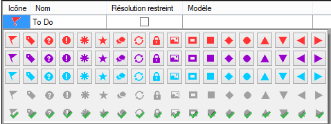
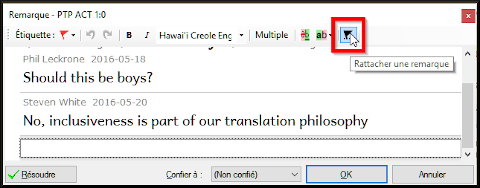
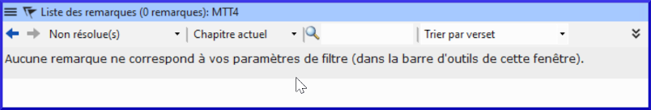
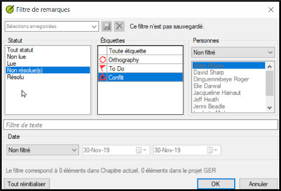
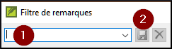
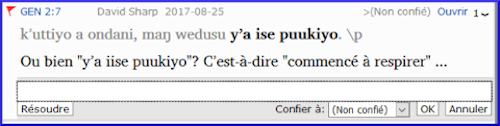

**Introduction**  
Il est possible que pendant de faire la traduction et les vérifications, vous ayez envie de faire des commentaires sur divers problèmes que vous rencontrez ou erreurs que vous ayez trouvées. Il se peut aussi que vous souhaitiez enregistrer vos discussions sur des sujets des termes clés et des questions d’orthographe. Paratext 9 vous permet d’enregistrer de tels commentaires directement dans le texte, dans la liste des termes bibliques ou dans la liste des mots.

**Où en sommes-nous dans le processus?**  
Vous êtes en train de saisir ou de réviser votre texte, votre liste de mots ou vos mots-clés et vous devez faire des commentaires sur un problème que vous avez observé.
:::caution
Les remarques dont on parle ici sont très différentes des notes de bas de page. Ces dernières apparaissent dans la Bible alors que les remarques servent à conserver les questions et les commentaires et ne s’affichent pas dans la Bible.
:::

**Qu’est-ce qu’on va faire ?**  
Vous allez

-  ajoutez plus d'icônes de remarques (administrateur seulement)
-  créer des remarques dans le texte en utilisant différentes icônes ;
-  ouvrez, modifiez et résolvez les remarques ;
-  ouvrir une liste des remarques à partir du texte ;
-  filtrer la liste ;
-  imprimer la liste des remarques ;

## 15.1 Les différentes icônes de remarques

Vous pouvez choisir parmi plusieurs icônes différentes pour vos remarques de projet dans Paratext 9 :

:::tip
Ne prenez pas trop d’icônes !
:::

### Les différentes formes d’icônes
Chaque icône peut avoir plusieurs formes :

| Icône                                            | Description                                                                   | Signification                                                                                                                                                                                |
|--------------------------------------------------|-------------------------------------------------------------------------------|----------------------------------------------------------------------------------------------------------------------------------------------------------------------------------------------|
|  | L’icône a une bordure et une couleur de base jaune clair.                     | La note a au moins un commentaire non lu.                                                                                                                                                    |
|   | L’icône est rouge, violet, ou bleu clair.                                     | Une note de projet confiée à vous ou à l’équipe entière.                                                                                                                                     |
|   | L’icône est grise.                                                            | Une note de projet confiée à quelqu’un d’autre ou non assigné.                                                                                                                               |
|   | L’icône est grise avec une **coche** verte.                                   | Une note de projet ayant le statut résolu.                                                                                                                                                   |
|   | L’icône est un point d’interrogation blanc sur la couverture d’un livre bleu. | Il y a une note de discussion d’orthographe pour ce mot. (Liste de mots)                                                                                                                      |
|   | L’icône est un point d’interrogation blanc sur la couverture d’un livre gris. | Il n’y a PAS de note de discussion d’orthographe pour ce mot. (Liste de mots)                                                                                                                |
|   | L’icône est un plus bleu clair.                                               | Une note du conseiller.                                                                                                                                                                      |
|   | L’icône est un globe bleu clair.                                              | Une note globale du conseiller.                                                                                                                                                              |
|   | L’icône est un point d’exclamation noir dans un triangle rouge.               | Il y a un conflit de fusion Envoyer/Recevoir parce que deux utilisateurs ont fait de différents changements dans le même verset.                                                             |
|   | L’icône est une flèche blanche sur la couverture d’un livre bleu.             | Il y a une note de discussion des équivalents pour ce terme biblique. Cette icône apparaît uniquement dans l’outil Termes bibliques ou dans la fenêtre des équivalents des termes bibliques. |
|   | L’icône est une flèche blanche sur la couverture d’un livre gris.             | Il n’y a PAS de note de discussion d’équivalent pour ce terme biblique (Termes bibliques)                                                                                                    |

### Définir des icônes de remarques
:::caution
Pour cela, on doit être un Administrateur
:::

1. **≡ Onglet**, sous **Projet** \> **Paramètres du projet**  \> **Propriétés du projet**
2. Cliquez sur l’onglet **Remarque**
3. Cliquez sur le bouton **Ajouter étiquette**  
     -  *Une nouvelle ligne est ajoutée*
4. Cliquez sur **l’icône** de la nouvelle ligne
5. Choisissez **l’icône** désirée
6. Cliquez sur **Nom** et saisissez un nom
7. Continuez pour définir toutes les remarques.

## 15.2 Utilisation des remarques
**Insertion d’une remarque**
1. Cliquez dans le texte où vous voulez le note (et si désiré, sélectionnez du texte)
1. **≡ Onglet**, sous **Insérer** \> **Remarque**
1. Choisissez l’étiquette pour la remarque de la liste déroulante  
     
1. Saisissez le texte de la remarque
1. Cliquez sur **OK**.  
    -  *Une icône s’affiche à côté du texte.*

### Ajouter des commentaires dans une remarque existante
1. Cliquez sur l’icône () dans le texte.  
   -  *La remarque s'ouvre.*  
    
1. Saisissez le commentaire
1. Cliquez sur **OK**

### Confier une remarque à quelqu’un
1. Cliquez sur l’icône () dans le texte.
1. Saisissez le commentaire
1. Cliquez sur **Confier à (Affecter à)**
1. Choisissez comme désiré
1. Cliquez sur **OK**

### Relie une remarque à plusieurs projets
1. Ouvrez la remarque
1. Cliquer sur le bouton **Multiple** 
1. Choisissez les projets
1. Cliquez sur **OK**
1. Cliquez sur **OK**  encore une fois pour fermer la boîte de dialogue.

### Rattacher une remarque
Parfois, en éditant un verset, le mot à qui la remarque était attachée est supprimé et l’icône est déplacé au début du verset. On peut rattacher la remarque à un autre mot.
1. Ouvrez la remarque  
     -  *Une boîte de dialogue s’affiche.*  
    
1. Cliquez sur le bouton rattacher 
1. Cliquez sur le(s) mot(s) à attacher
1. Cliquez sur **OK**.  
    -  *La remarque est attachée au mot.*

### Marquer une remarque comme étant résolue
1. Cliquez sur l’icône () dans le texte.
1. Saisissez un autre commentaire si nécessaire.
1. Cliquez sur le bouton **Résoudre remarque** 
1. Cliquez sur **OK**

### Supprimer des remarques
1. Cliquez sur l’icône de la remarque
1. Cliquez sur le petit x rouge
1. Cliquez sur **Oui** pour supprimer définitivement le commentaire.
1. S’il y a plus qu’un commentaire, continuez à supprimer pour supprimer la remarque.

## 15.3 Ouvrir une liste des remarques

Lors de la révision des remarques, il est souvent utile de les voir sous forme de liste.

1. **≡ Onglet**, sous **Outils** \> **Liste des remarques**…
1. Sélectionnez votre projet.
1. Cliquez sur **OK**.  
     -  *Les remarques s’affichent dans une fenêtre séparée.*  
    
1. Modifiez les filtres si nécessaire/
:::tip
Si la fenêtre est vide, modifiez le filtre en utilisant les boutons des filtres. (voir ci-dessous).
:::

### Barre d'outils de la fenêtre des remarques

Il y a quatre listes déroulantes sur la barre d’outils

1. Filtre de remarques
1. Filtre de versets
1. Recherche
1. Trier par [verset, date, confiée (affectée) à]

### Filtre la liste de remarques

1. Cliquez sur le premier bouton/liste
1. Choisissez un filtre existant

### Définir un nouveau filtre de remarques

1. Cliquez sur le premier bouton/liste
1. Choisissez **Nouveau filtre**  
    
1. Choisissez le statut, l’étiquette, la personne, et la date comme vous le souhaitez.
1. Cliquez sur **OK**

### Enregistrer un filtre

1. Définissez le filtre selon votre besoin.
2. Cliquez sur la case de texte en haut. (1)  
      
3. Saisissez un nom pour le filtre
4. Cliquez sur l’icône de la disquette pour enregistrer (2).

## 15.4 Ajouter des commentaires dans une remarque d'une fenêtre de remarques

1. Cliquez sur l’icône () dans le texte.   
     -  *La remarque s'ouvre.*
1. Saisissez un commentaire dans la case de texte en bas.  
    
1. Résolvez ou confiez (affectez) la remarque comme désiré.
1. Cliquez sur la flèche pour réduire la remarque.

## 15.5 Imprimer un rapport des remarques

1. Cliquez dans la fenêtre des remarques.
1. Filtrez les remarques comme vous le souhaitez.
1. **≡ Onglet**, sous **Projet** \> **Imprimer**.
1. Choisissez l’imprimante et les options désirées.
1. Cliquez sur **OK**.
1. Fermez la fenêtre.
