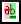
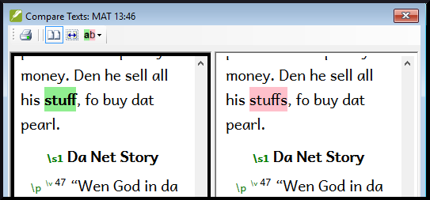
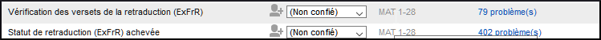

**Introduction**  
En préparant une vérification, le conseiller aura besoin d’une ou plusieurs versions de votre texte dans une langue qu’il comprend. C’est souvent appelé une retraduction. Il y a deux types de retraduction. Ce module explique comment faire une retraduction libre et la tenir à jour. Le prochain module explique comment faire une retraduction mot à mot.

**Où en sommes-nous dans le processus ?**  
Vous avez saisi, vérifié et révisé votre traduction dans Paratext. Votre administrateur doit créer un projet pour la retraduction.

**Pourquoi est-il important ?**  
Il est essentiel que votre texte soit vérifié par votre conseiller. Mais puisque votre conseiller ne connaît pas votre langue, il vous faut retraduire votre texte dans une langue que votre conseiller peut comprendre. D’où le terme **retraduction**. Le conseiller utilisera cette traduction pour aider votre équipe à améliorer vos choix exégétiques dans le texte.

Il est préférable que la retraduction soit faite par quelqu’un qui n’était pas impliqué dans votre traduction. Dans ce cas, il rendra ce que le texte dit et pas ce que vous avez voulu que le texte dise. Cela doit également être fait sans regarder les aides ou d'autres Bibles. Avoir les deux versions différentes aide le conseiller à trouver dans le texte tout problème possible.

**Que ferez-vous ?**  
-  Ouvrir votre projet et votre projet de retraduction (libre).
-  Arrangez les fenêtres côté à côté,
-  Saisissez le texte de la retraduction
-  Marquez le chapitre comme achevé
-  Vérifiez que votre texte est à jour (ou synchronisé), visualisez les éventuelles différences en passant à la modification suivante le cas échéant.

## 16.1 Créer un nouveau projet pour la retraduction

:::caution
Le projet est créé une fois par un administrateur. Si un projet existe, voir [16.2](#162) ci-dessous. 
:::

- **≡ Paratext**, sous **Paratext** \> **Nouveau Projet**

### Saisissez les noms du projet
1. Cliquez sur le bouton **Édition**
2. Saisissez le** nom complet** et un **nom raccourci**
3. Cliquez sur **OK**

### Choisissez la langue
1. Choisissez la **langue** pour votre retraduction (p.ex. française)
5. Laissez la versification
6. Comme type de projet, choisissez **Retraduction** 
7. Choisissez votre projet de la liste **Basé sur**.  
   - *Si nécessaire, Paratext modifiera la versification pour l'adapter à votre projet.*

### Créer les livres
1. Cliquez sur l’onglet **Livres**
2.  Choisissez les livres désirés
3.  Cliquez sur **OK** encore
4.  Cliquer sur le lien **Créer un/des livre(s)**.
5.  Créez des livres comme voulu.

:::info
Ce projet n’est pas besoin d’être inscrit, parce ce qu’il hérite l'inscription de votre projet.
:::

## 16.2 Saisir votre retraduction{#162}

1. Ouvrez votre projet
1. Ouvrez votre retraduction
1. Arrangez les fenêtres côté à côté pour facilement voir les deux fenêtres.
1. Cliquez dans la fenêtre de retraduction (le verset dans votre projet est surligné)
1. Saisissez la retraduction dans chaque verset (après la case à cocher).
1. Continuez à saisir chaque verset.

## 16.3 Marquer le chapitre comme Achevé

Quand vous avez fini le chapitre
1. De la barre d’outils en haut de la fenêtre de retraduction, cliquez sur la coche.
  
1. Choisissez **Marquer tous les versets du chapitre comme achevés**.  
   -  *Toutes les cases du chapitre seront cochées en vert*.

## 16.4 Quand une modification est faite dans votre projet

Paratext détectera tout changement dans votre texte (au moment où le texte est enregistré) et va changer la case de traduction vers un point d’interrogation rouge  et ajouter des questions à l’état de la retraduction dans le plan de projet.

1. Cliquez dans un verset avec un point d’interrogation rouge.
1. Revoyez et corrigez la retraduction.
1. Cliquez sur le point d’interrogation rouge.  
   -  *Il devient une coche verte.*

### Afficher les différences pour les versets qui n'sont pas à jour
1. Cliquez sur l’icône  dans la barre d’outils pour voir les différences.  
    -  *Une fenêtre de comparaison s’affiche.*
    

### Passer aux différences suivantes
1. Cliquez sur les flèches de haut et de bas pour passer aux différences précédentes ou suivantes.
    

## 16.5 Vérifiez votre plan de projet

1. Cliquez sur l’icône du plan de projet 
1. Développez l'étape 3, les vérifications de la retraduction sont à la fin)  
     
     -  *Le nombre de problèmes est affiché.*

## 16.6 Vérification de versets de la retraduction (dans le plan du projet)

1. Cliquez sur le lien de problèmes (à droite de **Statut de retraduction (xxx) achevée**)  
     -  *Une liste de toutes les erreurs trouvées s’affiche*
     - *Et la fenêtre de retraduction s’affiche avec le curseur dans le premier verset qui a des problèmes.*
1. Corrigez le problème et passez au verset suivant qui a du **texte de verset dépassé** en cliquant sur les flèches de la barre d’outils.
 

## 16.7 Statut de la retraduction 

- Dans **le plan du projet,** la retraduction est achevée quand il n'y a plus des problèmes.

## 16.8 Tâche d’apprentissage

Les cases à cocher dans une retraduction peuvent avoir un certain nombre de symboles différents.

Consultez la rubrique Aide sur les symboles et les symboles suivants: *Quels symboles peuvent se produire dans les cases à cocher de statut dans une retraduction ?* et associez les symboles et statuts suivants :

| | | | |  |
|---|-------------------------------------------------|---|---|-----------------------------|
| A |  |   | 1 | numéro de verset incohérent |
| B |  |   | 2 | pas de texte/verse no.      |
| C |  |   | 3 | inachevé (unfinished)       |
| D |  |   | 4 | Achevé (Finished)           |
| E |  |   | 5 | Dépassé (Out of date)       |

:::info
[Réponses: A3, B4, C5, D1, E2]
:::