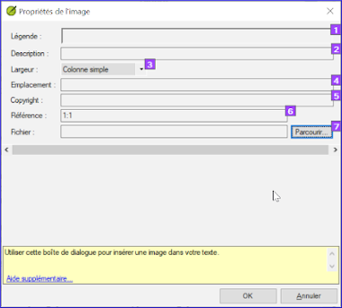

**​Introduction**  
Ce module traite la variété de tâches qu'on doit faire pour finaliser le texte pour la publication.

**Qu’est-ce que vous allez faire ?**  
-  Ajouter des **images** et légendes
-  Trouver les noms des villes pour les cartes
-  Ajouter l’introduction au NT / Bible
-  Vérifier les passages parallèles
-  Vérifier que tous les contrôles sont complets
-  Vérification finale des noms propres
-  Vérifier les chiffres, l’argent, les poids et les mesures
-  Vérification du de la mise en forme.

## 24.1 Choisir les illustrations et légendes

Il y a plus de 2800 images disponibles, il peut donc être difficile de choisir les illustrations. Heureusement, il est désormais possible de rechercher des images par référence de chapitre et par mots-clés en français. Notez que toute illustration que vous insérez dans Paratext augmentera la taille de votre projet. N'ajoutez que ces petits fichiers jpg (ou alternativement juste le nom du fichier). Au moment de la composition elles seront remplacées par des images plus grandes en haute résolution.

### Créer un dossier d'images à rechercher

Premier fois:

1.  Ouvrez le lien https://tiny.cc/sampleimages sur l’Internet
1.  Cliquez-droit sur le dossier **Illustrations - Français**,
1.  Sélectionnez **Télécharger**  
     -  *Il va télécharger environ 121Mo*
1.  Recherchez et ouvrez le **fichier .zip** téléchargé
1.  Extrayez l’unique dossier dans l’archive: **Illustrations - Français** et mettre-le dans votre dossier **Images** (PIctures)  
     -  *(Windows commence à indexer les contenus des images…)*

### Tester différentes recherches

Lorsque vos images sont indexées, vous pouvez tester différentes recherches.

1.  Ouvrez ce nouveau dossier dans l’**Explorateur de fichiers**  
      
1.  Tapez dans le champs de recherche:
1.  **Un mot de recherche**, comme croix, brebis, maison, etc.
1.  **Une référence biblique**, comme MAT27, ACT03, etc. (utilisant au moins 2 chiffres pour le chapitre).
1.  Ajouter **black** ou **-color** pour afficher seulement les images noir et blanc.

## 24.2 Ajouter des illustrations et légendes

1.  Dans votre projet, accédez au verset désiré.
1.  Du menu **Insérer**, choisissez **Image**  
      
1.  Saisissez une **légende** pour être imprimé avec l’image (en votre langue).[1]
1.  Saisissez une **description** en français de l’image (ce pas être imprimé) [2].
1.  Indiquez si l’image doit remplir la largeur d’une colonne ou d’une page. [3]
1.  S'il y a lieu, tapez une plage de vers comme emplacement acceptable. [\*] [Facultatif]
1.  Entrez les informations de droits d’auteur (copyright) nécessaires sur l’image [4]
1.  Paratext va remplir la référence de chapitre et verset qui concerne l’image. [5]

### Parcourir pour rechercher le fichier de l'image

1.  Cliquez sur **Parcourir**… pour rechercher le fichier de l’image. [7]  
     -  *Une boîte de dialogue s'affiche*  
      
1.  Dans le dialogue, sélectionnez à gauche le dossier **Images \> Illustrations - Français**
1.  Cliquez dans le champ de **Rechercher** (en haut, à droite) et tapez pour filtrer les images (comme ci-dessus)
1.  Cliquez sur l’image souhaitée et cliquez sur le bouton **Ouvrir**.
1.  Cliquez sur **OK**.

:::tip
Pour faciliter la recherche, double-cliquez sur la barre de titre pour **agrandir la fenêtre**, **affichez** les très grandes icônes et **masquer le volet de visualisation**.
:::

## 24.3 Trouver les noms des villes pour les cartes

:::info
La liste des noms des villes (CombinedNTMapBiblicalTerms.xml) n'est pas encore disponible dans Paratext 9. Le fichier peut être [**télécharger ici**](pathname:///img/CombinedNTMapBiblicalTerms.xml) et, une fois téléchargé, le fichier doit être copier vers "My Paratext 9 Projects".
:::

1.  Cliquez dans votre projet.
1.  **≡ Onglet**, sous **Outils** \> **Termes bibliques**
1.  **≡ Onglet**, sous **Termes bibliques** \> **Sélectionner liste de termes**
1.  Double-cliquez sur **CombinedNTMapsBiblical Terms**
1.  Ajouter les équivalents comme normaux.
1.  **≡ Onglet**, sous **Termes bibliques** \> **Enregistrer au format HTML**
1.  Tapez un nom pour le fichier.
1.  Cliquez sur **Save/Enregistrer**.

## 24.4 Ajouter l’introduction au NT/Bible

1.  Accédez au livre **INT**
1.  Vérifiez qu'il y a un ligne \\h
1.  Entrez votre introduction en utilisant au moins les marqueurs suivant :  
    \\mt1  
    \\is  
    \\ip  
1.  Tapez l’introduction du Bible dans le livre **INT**

## 24.5 Vérifier les textes parallèles

-  Voir module [PP Comparer les textes parallèles](./23.PP.md)

## 24.6 Vérifier que tous les contrôles soient complets

### Livre actuel

1.  Ouvre le plan du projet.
1.  Vérifiez qu’il n’y a plus de problèmes pour les vérifications.

### Plusieurs livres

1.  Refaites les inventaires.
1.  **≡ Onglet**, sous **Outils** \> **Effectuer les vérifications de base**
1.  Cochez toutes les vérifications.
1.  Sélectionnez tous les livres à publier.
1.  Cliquez sur **OK**.
1.  Corrigez toutes les erreurs.

### Vérifications du liste de mots

A partir de la liste de mots, effectuez les vérifications suivantes

1.  **≡ Onglet**, sous **Outils** \> **Vérifier l’orthographe** \> **Toutes les vérifications**
1.  **≡ Onglet**, sous **Outils** \> **Rechercher les mots semblables**
1.  **≡ Onglet**, sous **Outils** \> **Rechercher des mots mal liés ou mal divisés**

## 24.7 Vérification finale des noms propres

1.  **≡ Onglet**, sous **Outils** \> **Termes bibliques**
1.  **≡ Onglet**, sous **Termes bibliques** \> **Sélectionner la liste des termes bibliques** et choisissez **Termes bibliques principaux**
1.  Faites un filtre de noms propres avec les équivalents manquants
1.  Vérifier que tous les noms ont un équivalent (ajoutez si nécessaire).

## 24.8 Les chiffres, l’argent, les poids et les mesures

1.  Cliquez dans votre projet.
1.  **≡ Onglet**, sous **Outils** \> **Termes bibliques**
1.  **≡ Onglet**, sous **Termes bibliques** \> **Sélectionner la liste des termes bibliques**
1.  Choisissez la liste approprié.
1.  Ajouter les équivalents comme normaux.

## 24.9 Vérification du mise en forme

1.  Refaites le module [**13. VM : Vérification de mise en page**](././../03-Stage-2/13.FC.md).
1.  **≡ Onglet**, sous **Outils** \> **Listes de vérifications** \> **Versets longs/Versets courts**
1.  **≡ Onglet**, sous **Outils** \> **Listes de vérifications** \> **Mots ou expression**
1.  **≡ Onglet**, sous **Outils** \> **Listes de vérifications** \> **En-têtes de section**
1.  **≡ Onglet**, sous **Outils** \> **Listes de vérifications** \> **Titres de livres**
1.  **≡ Onglet**, sous **Outils** \> **Listes de vérifications** \> **Références**
1.  **≡ Onglet**, sous **Outils** \> **Listes de vérifications** \> **Notes de bas de pages**
