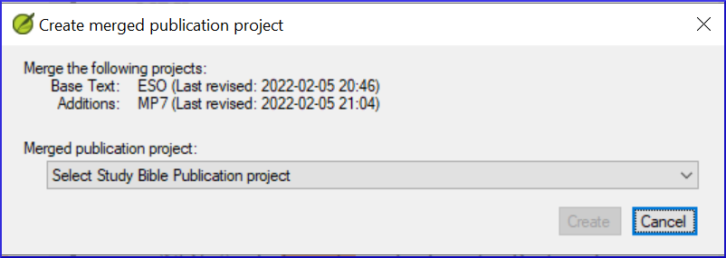

---
lang: fr
title:  25. Création d'une Bible d'étude 
---
**Introduction**  
Avec Paratext 9.2 (et plus), vous pouvez créer une Bible d'étude basée sur votre traduction en ajoutant des paragraphes d'introduction, des encadrés, des notes de bas de page détaillées et des renvois supplémentaires pour aider votre utilisateur à avoir une compréhension plus approfondie du texte biblique. 

**Avant de commencer**  
Avant de pouvoir créer une Bible d'étude, vous devrez traduire et vérifier votre Nouveau Testament (ou ses parties). Ensuite, votre administrateur peut créer un nouveau projet (voir ci-dessous).

**Pourquoi est-ce important?**  
Les informations de la Bible d'étude sont créées dans un projet séparé avec des liens vers le texte traduit. Si le texte traduit change, le lien peut être rompu. Les liens peuvent être corrigés, mais le problème est moins susceptible de se poser si le texte est stable.

**Que ferez-vous?**  
Vous (ou votre administrateur) allez créer un projet **Annexes de la Bible d'étude**. Comme son nom l'indique, c'est là que vous pouvez ajouter les matériaux d'étude (sans affecter votre traduction).

Ce projet séparé contient une copie en lecture seule de votre projet et de votre texte supplémentaire. Lorsque vous êtes prêt, vous pouvez fusionner le projet Study Bible Additions avec votre projet de traduction en un troisième projet.

- Créez un nouveau projet d'ajouts à la Bible d'étude basé sur votre traduction.
- Enregistrez le nouveau projet
- Ajoutez le matériel supplémentaire (introductions, barres latérales, notes de bas de page et renvois).
- Masquez tout texte non biblique dans la traduction de base (par exemple, les titres).
- Fusionnez les projets pour créer un projet de publication.

## 25.1 Créer un projet de type Annexes de la Bible d'étude

1. Utilisez le menu Paratext pour créer un nouveau projet.
1. Définissez le type de projet comme Annexe de la Bible d'étude (Study Bible Additions).
1. Choisissez votre projet de traduction pour le projet "basé sur".
1. Vous devrez enregistrer le nouveau projet.  
   -  *Une copie grise en lecture seule de votre projet est affichée, avec une barre d'outils en haut.  
    

### Ajouter le matériel supplémentaire

### Matériel d'introduction

1. Déplacez votre curseur à l'endroit où vous souhaitez ajouter le matériel supplémentaire.
1. Cliquez sur **Ajouter +** dans la barre d'outils.
1. Une boîte bleue avec une marqueur \\ip est ajoutée.
1. Tapez le texte.

### Texte de l'encadré

1. Placez votre curseur à l'endroit où vous souhaitez ajouter du matériel.
1. cliquez sur **\esb** dans la barre d'outils
1. Un panneau latéral s'ouvre avec un marqueur \\ms ajouté.
1. Tapez le titre après le marqueur \{\ms}.
1. Appuyez sur la touche Entrée
1. Choisissez un marqueur pour le texte suivant.
1. Tapez le texte.
1. Continuez si nécessaire.

### Renvoi étendu

1. Positionnez votre curseur à l'endroit où vous souhaitez que l'appel de la renvoi
1. cliquez sur **\\ex** dans la barre d'outils
1. Un panneau de notes de bas de page s'ouvre avec un marqueur de renvoi ajouté.
1. Tapez la renvoi.

### Note de bas de page étendue

1. Positionnez votre curseur à l'endroit où vous souhaitez ajouter la note de bas de page supplémentaire
1. cliquez sur **\ef** dans la barre d'outils
1. Un panneau de notes de bas de page s'ouvre avec les marqueurs \\ef appropriés.
1. Ajoutez des notes de bas de page selon vos besoins.

### Masquer le matériel non scripturaire

Vous pouvez masquer les éléments non scripturaires, tels que les titres, dans la traduction.

1. Positionnez votre curseur à l'endroit où vous souhaitez ajouter une note de bas de page.
1. Cliquez sur **Masquer** dans la barre d'outils
1. Le texte s'affiche dans une zone grisée.

## 25.2 Comparer les versions
La nouvelle fonctionnalité la plus évidente est la possibilité de **comparer les versions**.

1. Ouvrez un projet Annexes de la Bible d'étude
1. Dans le menu **Projet**, 
1. Sous **Projet**, choisissez **Comparer les versions**  
    -  *Les changements dans les annexes sont affichés*.

## 25.3 Fusionnez les projets pour créer un projet de publication

Pour publier la Bible d'étude, vous devez créer un projet de publication.

1. Cliquez sur le menu Projet
1. Choisissez "Créer un projet de publication fusionné".  
    
1. Cliquez sur la liste déroulante "Projet de publication fusionné".
1. Créez un nouveau projet ou choisissez un projet précédent
1. Cliquez sur **Créer**  
     -  *Paratext fusionne le projet de traduction et le projet d'ajouts d'études bibliques et affiche le projet de publication fusionné.*
1. Si nécessaire, changez l'affichage en Aperçu.

## 25.4 Effectuer des modifications

Vous avez maintenant trois projets.

1. Votre projet de traduction original,
1. Le projet d'annexes de la Bible d'étude et
1. Le projet de publication fusionnée.
     -  *Le projet de publication fusionné est en lecture seule et ne peut pas être modifié*.

:::caution
- Toute **correction de la traduction** doit être apportée au **projet de traduction** original. Ces corrections seront mises à jour dans le projet Annexes de la Bible d'étude bibliques lors de la prochaine recréation du projet de publication fusionné.
- Toute **correction apportée au matériel d'étude biblique** doit être effectuée dans le **projet Annexes** de la Bible d'étude.
- Pour mettre à jour les modifications, **créez à nouveau** le projet de **publication fusionné**.
:::

## 25.5 Imprimer la Bible d'étude avec PTXPrint

PTXPrint version 2.1.x (et supérieure) peut imprimer le projet de publication fusionné. 
Pour des instructions détaillées, voir **<https://software.sil.org/ptxprint/how-to-study-bible-layout/>**
