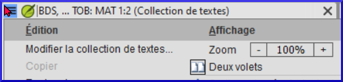
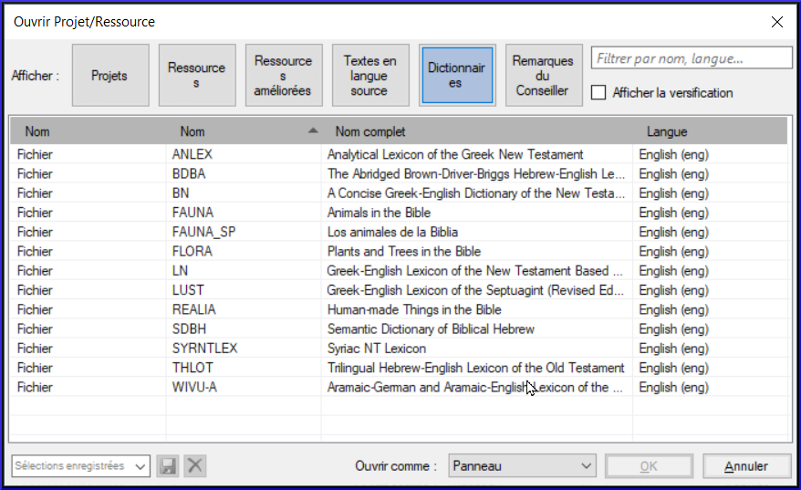

**Introduction** Vous désirez travailler sur votre texte en Paratext 9 et consulter les ressources diverses. Dans ce module, vous allez apprendre comment ouvrir des ressources et organiser votre bureau.

**Où en sommes-nous dans le processus ? **Nous nous préparez à saisir du texte dans un projet existant. Avant de pouvoir faire ceci, Paratext 9 et les ressources diverses doivent avoir été installés et un projet pour vos données doit avoir été créé.

**Pourquoi est-il important ? **Le traducteur qui organise bien son bureau a toutes les ressources nécessaires pour son travail.

**Qu’est-ce qu’on va faire ?** On va lancer le logiciel Paratext 9, puis ouvrir une disposition des fenêtres qui est déjà enregistrée. Si nécessaire vous pouvez modifier la disposition des fenêtres et réenregistrer la disposition.

:::info Vidéos

Un certain nombre de vidéos sont disponibles pour vous aider à utiliser les différents types de ressources et à disposer les fenêtres. Voici quelques suggestions. Cliquez sur le lien pour voir la vidéo.

[**0.2.1b**](https://vimeo.com/368328862) Les bases des projets et des ressources https://vimeo.com/411837591)

[**0.2.1d**](https://vimeo.com/368328956) Arranger les fenêtres https://vimeo.com/412695128

[**0.2.2a**](https://vimeo.com/419872321) Comment ouvrir et modifier une collection de textes

[**0.2.3a**](https://vimeo.com/424066973) Comment contrôler les fenêtres qui défilent ensemble

[**0.2.3c**](https://vimeo.com/377612971) Comment éxchanger un texte dans une fenêtre https://vimeo.com/433948282

[**0.2.3d**](https://vimeo.com/419314037) Autres astuces sur la disposition des fenêtres

:::

### **Changements dans Paratext 9** {#ed3427390c2b484f8c1343a8944fe332}

Les menus ont été modifiés dans Paratext 9.0. Pour afficher le menu, vous devez maintenant cliquer sur l'icône du menu ≡. Il existe deux types de menus.

Le menu principal de Paratext se trouve dans la barre de titre. Chaque fenêtre (ou onglet) possède son propre menu.

Lorsque vous cliquez sur l'une de ces icônes de menu, tous les menus sont affichés et il vous suffit de cliquer sur la commande.

:::tip

Dans ce manuel, lorsqu'il est indiqué **≡ Paratext**, sous **Menu** \&gt; **Commande** (par exemple **≡ Paratext**, sous **Paratext** \&gt; **Ouvrir**). Cela signifie qu'il faut cliquer sur l'icône du menu Paratext ≡, puis sous le menu (par exemple Paratext) choisir la commande (par exemple Ouvrir).

Et quand il est dit **≡ Onglet**, sous **Menu** &gt; **Commande** cela signifie qu'il faut cliquer sur l'icône du menu de l'onglet, puis sous le menu (par exemple, Outils) cliquer sur la commande (par exemple, Liste de mots). L'onglet le plus courant est le menu du projet, qui peut donc se résumer à "**≡ projet** **menu**".

:::

## 2.1 Lancer le programme Paratext {#c07b16862b1d4f55821e9a5398e26435}

1. Double-cliquez sur l’icône Paratext 9 sur le bureau

    

    - **OU**
2. (Dans le menu **Démarrer**, choisissez **Paratext 9**)

## 2.2 Ouvrir une disposition de fenêtres déjà enregistrée {#d65baaea138b4d72b0dbaaadd85f23d5}

:::info Mise à jour

In 9.4 there are some improvements to manage layouts. Votre dernière disposition de fenêtres utilisée doit figurer en haut du menu.

Pour plus de détails, voir [Nouveautés de la version 9.4 - Menu principal - Gérer les dispositions de fenêtres](https://vimeo.com/857678678) (en anglais)

:::

1. Cliquez sur le menu **≡ Paratext**, puis sous le menu **Disposition de fenêtres**
2. Choisissez une disposition de fenêtres enregistrée (combinaison de textes).
    - _Votre écran doit ressembler à l’image ci-dessous (sinon, voir ci-dessous pour comment ouvrir les fenêtres)._

        

## 2.3 Créer une nouvelle disposition {#71e308de0d1f4c71b54acfb4d760fae8}

Si vous n’avez pas encore enregistré une disposition de fenêtres, on vous suggère de faire comme ci-dessous:

### **Ouvrir et arranger les fenêtres** {#f5f12c7b122148ca9b9b4edd7c7eb807}

- 1 = ressources en collection de textes
    - **≡ Paratext** menu, sous **Paratext** choisissez**Ouvrir une collection de texte**, Sélectionnez plusieurs ressources en utilisant la touche Ctrl lorsque vous cliquez sur la ressource. Cliquez sur le **bouton flèche droite**, cliquez **OK**. Voir [2.5](/2.OD#204f93f95d7e4da7aa004d8b2aefaa86))
- 2 =Votre projet
    - **≡ Paratext** menu sous **Paratext** > **Ouvrir**
- 5 = équivalents
    - **≡ Onglet** menu, sous Outils> **Équivalents des termes bibliques**
- 3 = texte source
    - **≡ Paratext** menu, sous**Paratext** > **Ouvrir > Textes en langue source**
- 4 = Ressource Enrichie
    - **≡ Paratext** menu, sous **Paratext** > **Ouvrir > Ressources enrichies**
- Arrangez les fenêtres comme vous le souhaitez. Voir les vidéos Paratext 0.2.1b, 0.2.1c, and 0.2.3d.

:::info Mise à jour

**≡ Paratext**, sous **Dispostion des fenêtres** \> **Enregistrer la disposition des fenêtres actuelle**

:::

:::tip

N'oubliez pas d'enregistrer votre disposition des fenêtres !

:::

### Enregistrer la disposition des fenêtres {#d4ebb0ef8d0f49998351a50a09b5942b}

Après avoir arrangé les fenêtres comme vous le souhaitez

1. **≡ Paratext**, sous **Disposition de fenêtres** &gt; **Enregistrer la disposition de fenêtres actuelle**
2. Tapez un nouveau nom
3. OU pour remplacer une disposition existante,
    1. Cliquez sur le menu déroulant à droite
    2. Choisissez le nom de la disposition enregistrée.
4. **≡ Onglet**, **Modifier la collection de textes**  

## 2.4 Supprimer une disposition des fenêtres {#75e26e8bdc3345529b5b3fc702f4c748}

Si vous souhaitez supprimer une disposition enregistrée,

1. **≡ Paratext** menu, sous**Disposition de fenêtres** &gt; **Supprimer la disposition de fenêtres enregistrée**
2. Cliquez sur le menu déroulant à droite
3. Choisissez le nom de la disposition enregistrée.
4. Cliquez sur **Supprimer**

## 2.5 Ouvrir Projet/Ressource en collection de textes {#204f93f95d7e4da7aa004d8b2aefaa86}

:::info 9.4 Mise à jour

Dans la version 9.4, Paratext peut vous informer des mises à jour de vos ressources.

1. Dans la boîte de dialogue **Télécharger/Installer ressources**, sous la liste des ressources
2. Cliquez sur la liste déroulante à côté de "**Vérifier les mises à jour des ressources**"
3. Choisir la fréquence des vérifications
    - _Si une ressource a été modifiée, un point vert apparaît sur l'icône du menu Paratext._

Pour plus de détails, consultez le site [Quoi de neuf - Menu principal](https://vimeo.com/857678678).

:::

Avec Paratext, il est possible d’avoir plusieurs projets/ressources ouverts au même moment. Mais au lieu d’avoir trop de fenêtres, il vaut mieux ouvrir plusieurs ressources dans une seule fenêtre en collection de textes.

1. Cliquez sur la liste déroulante à côté de "**Vérifier les mises à jour du projet**"

2. Choisir la fréquence des vérifications
:::  

:::info Mise à jour

Dans Paratext 9.3, la collection de textes peut également être ouverte directement à partir du menu **≡ Paratext**

:::

:::info 9.4 Upgrade
In 9.4, Paratext can notify you when there are updates to any of your resources.

1. Dans la boîte de dialogue **Télécharger/Installer ressources**, sous la liste des ressources
2. Cliquez sur la liste déroulante à côté de "**Vérifier les mises à jour des ressources**"
3. Choisir la fréquence des vérifications
    - _If a resource has changed, a green dot is shown on the Paratext menu icon._ For more details watch [What's new main menu](https://vimeo.com/857678678).

:::

### Nouvelle méthode - Ouvrir directement à partir du menu Paratext {#72a473aaf424486aaa027854c81aa784}

1. **≡ Paratext** menu, sous **Paratext** &gt; **Ouvrir une collection de textes**
2. Sélectionnez plusieurs ressources en utilisant la touche Ctrl lorsque vous cliquez sur la ressource.
3. Cliquez sur le bouton **flèche droite**.
    - _Les ressources sont répertoriées dans la colonne sélectionné_.
4. Répétez l'opération si nécessaire.
5. Utilisez les flèches haut et bas pour les réorganiser si nécessaire.

Enregistrer la collection

1. Cliquez dans la zone de texte située dans le coin inférieur gauche.
2. Saisissez un nom pour la collection enregistrée et cliquez sur l'icône d'enregistrement.
3. Cliquez sur **OK**.
    - *La collection de texte s'affiche*.

### Méthode précédente - Dialogue d'ouvrir {#4ce29225a23d4f53998f378f3d1f993f}

1. **≡ Paratext** menu, sous **Paratext** &gt; **Ouvrir**
2. Cliquez sur le bouton ressources (en haut).
3. Sélectionnez plusieurs ressources en utilisant la touche Ctrl lorsque vous cliquez sur la ressource.
4. Répétez l'opération si nécessaire.
5. Cliquez sur la liste déroulante **Ouvrir en tant que**.
6. Choisissez **Panneau de collection de textes**
7. **≡ Onglet**, **Modifier la collection de textes**  

:::tip

Il est suggéré que les ressources soient présentées dans l’ordre de la plus littérale à la moins littérale (pour mettre l’accent sur les textes les plus fidèles aux textes sources). Parmi les ressources en anglais : ESV, RSV, NIV, NLT. Pour les ressources en français, l’ordre suivant est suggéré : TOB, NVSR78Col, NBS, BDS, FC97, PDV11.

:::

Il existe plusieurs façons de modifier l'ordre des textes dans la collection

1. **≡ Onglet**, **Modifier la collection de textes**

**Dans la boîte de dialogue Sélection de textes**

1. Use the arrow buttons to change the order as necessary

2. Effectuer d'autres modifications

3. 1. Cliquez sur **OK**

:::tip

Vous pouvez changer le texte dans le deuxième volet en cliquant sur le lien bleu de l'abréviation du texte. Vous pouvez également utiliser le menu **≡ Onglet** sous **Affichage** pour changer l'Affichage (aperçu, non formaté ou standard).

:::

## 2.6 Ouvrir une ressource enrichie {#ddb656b63852444cbe84a309b3bb9923}

1. **≡ Menu Paratext**, sous **Paratext** > **Ouvrir**

2. Cliquez sur **Ressources enrichies**

:::tip

 Les ressources enrichies contiennent également un dictionnaire, des images, des cartes, **des vidéos**, etc. Lorsque vous ouvrez une ressource enrichie, un guide s'ouvre également.

:::

:::info Mise à jour 9.4

Dans la version 9.4, Paratext peut vous avertir lorsqu'une ressource a été mise à jour.

:::

## 2.7 Ouvrir un dictionnaire {#7ea1b54db25c492c832d9d92995b4030}

:::tip

Si vous n'utilisez pas de ressource enrichie, vous pouvez ouvrir un dictionnaire de langue source avec des gloses en français :

:::

1. **≡ Menu Paratext**, sous **Paratext** > **Ouvrir**

2. Cliquez sur **Dictionnaires**

3. Choisir "A Concise Greek-English Dictionary of the New Testament" OU "Trilingual Hebrew-English Lexicon of the Old Testament"

4. Cliquez sur **OK**.

5. 1. **Affichage** > choisir une langue (p. ex. **French**)

:::tip

 Il est utile de déplacer les fenêtres du dictionnaire vers masquer automatiquement, (clic droit sur le nom de l'onglet, choisir déplacer vers masquer automatiquement).

:::

D'autre dictionnaires (en anglais, mais avec des photos)

- Les plantes et les arbres de la Bible (angl. « Plants and Trees in the Bible »)
- Les animaux de la Bible (angl. « Animals in the Bible »)

## 2.8 Travailler avec le text en langue source {#9fe3171ca9784daf8bc9ff0681bcaa59}

Vous pouvez ouvrir le texte en langue source avec des gloses dans une autre langue que l'anglais, par exemple Gloss FR.

1. **≡ Menu Paratext**, sous **Paratext** > **Ouvrir**

2. Cliquez sur **Textes en langue source**

3. Choisir HEB/GRK

4. 1. Cliquez sur **OK.**

Si vous avez téléchargé la ressource spéciale (de gloses), vous pouvez la charger comme suit

1. **≡ Onglet** sous **Affichage** &gt; **Gloses supplémentaires**
2. Choisissez le projet avec les gloses (GlossFR)
3. Cliquez sur **OK.**
