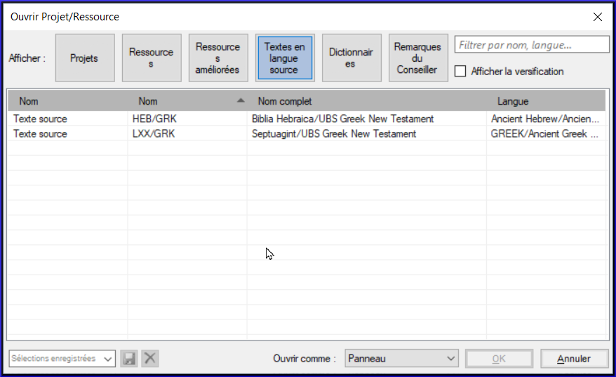

**Introduction** Vous désirez travailler sur votre texte en Paratext 9 et consulter les ressources diverses. Dans ce module, vous allez apprendre comment ouvrir des ressources et organiser votre bureau.

**Où en sommes-nous dans le processus ? **Nous nous préparez à saisir du texte dans un projet existant. Avant de pouvoir faire ceci, Paratext 9 et les ressources diverses doivent avoir été installés et un projet pour vos données doit avoir été créé.

**Pourquoi est-il important ? **Le traducteur qui organise bien son bureau a toutes les ressources nécessaires pour son travail.

**Qu’est-ce qu’on va faire ?** On va lancer le logiciel Paratext 9, puis ouvrir une disposition des fenêtres qui est déjà enregistrée. Si nécessaire vous pouvez modifier la disposition des fenêtres et réenregistrer la disposition.

:::info Vidéos

Un certain nombre de vidéos sont disponibles pour vous aider à utiliser les différents types de ressources et à disposer les fenêtres. Quelques suggestions sont données ci-dessous. Cliquez sur le lien pour voir la vidéo.

[https://vimeo.com/368328862](https://vimeo.com/368328862)

  
 
  
  

    

[https://vimeo.com/368328956](https://vimeo.com/368328956)

    
    

    

  

  
  

[https://vimeo.com/377612892](https://vimeo.com/377612892)

    
    

      
 
      
      

        

[https://vimeo.com/382483908](https://vimeo.com/382483908)

        
        

        

      

      
      

[https://vimeo.com/377612971](https://vimeo.com/377612971)

        
        

          
 
          
          

            

[https://vimeo.com/377613013](https://vimeo.com/377613013)

            
            

            

          

          
          

:::
          

<h3 id="ed3427390c2b484f8c1343a8944fe332" spaces-before="0">
  <strong x-id="1">Changements dans Paratext 9</strong>
</h3>

  Les menus ont été modifiés dans Paratext 9.0. Pour afficher le menu, vous devez maintenant cliquer sur l'icône du menu ≡. Il existe deux types de menus.

Le menu principal de Paratext se trouve dans la barre de titre. Chaque fenêtre (ou onglet) possède son propre menu.

  
  

    
 
    
    

      

      
      

      

    

    
    

      Lorsque vous cliquez sur l'une de ces icônes de menu, tous les menus sont affichés et il vous suffit de cliquer sur la commande.
    

    
    

      :::astuce
    

    
    

      In this manual, when it says <strong x-id="1">≡ Paratext</strong>, under <strong x-id="1">Menu</strong> &gt; <strong x-id="1">Command</strong> (e.g. Cela signifie qu'il faut cliquer sur l'icône du menu Paratext ≡, puis sous le menu (par exemple Paratext) choisir la commande (par exemple Ouvrir).
    

    
    

      And when it says <strong x-id="1">≡ Tab</strong>, under <strong x-id="1">Menu</strong> &gt; <strong x-id="1">Command</strong> it means click on the tab menu icon, then under the menu (e.g. Tools) click on the command (e.g. Wordlist). The most common Tab is the project menu so it may just say ”<strong x-id="1">≡ project</strong> <strong x-id="1">menu</strong>”.
    

    
    

:::
    

<h2 id="c07b16862b1d4f55821e9a5398e26435" spaces-before="0">
  2.1 Lancer le programme Paratext
</h2>

<ol start="1">
  <li>
    

      Double-cliquez sur l’icône Paratext 9 sur le bureau
    

    

      
    

  </li>
</ol>

<ul>
  <li>
    <strong x-id="1">OU</strong> <ol start="1">
      <li>
        (Dans le menu <strong x-id="1">Démarrer</strong>, choisissez <strong x-id="1">Paratext 9<0>)</li> </ol></li> </ul>

<h2 id="d65baaea138b4d72b0dbaaadd85f23d5" spaces-before="0">
  2.2 Ouvrir une disposition de fenêtres déjà enregistrée
</h2>

<ol start="1">
  <li>
    <strong x-id="1">≡ Onglet</strong>, <strong x-id="1">Modifier la collection de textes</strong>
  </li>
  
  <li>
    

      Choisissez une disposition de fenêtres enregistrée (combinaison de textes).
    

    <ul>
      <li>
        

          <em x-id="4">Votre écran doit ressembler à l’image ci-dessous (sinon, voir ci-dessous pour comment ouvrir les fenêtres).</em>
        

        

          
        

      </li>
    </ul>
  </li>
</ol>

<h2 id="71e308de0d1f4c71b54acfb4d760fae8" spaces-before="0">
  2.3 Créer une nouvelle disposition
</h2>

  Si vous n’avez pas encore enregistré une disposition de fenêtres, on vous suggère de faire comme ci-dessous:

<h3 id="f5f12c7b122148ca9b9b4edd7c7eb807" spaces-before="0">
  <strong x-id="1">Ouvrir et arranger les fenêtres</strong>
</h3>

<ul>
  <li>
    1 = ressources en collection de textes <ul>
      <li>
        <strong x-id="1">≡ Paratext</strong> menu, sous <strong x-id="1">Paratext</strong> choisissez<strong x-id="1">Ouvrir une collection de texte</strong>, Sélectionnez plusieurs ressources en utilisant la touche Ctrl lorsque vous cliquez sur la ressource. Cliquez sur le <strong x-id="1">bouton flèche droite</strong>, cliquez <strong x-id="1">OK</strong>. See <a href="/2.OD#204f93f95d7e4da7aa004d8b2aefaa86">2.5</a>)
      </li>
    </ul>
  </li>
  <li>
    2 =Your project <ul>
      <li>
        <strong x-id="1">≡ Paratext</strong> menu under <strong x-id="1">Paratext</strong> > <strong x-id="1">Open</strong>, Projects
      </li>
    </ul>
  </li>
  <li>
    5 = équivalents <ul>
      <li>
        <strong x-id="1">≡ Tab</strong> menu, under Tools > <strong x-id="1">Biblical Terms renderings</strong>
      </li>
    </ul>
  </li>
  <li>
    3 = texte source <ul>
      <li>
        <strong x-id="1">≡ Paratext</strong> menu, under <strong x-id="1">Paratext</strong> > <strong x-id="1">Open > Source language text</strong>
      </li>
    </ul>
  </li>
  <li>
    4 = Ressource Enrichie <ul>
      <li>
        <strong x-id="1">≡ Paratext</strong> menu, under <strong x-id="1">Paratext</strong> > <strong x-id="1">Open > Enhanced resources</strong>
      </li>
    </ul>
  </li>
  <li>
    Arrangez les fenêtres comme vous le souhaitez. See Paratext videos 0.2.1b, 0.2.1c, and 0.2.3d.
  </li>
</ul>

  :::info Upgrade

  <strong x-id="1">≡ Paratext</strong>, sous <strong x-id="1">Dispostion des fenêtres</strong> \> <strong x-id="1">Enregistrer la disposition des fenêtres actuelle</strong>

:::

  :::astuce

  N'oubliez pas d'enregistrer votre disposition des fenêtres !

:::

<h3 id="d4ebb0ef8d0f49998351a50a09b5942b" spaces-before="0">
  Enregistrer la disposition des fenêtres
</h3>

  Après avoir arrangé les fenêtres comme vous le souhaitez

<ol start="1">
  <li>
    <strong x-id="1">≡ Paratext</strong>, under <strong x-id="1">Layout</strong> &gt; <strong x-id="1">Save current layout</strong>
  </li>
  
  <li>
    Tapez un nouveau nom
  </li>
  
  <li>
    OR to replace an existing layout, <ol start="1">
      <li>
        Click the dropdown to the right
      </li>
      
      <li>
        Choisissez le nom de la disposition enregistrée.
      </li>
    </ol>
  </li>
  
  <li>
    <strong x-id="1">≡ Onglet</strong>, <strong x-id="1">Modifier la collection de textes</strong>  
  </li>
</ol>

<h2 id="75e26e8bdc3345529b5b3fc702f4c748" spaces-before="0">
  2.4 Supprimer une disposition des fenêtres
</h2>

  Si vous souhaitez supprimer une disposition enregistrée,

<ol start="1">
  <li>
    <strong x-id="1">≡ Paratext</strong> menu, under <strong x-id="1">Layout</strong> &gt; <strong x-id="1">Delete layout</strong>
  </li>
  
  <li>
    65ab77824a1e025fac1bf88feb6ba66f.png
  </li>
  
  <li>
    Choisissez le nom de la disposition enregistrée.
  </li>
  
  <li>
    Cliquez sur <strong x-id="1">Supprimer</strong>
  </li>
</ol>

<h2 id="204f93f95d7e4da7aa004d8b2aefaa86" spaces-before="0">
  2.5 Ouvrir Projet/Ressource en collection de textes
</h2>

  Avec Paratext, il est possible d’avoir plusieurs projets/ressources ouverts au même moment. Mais au lieu d’avoir trop de fenêtres, il vaut mieux ouvrir plusieurs ressources dans une seule fenêtre en collection de textes.

  In Paratext 9.3 the Text Collection can also be opened directly from the <strong x-id="1">≡ Paratext</strong> menu
:::

:::

<h3 id="72a473aaf424486aaa027854c81aa784" spaces-before="0">
  Nouvelle méthode - Ouvrir directement à partir du menu Paratext
</h3>

1. **≡ Paratext** menu, under **Paratext** > **Open text collection**

1. Ctrl+cliquez sur des ressources désirés

1. Click on the **Right arrow button**.

1. Répétez l'opération si nécessaire.

1. Utilisez les flèches haut et bas pour les réorganiser si nécessaire.

  
  

    
 
    
    

      

      
      

      

    

    
    

      Enregistrer la collection
    

    
    <ol start="1">
      <li>
        Cliquez dans la zone de texte située dans le coin inférieur gauche.
      </li>
      
      <li>
        Saisissez un nom pour la collection enregistrée et cliquez sur l'icône d'enregistrement.
      </li>
      
      <li>
        Cliquez sur <strong x-id="1">OK</strong>. <ul>
          <li>
            <em x-id="3">La collection de texte s'affiche</em>.
          </li>
        </ul>
      </li>
    </ol>

<h3 id="4ce29225a23d4f53998f378f3d1f993f" spaces-before="0">
  Méthode précédente - Dialogue d'ouvrir
</h3>

1. **≡ Paratext** menu, under **Paratext** > **Open**

1. Cliquez sur le bouton ressources

1.

1. Ctrl+cliquez sur des ressources désirés

1. Répétez l'opération si nécessaire.

1. Click on the **Open as** dropdown list.

1. Choose **Text collection panel**

1. Click **OK**

  
  

    
 
    
    

      

      
      

      

    

    
    

      :::astuce
    

    
    

      Il est suggéré que les ressources soient présentées dans l’ordre de la plus littérale à la moins littérale (pour mettre l’accent sur les textes les plus fidèles aux textes sources). Parmi les ressources en anglais : ESV, RSV, NIV, NLT. Pour les ressources en français, l’ordre suivant est suggéré : TOB, NVSR78Col, NBS, BDS, FC97, PDV11.
    

    
    

:::
    

    
    

      Il existe plusieurs façons de modifier l'ordre des textes dans la collection
    

    
    

1. **≡ Tab**, **Modify text collection**

      
      

        
 
        
        

          

          
          

          

        

        
        

**From the Select Texts dialog**

1. Use the arrow buttons to change the order as necessary

2. Make any other changes

3. Click **OK**

          
          

            
 
            
            

              

              
              

              

            

            
            

              :::astuce
            

            
            

              You can change the text in the second pane by clicking on the blue link of the abbreviation for the text. You can also use the <strong x-id="1">≡ Tab</strong> under V<strong x-id="1">iew</strong> menu to change the view (preview, unformatted or standard).
            

            
            

:::
            

<h2 id="ddb656b63852444cbe84a309b3bb9923" spaces-before="0">
  2.6 Ouvrir une ressource enrichie
</h2>

1. **≡ Paratext** menu, under **Paratext** > **Open**

1. Click on **Enhanced Resources**

  
  

    
 
    
    

      

      
      

      

    

    
    

      :::astuce
    

    
    

      Lorsque vous ouvrez une ressource enrichie, un guide s'ouvre également. :::tip Lorsque vous ouvrez une ressource enrichie, un guide s'ouvre également.
    

    
    

:::
    

<h2 id="7ea1b54db25c492c832d9d92995b4030" spaces-before="0">
  2.7 Ouvrir un dictionnaire
</h2>

  :::astuce

  Si vous n'utilisez pas de ressource enrichie, vous pouvez ouvrir un dictionnaire de langue source avec des gloses en français :

:::

1. **≡ Paratext** menu, under **Paratext** > **Open**

1. Click **Dictionaries**

1. Choose “A Concise Greek-English Dictionary of the New Testament” OR “Trilingual Hebrew-English Lexicon of the Old Testament”

1. Click **OK**

1. **View** > choose a language (e.g. **French**)

  
  

    
 
    
    

      

      
      

      

    

    
    

      :::astuce
    

    
    

      Il est utile de déplacer les fenêtres du dictionnaire vers masquer automatiquement, (clic droit sur le nom de l'onglet, choisir déplacer vers masquer automatiquement).
    

    
    

:::
    

    
    

      D'autre dictionnaires (en anglais, mais avec des photos)
    

    
    <ul>
      <li>
        "Plants and Trees in the Bible"
      </li>
      <li>
        "Animals in the Bible"
      </li>
    </ul>

<h2 id="9fe3171ca9784daf8bc9ff0681bcaa59" spaces-before="0">
  2.8 Travailler avec le text en langue source
</h2>

  You can open the source language text with glosses in an alternative language than English, e.g. Gloss FR.

1. **≡ Paratext**, under **Paratext** > **Open**

1. Click **Source Language Texts**

1. Choose HEB/GRK

1. Click **OK.**

  
  

    
 
    
    

      

      
      

      

    

    
    

      If you have downloaded the special gloss resource, you can load them as follows
    

    
    <ol start="1">
      <li>
        <strong x-id="1">≡ Tab</strong> under <strong x-id="1">View</strong> &gt; <strong x-id="1">Additional glosses</strong>
      </li>
      
      <li>
        Choose the specific resource that has the glosses (e.g. GlossFR)
      </li>
      
      <li>
        Cliquez sur <strong x-id="1">OK</strong>.
      </li>
    </ol>
