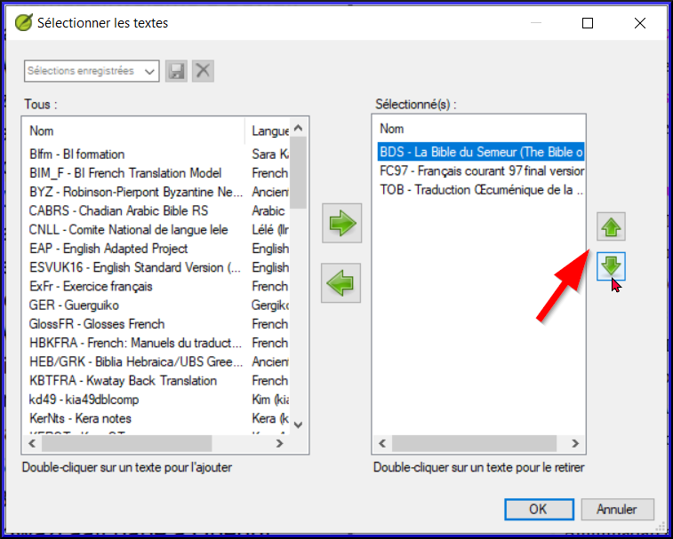

**Introduction** Vous désirez travailler sur votre texte en Paratext 9 et consulter les ressources diverses. Dans ce module, vous allez apprendre comment ouvrir des ressources et organiser votre bureau.

**Où en sommes-nous dans le processus ? **Nous nous préparez à saisir du texte dans un projet existant. Avant de pouvoir faire ceci, Paratext 9 et les ressources diverses doivent avoir été installés et un projet pour vos données doit avoir été créé.

**Pourquoi est-il important ? **Le traducteur qui organise bien son bureau a toutes les ressources nécessaires pour son travail.

**Qu’est-ce qu’on va faire ?** On va lancer le logiciel Paratext 9, puis ouvrir une disposition des fenêtres qui est déjà enregistrée. Si nécessaire vous pouvez modifier la disposition des fenêtres et réenregistrer la disposition.

:::info Vidéos

Un certain nombre de vidéos sont disponibles pour vous aider à utiliser les différents types de ressources et à disposer les fenêtres. Quelques suggestions sont données ci-dessous. Click on the link to see the video.

:::info Vidéos

[**0.2.1b**](https://vimeo.com/368328862) Basics of Projects and Resources

[**0.2.1d**](https://vimeo.com/368328956) How To Arrange Windows

[**0.2.2a**](https://vimeo.com/377612892) How To Open And Modify A Text Collection

[**0.2.3a**](https://vimeo.com/382483908) How To Control Which Windows Scroll Together

[**0.2.3c**](https://vimeo.com/377612971) How To Swap A Text In A Window

[**0.2.3d**](https://vimeo.com/377613013) Further Tips On Arranging Windows

:::

### **Changements dans Paratext 9** {#ed3427390c2b484f8c1343a8944fe332}

Les menus ont été modifiés dans Paratext 9.0. Pour afficher le menu, vous devez maintenant cliquer sur l'icône du menu ≡. Il existe deux types de menus.

Le menu principal de Paratext se trouve dans la barre de titre. Chaque fenêtre (ou onglet) possède son propre menu.

Lorsque vous cliquez sur l'une de ces icônes de menu, tous les menus sont affichés et il vous suffit de cliquer sur la commande.

:::tip

In this manual, when it says <strong x-id="1">≡ Paratext</strong>, under <strong x-id="1">Menu</strong> &gt; <strong x-id="1">Command</strong> (e.g. Cela signifie qu'il faut cliquer sur l'icône du menu Paratext ≡, puis sous le menu (par exemple Paratext) choisir la commande (par exemple Ouvrir).

And when it says <strong x-id="1">≡ Tab</strong>, under <strong x-id="1">Menu</strong> &gt; <strong x-id="1">Command</strong> it means click on the tab menu icon, then under the menu (e.g. Tools) click on the command (e.g. Wordlist). The most common Tab is the project menu so it may just say ”<strong x-id="1">≡ project</strong> <strong x-id="1">menu</strong>”.

:::

## 2.1 Lancer le programme Paratext {#c07b16862b1d4f55821e9a5398e26435}

1. Double-cliquez sur l’icône Paratext 9 sur le bureau

    

    - **OR**
1. (Dans le menu **Démarrer**, choisissez **Paratext 9**)

## 2.2 Ouvrir une disposition de fenêtres déjà enregistrée {#d65baaea138b4d72b0dbaaadd85f23d5}

1. **≡ Paratext**, sous **Dispostion des fenêtres** \> **Enregistrer la disposition des fenêtres actuelle**
1. Choisissez une disposition de fenêtres enregistrée (combinaison de textes).
    - _Votre écran doit ressembler à l’image ci-dessous (sinon, voir ci-dessous pour comment ouvrir les fenêtres)._

        

## 2.3 Créer une nouvelle disposition {#71e308de0d1f4c71b54acfb4d760fae8}

Si vous n’avez pas encore enregistré une disposition de fenêtres, on vous suggère de faire comme ci-dessous:

### **Ouvrir et arranger les fenêtres** {#f5f12c7b122148ca9b9b4edd7c7eb807}

- 1 = ressources en collection de textes
    - **≡ Paratext** menu, sous **Paratext** choisissez**Ouvrir une collection de texte**, Sélectionnez plusieurs ressources en utilisant la touche Ctrl lorsque vous cliquez sur la ressource. Cliquez sur le **bouton flèche droite**, cliquez **OK**. Voir [2.5](/2.OD#204f93f95d7e4da7aa004d8b2aefaa86))
- 2 =Votre projet
    - **≡ Paratext** menu sous **Paratext** > **Ouvrir**
- 5 = équivalents
    - **≡ Onglet** menu, sous Outils> **Équivalents des termes bibliques**
- 3 = texte source
    - **≡ Paratext** menu, sous**Paratext** > **Ouvrir > Textes en langue source**
- 4 = Ressource Enrichie
    - **≡ Paratext** menu, sous **Paratext** > **Ouvrir > Ressources enrichies**
- Arrangez les fenêtres comme vous le souhaitez. Voir les vidéos Paratext 0.2.1b, 0.2.1c, and 0.2.3d.

:::info Mise à jour

**≡ Paratext**, sous **Dispostion des fenêtres** \> **Enregistrer la disposition des fenêtres actuelle**

:::

:::tip

N'oubliez pas d'enregistrer votre disposition des fenêtres !

:::

### Enregistrer la disposition des fenêtres {#d4ebb0ef8d0f49998351a50a09b5942b}

Après avoir arrangé les fenêtres comme vous le souhaitez

1. **≡ Paratext**, sous **Disposition de fenêtres** &gt; **Enregistrer la disposition de fenêtres actuelle**
1. Tapez un nouveau nom
1. OU pour remplacer une disposition existante,
    1. Cliquez sur le menu déroulant à droite
    2. Choisissez le nom de la disposition enregistrée.
1. **≡ Onglet**, **Modifier la collection de textes**  

## 2.4 Supprimer une disposition des fenêtres {#75e26e8bdc3345529b5b3fc702f4c748}

Si vous souhaitez supprimer une disposition enregistrée,

1. **≡ Paratext** menu, sous**Disposition de fenêtres** &gt; **Supprimer la disposition de fenêtres enregistrée**
1. Cliquez sur le menu déroulant à droite
1. Choisissez le nom de la disposition enregistrée.
1. Cliquez sur **Supprimer**

## 2.5 Ouvrir Projet/Ressource en collection de textes {#204f93f95d7e4da7aa004d8b2aefaa86}

Avec Paratext, il est possible d’avoir plusieurs projets/ressources ouverts au même moment. Mais au lieu d’avoir trop de fenêtres, il vaut mieux ouvrir plusieurs ressources dans une seule fenêtre en collection de textes.

:::info Mise à jour

In Paratext 9.3 the Text Collection can also be opened directly from the **≡ Paratext** menu

:::

### Nouvelle méthode - Ouvrir directement à partir du menu Paratext {#72a473aaf424486aaa027854c81aa784}

1. **≡ Menu Paratext**, sous **Paratext** > **Ouvrir une collection de textes**

1. Sélectionnez plusieurs ressources en utilisant la touche Ctrl lorsque vous cliquez sur la ressource.

1. Cliquez sur la **flèche droite**.

1. Répétez l'opération si nécessaire.

1. Utilisez les flèches haut et bas pour les réorganiser si nécessaire.

Enregistrer la collection

1. Cliquez dans la zone de texte située dans le coin inférieur gauche.
1. Saisissez un nom pour la collection enregistrée et cliquez sur l'icône d'enregistrement.
1. Cliquez sur **OK**.
    - *La collection de texte s'affiche*.

### Méthode précédente - Dialogue d'ouvrir {#4ce29225a23d4f53998f378f3d1f993f}

1. **≡ Menu Paratext**, sous **Paratext** > **Ouvrir**

1. Cliquez sur le bouton ressources

1.

1. Sélectionnez plusieurs ressources en utilisant la touche Ctrl lorsque vous cliquez sur la ressource.

1. Répétez l'opération si nécessaire.

1. Cliquez sur la liste déroulante **Ouvrir en tant que**.

1. Choisissez **Text collection panel** (Panneau de collection de textes). Cliquez sur **OK**

:::tip

Il est suggéré que les ressources soient présentées dans l’ordre de la plus littérale à la moins littérale (pour mettre l’accent sur les textes les plus fidèles aux textes sources). Parmi les ressources en anglais : ESV, RSV, NIV, NLT. Pour les ressources en français, l’ordre suivant est suggéré : TOB, NVSR78Col, NBS, BDS, FC97, PDV11.

:::

Il existe plusieurs façons de modifier l'ordre des textes dans la collection

1. **≡ Onglet**, **Modifier la collection de textes**

**Dans la boîte de dialogue Sélection de textes**

1. Utilisez les boutons fléchés pour changer l'ordre si nécessaire. Effectuer d'autres modifications

1. Cliquez sur **OK**

:::tip

Vous pouvez changer le texte dans le deuxième volet en cliquant sur le lien bleu de l'abréviation du texte. You can also use the **≡ Tab** under **View** menu to change the view (preview, unformatted or standard).

:::

## 2.6 Ouvrir une ressource enrichie {#ddb656b63852444cbe84a309b3bb9923}

1. **≡ Menu Paratext**, sous **Paratext** > **Ouvrir**

1. Cliquez sur **Ressources enrichies**

:::tip

 Lorsque vous ouvrez une ressource enrichie, un guide s'ouvre également. :::tip Lorsque vous ouvrez une ressource enrichie, un guide s'ouvre également.

:::

## 2.7 Ouvrir un dictionnaire {#7ea1b54db25c492c832d9d92995b4030}

:::tip

Si vous n'utilisez pas de ressource enrichie, vous pouvez ouvrir un dictionnaire de langue source avec des gloses en français :

:::

1. **≡ Menu Paratext**, sous **Paratext** > **Ouvrir**

1. Cliquez sur **Dictionnaires**. Choisissez "A Concise Greek-English Dictionary of the New Testament" OU "Trilingual Hebrew-English Lexicon of the Old Testament". Cliquez sur **OK**

1. **Affichage** > choisir  une langue (e.g. **French**)

:::tip

 Il est utile de déplacer les fenêtres du dictionnaire vers masquer automatiquement, (clic droit sur le nom de l'onglet, choisir déplacer vers masquer automatiquement).

:::

D'autre dictionnaires (en anglais, mais avec des photos)

- "Plants and Trees in the Bible"
- "Animals in the Bible"

## 2.8 Travailler avec le text en langue source {#9fe3171ca9784daf8bc9ff0681bcaa59}

Vous pouvez ouvrir le texte en langue source avec des gloses dans une autre langue que l'anglais, par exemple Gloss FR.

1. **≡ Paratext**, under **Paratext** > **Open**

1. Cliquez sur **Textes en langue source**

1. Choisissez le HEB/GRK. Click **OK.**

Si vous avez téléchargé la ressource spéciale (de gloses), vous pouvez la charger comme suit

1. **≡ Onglet** sous **Affichage** &gt; **Gloses supplémentaires**
1. Choisissez le projet avec les gloses (GlossFR)
1. Cliquez sur **OK**
