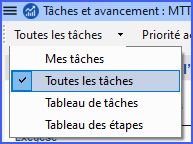
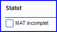
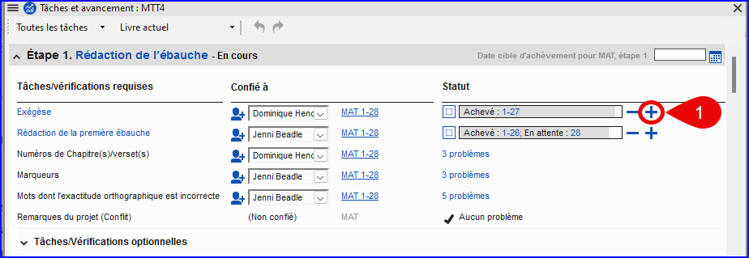
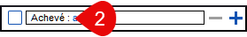
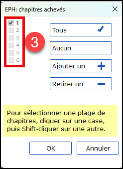

**Introduction** Vous utilisez Tâches et avancement pour vous aider à organiser votre travail et à voir quelles tâches faire ensuite. Dès qu’on a fini une tâche, on la note comme fini pour qu’il soit dans le rapport des tâches accomplies. [Si vous avez utilisé une version précédente, vous allez voir que c’est bien amélioré en Paratext 9.]

**Avant de commencer** Avant de pouvoir utiliser le plan, celui-ci doit être configuré. [L'administrateur du projet ajoutera le plan d'organisation approprié et le configurera pour votre équipe]

**Pourquoi est-il important ?** Il y a beaucoup de taches à faire dans un projet de traduction. Il est important d'avoir un système pour s'assurer que vous accomplissez toutes ces tâches. Puisque votre plan a été configuré, vous pouvez utiliser le plan pour voir quelles tâches ont été affectées (confiées) à vous. Lorsque vous avez terminé la tâche, vous pouvez marquer la tâche comme achevée et voir la tâche suivante à faire. Vous pouvez utiliser ces informations pour générer des rapports pour les superviseurs et les donateurs (voir [État d'avancement du projet 2](https://maual.paratext.org/fr/6.PP2)).

**Qu’est-ce qu’on va faire ?** Vous marquerez une variété de tâches comme achevées. Les étapes exactes varieront légèrement, selon si la tâche est fixée à une fois par projet, une fois par livre, ou par le chapitre. L'endroit pour marquer le progrès pour tous les types de tâches est la colonne Status (Statut).

## 3.1 Affichage des tâches à faire {#85dfcb5c87ec4d4ba3afad5489b6d5c4}

- Dans votre projet, cliquez sur le bouton **Tâches et avancement**

OU

- [**≡ Onglet** sous le menu **Projet**, sélectionnez **Tâches et avancement**]

- De la première liste déroulante, choisissez soit **Mes tâches** soit **Toutes les tâches**
    - _Une liste des différentes tâches et vérifications s'affiche._

:::tip

Vous pouvez voir plus de détails sur n'importe quelle tâche en cliquant sur le nom de la tâche.

:::

## 3.2 Identifier la prochaine tâche {#11b807d65f9a45c8a9da4cd5f798fdb2}

La liste des tâches vous montre les taches inachevées, chacune avec une barre de couleur à côté.

1. Identifiez la prochaine tâche à faire. Il aura une barre verte ou verte barrée.
2. Vérifiez qu’il n'est pas en train d'attendre une autre tâche. Dans ce cas, il y aura une barre rouge.
3. (Voir les autres modules si nécessaire.)

:::tip

Une fois la tâche terminée, suivez les instructions ci-dessous pour la marquer comme achevé. (Une vérification est achevée quand il indique <strong x-id="1">Aucun problème</strong>)

:::

## 3.3 Marquer une tâche comme achevée {#1e10472de6644e289a8dfb9d8ccde488}

### Marquer une tâche de livre comme achevée {#03059c2408d64c30baf38c460e0813ff}

- Cliquez sur la coche à gauche de Statut.
    - _Il doit devenir solide pour indiquer qu'il est achevé._

### Marquer une tâche de chapitre comme achevée {#dabedb60bf4143888eb08c8f457c7598}

1. Cliquez sur **+** pour marquer le prochain chapitre comme achevé

2. Pour marquer d'autres chapitres comme achevé, vous pouvez cliquer sur le mot **Achevé [2]**

    

    - _Une boîte de dialogue s'affiche avec la liste des chapitres_.

        

3. Cliquez sur les numéros des chapitres qui ont été achevé [3].

4. Cliquez sur **OK**

## 3.4 Vérifications {#3aa5683d6c7e41f588d4b15d4c498689}

- Si la tâche est une vérification, l’état de la vérification indiquera soit **Configuration requise** soit le nombre de **problèmes** restants.
- Une vérification est achevée quand il n'y a **aucun problème**.

### Vérifications – configuration requise (Administrateur) {#cf9cddb209dd432c92295e5baed75ecc}

1. Cliquez sur le lien bleu "Paramétrage requis"
    - _Paratext 9 va soit lancer l’inventaire soit afficher les paramètres appropriés._
2. Complétez le paramétrage comme nécessaire.
3. Fermez la fenêtre quand c'est fini.

:::tip

Si plusieurs inventaires sont nécessaires pour une vérification (par exemple, mises en majuscules), vous devrez les configurer manuellement à partir du menu Outils &gt; Inventaires de vérifications.

:::

### Vérifications – problèmes {#86edf92b36dd43a7af95a16dcf743313}

1. Cliquez sur le lien bleu <strong x-id="1">problèmes</strong>
    - _Une liste de problèmes s’affiche._
2. Faites les corrections.
3. Fermez le résultat de la liste (si vous le souhaitez).
4. **≡ Paratext** sous **Paratext** > **Enregistrer tout** (ou **Ctrl**+**s**).
5. Retourner aux Tâches et avancement.

:::tip

Une vérification est achevée quand il indique <strong x-id="1">Aucun problème</strong>. Si vous n'êtes pas en mesure d'effectuer une vérification, il est possible de le reporter à une date ultérieure.

:::

### Reporter la vérification {#110391bc0b9647129c47c1ccdebf2ac4}

1. **≡ Onglet**, sous le menu **Projet**, sélectionnez **Tâches et avancement**
2. Modifier à l'affichage **Toutes les tâches**
3. Passez au-dessus d'un vérification qui a des problèmes
4. Cliquez sur **Reporter** (qui apparaît à droite de la colonne Statut),
5. Choisissez l'étape à laquelle vous souhaitez reporter la vérification
6. Tapez la raison pour reporter la vérification.
    - _La vérification s'affiche à cette étape._
