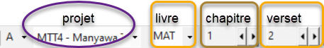
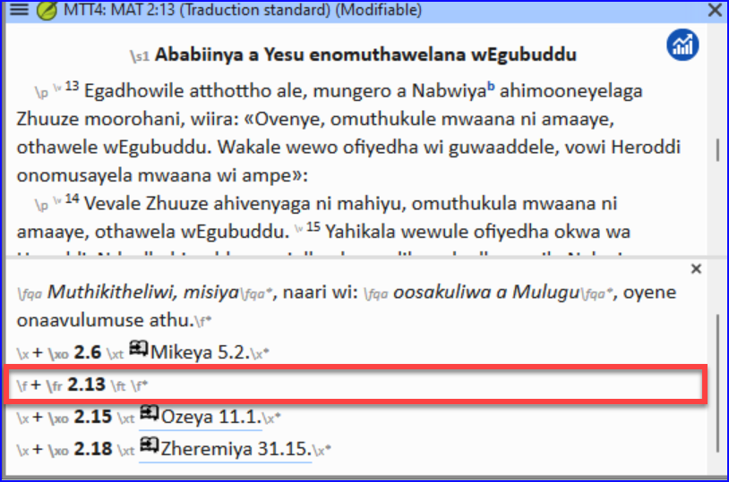
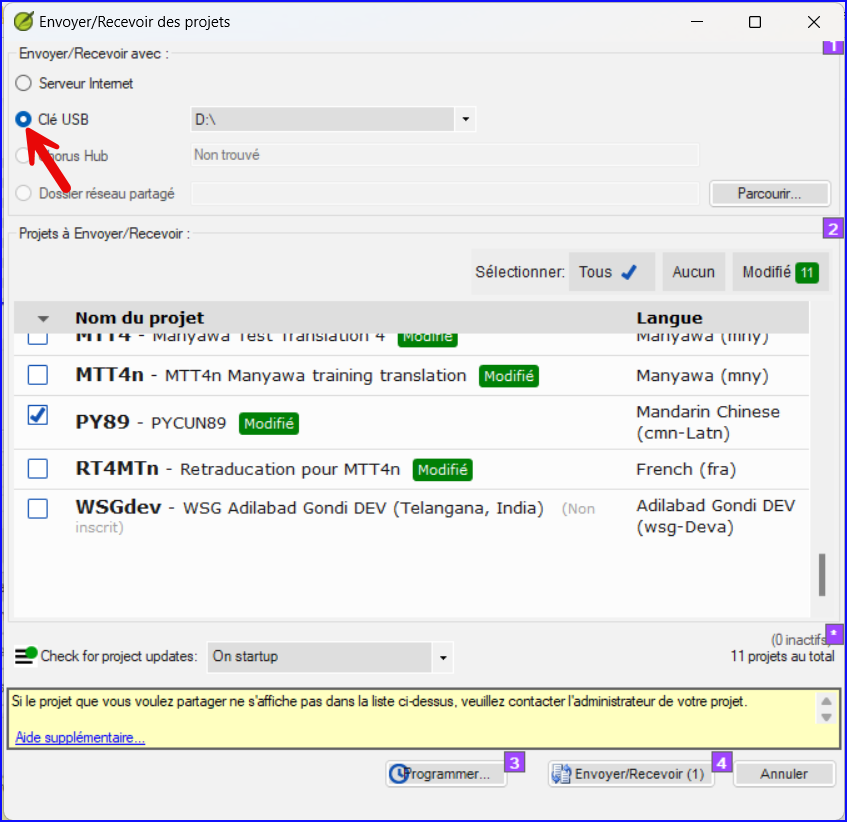

**Introduction**  This module explains how to keyboard your draft translations into a project in Paratext 9.

**Before you start**  We are about to keyboard text into an existing project. Avant que vous puissiez faire ceci, quelqu’un doit avoir installé le programme et avoir créé un projet pour vos données.

**Why this is important**  This is the first stage of entering your translation into the computer. Une fois que le texte a été saisi, vous pourrez exécuter divers contrôles sur le contenu et le format du texte.

## 4.1 Naviguer vers une référence biblique {#51581b24aa2e48c3bf3d4017c24abce2}

:::astuce

:::tip Conseil
Avant de pouvoir commencer à saisir un texte, vous devez déplacer votre curseur au livre, au chapitre et au verset appropriés. Servez-vous de la barre d’outils Référence pour le faire.

:::

- Using the icons on the toolbar, change the project, book, chapter and verse as needed.

    

:::info Upgrade
In Paratext 9.3 you can copy and paste a scripture reference into the book name on the navigation bar. Par exemple en français : MAT 12.3, Mrk 5:4, Galates 1:12.
:::

:::astuce

If you don't know the verse reference, you could use the **Find** feature to look for a word that occurs in the verse you are looking for. Ctrl+F.

:::

## 4.2 Vérifier que le projet est modifiable {#5ace3b29698c4618b278657a58c7cde9}

1. Look at the titlebar of your project.

1. If it is not editable, try changing the view (see below).

1. If the book is still not editable, and you need to edit it, you should talk with your project administrator.

  
 
  
  

    

    
    

    

  

<h2 id="4ebf0759e8154f6a938ebc6a44d0d3e0" spaces-before="0">
  4.3 Changer l’affichage
</h2>

  :::astuce

  Paratext 9 comporte cinq vues. Seul le mode Aperçu n’est pas modifiable.

:::

<ul>
  <li>
    <strong x-id="1">Ctrl</strong> + <strong x-id="1">E</strong> —ou—
  </li>
  <li>
    La barre de titre doit afficher <strong x-id="1">Modifiable</strong>.
  </li>
</ul>

<h2 id="85ef7d3181e44b0a93f3669ef5068d93" spaces-before="0">
  4.4 Taper les caractères spéciaux
</h2>

  :::caution

  :::tip  Certains des caractères orthographiques ne se trouvent pas sur le clavier. Pour les taper, vous devez appuyer sur plus d’une touche.

:::

<ol start="1">
  <li>
    Changez le système de clavier si nécessaire.
  </li>
  
  <li>
    

      If you are using Keyman then choose your keyboard (e.g. Tchad Unicode (or for MS-Keyboards choose AF or TR/SQ/TZ/AF…)
    

  </li>
  
  <li>
    

      Type the keys for the special character (see the chart provided with your Keyman file).
    

  </li>
</ol>

  :::astuce

  You can use <strong x-id="1">≡ Tab</strong> under <strong x-id="1">View</strong> &gt; <strong x-id="1">Highlight Invalid Characters</strong> to quickly see if you have typed any invalid characters. Ctrl+F.

:::

<h2 id="8ec1c85f258b4da2ae2062a80f9897d1" spaces-before="0">
  4.5 Ajouter texte d'une autre catégorie – titre ou introduction
</h2>

  :::astuce

  :::tip  Chaque élément de texte doit avoir un marqueur. Les marqueurs pour les chapitres et versets sont déjà dans votre projet. When you want to add text such as headings, or introductions etc you need to also add the appropriate marker as follows:

:::

<ol start="1">
  <li>
    Move your cursor to the end of the previous paragraph:
  </li>
  
  <li>
    Type <strong x-id="1">Enter</strong>
  </li>
  
  <li>
    Saisissez <strong x-id="1">p</strong> puis tapez <strong x-id="1">Entrée</strong> (ou le sélectionnez de la liste).
  </li>
  
  <li>
    Saisissez le texte
  </li>
  
  <li>
    Add a paragraph marker after the text (for example: \\ p)
  </li>
</ol>

  :::caution

  You must always have a USFM marker after a title and before the verse. This is usually \p (normal paragraph), but it can be different (for example \q1).

:::

<h3 id="a8323ee1f37847e6b1ceaf05b6127968" spaces-before="0">
  Character markers
</h3>

  :::astuce

  Paratext has both paragraph and character markers. As the name suggests, paragraph markers format the whole paragraph. Character markers let your format part of the paragraph and so need a beginning and ending marker.

:::

<ol start="1">
  <li>
    Select the text you want to apply the character style
  </li>
  
  <li>
    Type  **\\**
  </li>
  
  <li>
    Select the marker from the list (e.g. nd)
  </li>
  
  <li>
    Appuyez sur <strong x-id="1">Entrée</strong>.
  </li>
</ol>

<ul>
  <li>
    Paratext adds the two markers (before and after the text)  (for example: \\nd LORD*\nd)
  </li>
</ul>

  :::astuce

  It is important to note that pressing <strong x-id="1">Enter displays paragraph markers</strong> and <strong x-id="1">\\ displays character markers.</strong>

:::

<h2 id="9920f9d1850246219d4f1eb1dbaebbcb" spaces-before="0">
  4.6 Ajouter des marqueurs de paragraphe
</h2>

  :::astuce

  Pour diviser le texte en paragraphes

:::

<ol start="1">
  <li>
    Déplacez le curseur où vous voulez casser le paragraphe.
  </li>
  
  <li>
    Appuyez sur <strong x-id="1">Entrée</strong>.
  </li>
  
  <li>
    Type <strong x-id="1">p</strong>, then <strong x-id="1">Enter</strong>.
  </li>
</ol>

<h2 id="a76d8d7a421841f79c4dcb1e87671678" spaces-before="0">
  4.7 Enregistrer votre travail
</h2>

  :::astuce

  :::tip  Il est important d’enregistrer votre travail régulièrement.

:::

<ul>
  <li>
    <strong x-id="1">≡ Paratext</strong> under <strong x-id="1">Paratext</strong> &gt; <strong x-id="1">Save All</strong>
  </li>
  <li>
    –or- <strong x-id="1">Ctrl</strong> + <strong x-id="1">S</strong>
  </li>
</ul>

<h2 id="0def5155dad145a7a96c40b56fe61974" spaces-before="0">
  4.8 Insérer une Note de bas de page
</h2>

  :::astuce

  :::tip  Vous pouvez ajouter les notes de bas de page dans le texte à l’endroit où la référence apparaît dans votre texte.

:::

<ul>
  <li>
    Déplacez le curseur où vous voulez insérer la note de bas de page.
  </li>
</ul>

1. **≡ Tab**, under **Insert** > **Footnote**

1. Type the text after the \ft

  
  

    
 
    
    

      

      
      

      

    

    
    

      :::tip  If you hover your mouse over the superscript letter the text of the footnote will be displayed in a tip box.
    

    
    <ul>
      <li>
        Pour <strong x-id="1">modifier</strong> la note de bas de page, cliquez sur la petite lettre et modifiez le texte dans le petit volet en bas.
      </li>
      <li>
        ou <strong x-id="1">Ctrl</strong> + <strong x-id="1">S</strong>
      </li>
      <li>
        or right-click the footnote text and choose <strong x-id="1">delete</strong>.
      </li>
    </ul>
    
    

:::
    

<h2 id="70bb5cddeb3342d8bc10e403e64348ea" spaces-before="0">
  4.9 Envoyer/Recevoir
</h2>

  :::astuce

  It is essential to have a second copy of your translation and to share your work with others in your team. This is done by doing a send/receive as follows:

:::

<h3 id="062239d736b749eba1e1ab44dd3be2d4" spaces-before="0">
  Envoyer/Recevoir des projets vers Internet
</h3>

<ol start="1">
  <li>
    Assurez-vous que votre ordinateur est connecté à l'Internet.
  </li>
  
  <li>
    <strong x-id="1">≡ Tab</strong> under <strong x-id="1">Project</strong>,&gt; <strong x-id="1">Send/Receive this project</strong> <ul>
      <li>
        <em x-id="4">Paratext will immediately Send/Receive i.e. without offering the different options.</em>
      </li>
    </ul>
  </li>
</ol>

<h3 id="57f34914b58f4c3b8e50ea49450d0b8a" spaces-before="0">
  Envoyer/Recevoir ce projet vers Internet
</h3>

<ol start="1">
  <li>
    Assurez-vous que votre ordinateur est connecté à l'Internet.
  </li>
  
  <li>
    If you want to send/receive other projects, or change the way to send/receive
  </li>
  
  <li>
    <strong x-id="1">≡ Paratext</strong> under <strong x-id="1">Paratext</strong> &gt; <strong x-id="1">Send/Receive projects</strong>
  </li>
  
  <li>
    Choisissez <strong x-id="1">Serveur Internet</strong>
  </li>
  
  <li>
    Choisissez les projets à Envoyer/Recevoir.
  </li>
  
  <li>
    Cliquez sur le bouton <strong x-id="1">Envoyer/Recevoir</strong>. <ul>
      <li>
        <em x-id="4">L’ordinateur fera une copie des fichiers. Un indicateur de progrès s’affiche jusqu’à ce que le processus soit fini. Une boîte de message vous dit s’il y a des problèmes.</em>
      </li>
    </ul>
  </li>
</ol>

<h3 id="d6ce92480ac444279ffa54dc26dc945b" spaces-before="0">
  Envoyer/Recevoir à une clé USB pour sauvegarder
</h3>

  Il est essentiel d’avoir une seconde copie de votre traduction. Si vous n'avez pas accès à l'Internet, vous pouvez utiliser une clé USB. To backup your data to a USB stick you do a Send/Receive as follows:

1. Insérez votre clé USB dans un port de l’ordinateur.

1. **≡ Paratext**, under **Paratext** > **Send/Receive project(s**)

1. Choose **USB drive**.

1. Choisissez les projets à Envoyer/Recevoir.

1. Click **Send/Receive**.

  
  

    
 
    
    

      

      
      

      

    

<h3 id="19ba693a99554a0eb9ffcd86a15367c2" spaces-before="0">
  Envoyer/Recevoir encore
</h3>

  :::astuce

  The next time you want to Send/Receive you can use the toolbar to Send/Receive using the same settings as the previous time. Cette option ne vous laisse pas l'option de sélectionner le moyen ou les projets:

:::

<ul>
  <li>
    Si nécessaire, insérez votre clé USB dans un port de l’ordinateur ou se connectez à l'Internet.
  </li>
</ul>

- Cliquez sur l’icône Envoyer/Recevoir

  
  

    
 
    
    

      

      
      

      

    

<h2 id="f79550c3c28c4ac6a277a839e6c8546d" spaces-before="0">
  4.10 Déplacer votre curseur rapidement
</h2>

  A lot of time is spent moving your cursor to the place where you need to add text or make corrections. Here are some useful keystrokes to move your cursor quickly.

<ul>
  <li>
    Les touches <ul>
      <li>
        flèches, <strong x-id="1">←</strong>
      </li>
      <li>
        <strong x-id="1">début</strong> (Home), <strong x-id="1">fin</strong> (End), <strong x-id="1">PgPréc</strong>, et <strong x-id="1">PgSuiv</strong>,
      </li>
      <li>
        <strong x-id="1">F8</strong> (chapitre), <strong x-id="1">F9</strong> (livre)
      </li>
    </ul>
  </li>
  <li>
    Try pressing <strong x-id="1">Ctrl</strong> + any of those keys.  Certains peuvent être très différents de ce à quoi vous vous attendez. <ul>
      <li>
        Ctrl + Flèche vers le bas = Verset suivant (Ctrl + Flèche vers le haut pour le verset précédent)
      </li>
      <li>
        F8 = Chapitre suivant (Ctrl + F8 pour le chapitre précédent)
      </li>
      <li>
        F9 = Livre suivant (Ctrl + F9 pour le livre précédent)
      </li>
      <li>
        Alt + Flèche gauche/droite = référence précédente/suivante dans l'historique
      </li>
      <li>
        Alt + Flèche gauche/droite = référence précédente/suivante dans une liste
      </li>
      <li>
        Ctrl + B = accéder à la zone de navigation de la barre d'outils.
      </li>
    </ul>
  </li>
</ul>

<h2 id="b43d69d9dc4a44029b365e87160c50be" spaces-before="0">
  4.11 Bilan :
</h2>

  If the titlebar doesn’t say Editable (or your name), you should try changing the __________.

  To add a different marker (such as section heading) you press _______.

  To add paragraph marker you type ________.

  To insert a footnote, you use the _______ menu and choose ______________.

  To send/receive, you use the _<strong x-id="1">_ menu then _</strong>_________.

  :::info

  [Answers: view, Enter or \, Enter, Insert, Footnote, Project, Send/Receive this project]

:::

