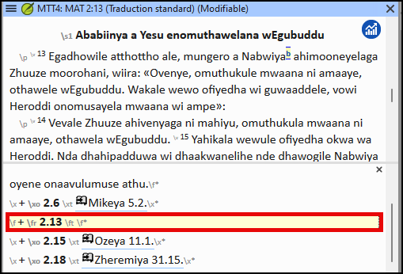

**Introduction** Ce module explique comment vous pouvez saisir votre traduction  dans un projet existant de Paratext 9.

**Avant de commencer**  Nous sommes sur le point de saisir du texte dans un projet existant. Pour cela, il faut que quelqu'un ait déjà installé le programme et créé un projet pour vos données.

**Pourquoi c'est important**  C'est la première étape de l'introduction de votre traduction dans l'ordinateur. Une fois que le texte a été saisi, vous pourrez exécuter divers contrôles sur le contenu et le format du texte.

## 4.1 Naviguer vers une référence biblique {#51581b24aa2e48c3bf3d4017c24abce2}

:::tip

Avant de pouvoir commencer à saisir un texte, vous devez déplacer votre curseur au livre, au chapitre et au verset appropriés. Servez-vous de la barre d’outils Référence pour le faire.

:::

- À l'aide des icônes de la barre d'outils, changez le projet, le livre, le chapitre et le verset selon vos besoins.

    

:::info Mise à jour

In Paratext 9.3 you can copy and paste a scripture reference into the book name on the navigation bar. Par exemple en français : MAT 12.3, Mrk 5:4, Galates 1:12.

:::

:::tip

Si vous ne connaissez pas la référence du verset, vous pouvez utiliser la fonction **Rechercher** pour rechercher un mot. Ctrl+F.

:::

## 4.2 Vérifier que le projet est modifiable {#5ace3b29698c4618b278657a58c7cde9}

Regardez la barre de titre de votre projet.

- _The titlebar should have the word (__**Editable****)._

    

1. Si elle n'est pas modifiable, essayez de changer de vue (voir ci-dessous).
2. Si le livre n'est toujours pas modifiable et que vous avez besoin de le modifier, adressez-vous à l'administrateur de votre projet.

## 4.3 Changer l’affichage {#4ebf0759e8154f6a938ebc6a44d0d3e0}

:::tip

Paratext 9 has five views. You can edit all views except the Preview view.

:::

- **Ctrl** + **E** -or-
- **≡ Tab** under **View** menu, choose the view (usually Standard).

## 4.4 Taper les caractères spéciaux {#85ef7d3181e44b0a93f3669ef5068d93}

:::caution

Some orthographic characters are not found on the keyboard. To type these characters, you may need to press more than one key.

:::

1. Change your keyboard system as needed on your computer.
2. If you are using Keyman then choose your keyboard (e.g. Tchad Unicode) (or for MS-Keyboards choose AF or TR/SQ/TZ/AF…)
3. Type the keys for the special character (see the chart provided with your Keyman file).

:::tip

You can use **≡ Tab** under **View** &gt; **Highlight Invalid Characters** to quickly see if you have typed any invalid characters. If you see lots of punctuation, then ask your instructor or administrator to configure your character inventory.

:::

## 4.5 Ajouter texte d'une autre catégorie – titre ou introduction {#8ec1c85f258b4da2ae2062a80f9897d1}

:::tip

Each piece of text needs to have a marker. The markers for the chapters and verses are already in your project. When you want to add text such as headings or introductions, etc., you need to also add the appropriate marker as follows:

:::

1. Move your cursor to the end of the previous paragraph:
2. Type **Enter**
3. Type the marker (e.g. s1 or ip) press **Enter** (or select it from the list).
4. Type the text
5. Add a paragraph marker after the text (for example: \\ p)

:::caution

You must always have a USFM marker after a title and before the verse. This is usually \p (normal paragraph), but it can be different (for example \q1).

:::

### Marqueurs de caractères {#a8323ee1f37847e6b1ceaf05b6127968}

:::tip

Paratext has both paragraph and character markers. As the name suggests, paragraph markers format the whole paragraph. Character markers let you format part of the paragraph and so need a beginning and ending marker.

:::

1. Select the text you want to apply the character style
2. Type  **\\**
3. Select the marker from the list (e.g. nd)
4. Press **Enter**

- Paratext adds the two markers (before and after the text)  
  (for example: \\nd LORD*\nd)

:::tip

It is important to note that pressing **Enter displays paragraph markers** and typing **\\ displays character markers.**

:::

## 4.6 Ajouter des marqueurs de paragraphe {#9920f9d1850246219d4f1eb1dbaebbcb}

:::tip

Dividing the text into paragraphs:

:::

1. Move the cursor to where you want to break the paragraph.
2. Press **Enter**
3. Type **p**, then **Enter**.

## 4.7 Enregistrer votre travail {#a76d8d7a421841f79c4dcb1e87671678}

:::tip

It is important to save your work regularly.

:::

- **≡ Paratext** under **Paratext** &gt; **Save All**
- OR **Ctrl** + **S**

## 4.8 Insérer une Note de bas de page {#0def5155dad145a7a96c40b56fe61974}

:::tip

You can add footnotes in the text at the place where you want the reference to appear.

:::

- Move the cursor to where you want to insert the footnote.

1. **≡ Tab**, under **Insert** > **Footnote**
    - _A set of footnote markers is added in the box below the text_

2. Type the text after the \ft

:::tip

If you hover your mouse over the superscript letter, the text of the footnote will be displayed in a tip box.

- To **change** the footnote, **click** the superscript letter in the text.
- To **delete** the footnote, you can **delete** the superscript letter.
- or right-click the footnote text and choose **delete**.

:::

## 4.9 Envoyer/Recevoir {#70bb5cddeb3342d8bc10e403e64348ea}

:::tip

It is essential to have a second copy of your translation and to share your work with others in your team. This is done by doing a send/receive as follows:

:::

### Envoyer/Recevoir des projets vers Internet {#062239d736b749eba1e1ab44dd3be2d4}

1. Make sure your computer is connected to the Internet.
2. **≡ Tab** under **Project**,&gt; **Send/Receive this project**
    - _Paratext will immediately Send/Receive i.e. without offering the different options._

:::info Mise à jour

In 9.4, Paratext can notify you when there are updates to any of your projects.

On the Send/Receive dialog, below the list of projects

1. Click the dropdown list beside “**Check for project updates**”

2. Choose how often to check
    - _If a project has changed, a green dot is shown on the project menu icon._

For more details watch [What's new main menu](https://vimeo.com/857678678).

:::

### Send/receive to the Internet {#eeef5150739042cebaf6ba88512fe809}

1. Make sure your computer is connected to the Internet.
2. If you want to send/receive other projects, or change the way to send/receive
3. **≡ Paratext** under **Paratext** &gt; **Send/Receive projects**
4. Choose **Internet Server**
5. Check the box next to the projects to Send/Receive.
6. Click **Send/Receive**.
    - _The computer will make a copy of your files. A progress meter will be displayed. A message box will only appear if there are any problems._

### Envoyer/Recevoir à une clé USB pour sauvegarder {#d6ce92480ac444279ffa54dc26dc945b}

It is essential to have a second copy of your translation. If you don't have access to the Internet, then you can use a USB stick. To backup your data to a USB stick you do a Send/Receive as follows:

1. Insert your USB key into your computer.

2. **≡ Paratext**, under **Paratext** > **Send/Receive project(s**)

3. Choose **USB drive**.

4. Check the box next to the projects to Send/Receive.

5. Click **Send/Receive**.
    - _The computer will make a copy of your files. A progress meter will be displayed. A message box will only appear if there are any problems._

### Envoyer/Recevoir encore {#19ba693a99554a0eb9ffcd86a15367c2}

:::tip

The next time you want to Send/Receive you can use the toolbar to Send/Receive using the same settings as the previous time. This option does not allow you to choose a different method or different projects.

:::

- Si nécessaire, insérez votre clé USB dans un port de l’ordinateur ou se connectez à l'Internet.

- Click the Send/Receive icon
    - _Paratext will immediately Send/Receive._

## 4.10 Déplacer votre curseur rapidement {#f79550c3c28c4ac6a277a839e6c8546d}

A lot of time is spent moving your cursor to the place where you need to add text or make corrections. Here are some useful keystrokes to move your cursor quickly.

- Les touches
    - touches fléchées **←** **↑** **→** **↓**
    - **début** (Home), **fin** (End), **PgPréc**, et **PgSuiv**,
    - **F8** (chapitre), **F9** (livre)
- Essayez d'appuyer sur **Ctrl** + l'une de ces touches.  Certains peuvent être très différents de ce à quoi vous vous attendez.
    - Ctrl + Flèche vers le bas = Verset suivant (Ctrl + Flèche vers le haut pour le verset précédent)
    - F8 = Chapitre suivant (Ctrl + F8 pour le chapitre précédent)
    - F9 = Livre suivant (Ctrl + F9 pour le livre précédent)
    - Alt + Flèche gauche/droite = référence précédente/suivante dans l'historique
    - Alt + Flèche gauche/droite = référence précédente/suivante dans une liste
    - Ctrl + B = accéder à la zone de navigation de la barre d'outils.

## 4.11 Bilan : {#b43d69d9dc4a44029b365e87160c50be}

If the titlebar doesn’t say Editable (or your name), you should try changing the __________.

To add a different marker (such as section heading) you press _______.

To add paragraph marker you type ________.

To insert a footnote, you use the _______ menu and choose ______________.

To send/receive, you use the ____ menu then __________.

:::info

[Answers: view, Enter or \, Enter, Insert, Footnote, Project, Send/Receive this project]

:::

