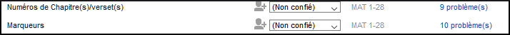

# 5. Basic checks 1 {#584144d4a3454570845a09cb69b1318f}

**Introduction**  In this module, you will check the chapters/verses and the markers using two methods: The Assignments and Progress and the project menu (4a.Checking).

**Before you start**  You have typed your text in Paratext 9. Maintenant, vous voulez commencer à faire les vérifications. Dans ce module on commence avec les deux premières vérifications de base. The remaining checks are covered in [Basic Checks 2](https://sillsdev.github.io/paratext-manual/12.BC2) and [Basic Checks 3](https://sillsdev.github.io/paratext-manual/19.BC3).

**Why this is important**  These checks allow you to be sure that you have all the chapters and verses and that the other markers are correct. Il est important d’exécuter la vérification *chapitre/verset* tout d’abord parce que tous les autres contrôles en dépendent. Cette vérification est également nécessaire si on veut marquer l'étape de "rédaction de l'ébauche" comme achevée.

**What you are going to do**  You are going to run the first two basic checks using two different methods. The easiest way is to run the checks from the Assignments and Progress. C’est aussi possible de faire les vérifications à partir du menu projet **(Outils)** pour faire plus qu'un livre à la fois.

## 5.1 Running checks from the Assignments and Progress {#28ad38164bcc4c688e8e4d2f4a392b64}

It is easier to run the checks from the Assignments and Progress.

### **View and correct errors** {#8dab705513394c93b89c6f71228b4783}

1. View the Assignments and Progress by clicking on the **blue icon** (at the top right of your project window).

  
 
  
  

    

    
    

    

  

  
  <ol start="1">
    <li>
      

        If there are any "issues" (errors), click the <u>blue link</u> to the right
      

      

        
      

    </li>
  </ol>
  
  <ul>
    <li>
      <em x-id="4">Une fenêtre s’affiche avec les problèmes</em>.    <ol start="1">
        <li>
          Double-cliquez sur ne ligne dans la liste.
        </li>
        
        <li>
          Corrigez l’erreur dans votre projet.
        </li>
        
        <li>
          Double-cliquez sur a prochaine ligne dans la liste.
        </li>
        
        <li>
          Continuez jusqu'à ce qu'il n'y a plus d’erreurs.
        </li>
      </ol>
    </li>
  </ul>

<h3 id="648ac1a433e748dd82299215b61cb8b3" spaces-before="0">
  <strong x-id="1">Confirmer que les erreurs ont été corrigées</strong>
</h3>

<ol start="1">
  <li>
    Cliquez sur le bouton <strong x-id="1">Relancer</strong>  pour vérifier toutes les erreurs sont corrigées. <ul>
      <li>
        <em x-id="4">A results list shows any remaining errors</em>.
      </li>
    </ul>
  </li>
  
  <li>
    Fix any errors
  </li>
  
  <li>
    Close the results list window (if desired).
  </li>
  
  <li>
    Return to the <strong x-id="1">Assignments and Progress</strong>
  </li>
  
  <li>
    Click on the link to show the issues from the markers check.
  </li>
</ol>

  :::astuce

  When you have finished with a check, some people like to close the results list, others like to keep it open particularly if it changes your window layout. You can also move it to a tab of another window.

:::

  :::info

  Watch the video ‘How to use Checking Tools (9.1 - 1.4).mp4’ for examples of how to correct some common errors.

:::

<h2 id="3d7c1c2bb72b412c84fa0be8315c0899" spaces-before="0">
  5.2 Running the checks from the menu
</h2>

  Si vous voulez vérifier plus d’un livre, vous pourriez faire ces vérifications du menu du projet <strong x-id="1">(Outils)</strong>.

<h3 id="ac301c02271b4d2cbe873464d1494925" spaces-before="0">
  Chapter/ Verse
</h3>

  Rechercher les problèmes

<ol start="1">
  <li>
    Cliquez sur votre projet
  </li>
  
  <li>
    <strong x-id="1">≡ Tab</strong>, under <strong x-id="1">Tools</strong> &gt; <strong x-id="1">Run Basic Checks</strong>
  </li>
  
  <li>
    Cocher seulement <strong x-id="1">Numéros Chapitre(s)/verset(s)</strong>
  </li>
  
  <li>
    Décochez les autres vérifications
  </li>
  
  <li>
    If necessary, click <strong x-id="1">Choose…</strong> and choose the book(s) you want to check
  </li>
  
  <li>
    <strong x-id="1">≡ Onglet</strong>, <strong x-id="1">Modifier la collection de textes</strong>   <ul>
      <li>
        <em x-id="4">A window appears with a list of the errors.</em>
      </li>
    </ul>
  </li>
</ol>

<h3 id="2724585e15974d88b2f788b23d7711dc" spaces-before="0">
  Corriger les problèmes
</h3>

<ol start="1">
  <li>
    Double-cliquez sur ne ligne dans la liste.
  </li>
  
  <li>
    Corrigez l’erreur dans votre projet.
  </li>
  
  <li>
    Double-cliquez sur a prochaine ligne dans la liste.
  </li>
  
  <li>
    Continue for all the errors.
  </li>
  
  <li>
    Cliquez sur le bouton <strong x-id="1">Relancer</strong>  pour vérifier que tous les problèmes sont corrigés.
  </li>
  
  <li>
    Fermez la fenêtre de résultats.
  </li>
</ol>

<h3 id="b9296e794a82435ca258a466eb7c9ee4" spaces-before="0">
  Markers check
</h3>

  The markers check displays an overview of the markers in your text. You cannot change anything, but you can look for markers which may be errors.

<ol start="1">
  <li>
    <strong x-id="1">≡ Tab</strong>, under <strong x-id="1">Tools</strong> &gt; <strong x-id="1">Checking Inventories</strong> then <strong x-id="1">Markers Inventory</strong> <ul>
      <li>
        <em x-id="4">The list is displayed showing an overview of the markers in your text</em>.
      </li>
    </ul>
  </li>
  
  <li>
    Review the list for markers (see below)
  </li>
  
  <li>
    Close the marker inventory (if desired).
  </li>
  
  <li>
    <strong x-id="1">≡ Tab</strong>, under <strong x-id="1">Tools</strong> &gt; <strong x-id="1">Run Basic Checks</strong>
  </li>
  
  <li>
    Cochez seulement <strong x-id="1">Marqueurs</strong>
  </li>
  
  <li>
    <strong x-id="1">≡ Onglet</strong>, <strong x-id="1">Modifier la collection de textes</strong>  
  </li>
  
  <li>
    Corrigez les erreurs.
  </li>
</ol>

  :::info

  What to look for. Markers that only occur a few times. Similar markers \q and \q1. Markers that appear together but do not have the same count (e.g. \f and \f*).

:::

