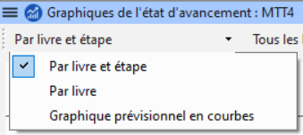

**Introduction** Dans ce module, vous apprendrez comment mettre à jour les informations sur le progrès fait en marquant les tâches comme achevées. et créer un rapport sur l'état d'avancement.

**Avant de commencer** Vous avez travaillé sur votre traduction et avez terminé une tâche. Vous voulez maintenant mettre à jour votre progrès.

**Pourquoi cette aptitude est-elle importante ?** Pour que Tâches et avancement fonctionne bien, vous devez marquer les tâches que vous avez finies. Cela permet à Paratext 9 de rendre la tâche suivante disponible pour les autres membres de l'équipe. Il donne également à Paratext des informations précises sur vos progrès pour les rapports. La création de rapports d'avancement vous aide à préparer un rapport pour vos superviseurs et vos bailleurs de fonds.

\*\*Qu’est-ce qu’on va faire ? Vous ouvrirez la fenêtre des Tâches et avancement et mettrez à jour les informations sur le progrès fait. Vous produirez alors un rapport.

## 6.1 Assurez-vous que l'avancement du plan est à jour {#1baa7ce081654a3a9aa755bf4ebdfc4d}

1. Ouvrez les Tâches et avancement (à l'aide du bouton bleu)
2. Mettre à jour l'état d'avancement de toutes les tâches (voir [3. Tâches et avancement](/3.PP1) pour des instructions sur chaque type de tâche).

## 6.2 Modifier une affectation {#420f3c9ae4d6494d8246e72237cc8030}

:::caution

Cette opération n'est possible que si vous disposez des autorisations d'avancement\*\*.

:::

1. À partir du **≡ Onglet**, sous le menu **Projet**, sélectionnez **Tâches et avancement…**
2. De la première liste déroulante en haut à gauche de la boîte de dialogue, choisissez **Toutes les tâches**.
3. Dans la colonne **Confié à**, utilisez la liste déroulante pour choisir qui aura la responsabilité de la tâche ou de la vérification (énumérée dans la colonne **Tâche/Vérification** à l'extrême gauche).

## 6.3 Produire un rapport sur l'état du projet {#5164035c401f4b409f6e8addbc7d0167}

1. Du menu **Projet**, sélectionnez **Rapport sur l'état du projet…**.
2. Choisissez le(s) projet(s)
3. Cliquez sur **OK**.
   - _Le rapport contient une colonne pour chaque projet sélectionné._

## **6.4 Afficher des graphiques de l'état d'avancement** {#6d88f283bc7643daa88084ac0d8a055f}

- Du **≡ Onglet**, sous le menu **Projet**, sélectionnez **Graphiques de l'état d'avancement…**

  

1. Utilisez la première boîte déroulant pour choisir le type de graphique
2. Choisissez les livres si nécessaires.
3. Cliquez sur l'icône d'imprimante
   - _Une fenêtre s'affiche_
4. Cliquez sur l'icône **Imprimer**
5. Choisissez votre imprimante (ou imprimante PDF)
6. Cliquez sur **OK**.
