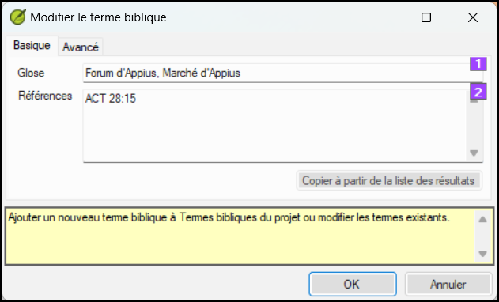

**Introduction** La fenêtre d’_Équivalents de termes bibliques_ et l’outil _Termes bibliques_ sont très utiles pour vérifier que vous êtes cohérent dans l’utilisation des termes, surtout les termes clés. Avec de nombreux termes répartis sur de nombreux livres, cela peut devenir une véritable tâche. Ce module explique un simple processus de 4 étapes pour assurer que les termes bibliques sont cohérents. Vous devez considérer ce processus comme faisant partie du processus de traduction et non comme un contrôle.

**Before you start**  You are translating a verse in Paratext 9, and you want to see what renderings you have already chosen for the terms in the current verse, and then make sure they are consistent with other verses.

**Why this is important**  For your readers to understand your text, you need to be consistent in your use of terms. C’est une grande tâche pour les rendre complètement cohérents. Si vous commencez à partir du verset que vous traduisez, et travaillez à partir de là, la tâche est plus facile à gérer. Le but est de s'assurer que vous avez été cohérent dans votre utilisation des termes bibliques et des décisions sont bien documentées sur les raisons pour lesquelles les changements ont été apportés.

**What you are going to do**  This method boils down to a short list of steps:

1. **[A]** Find all the ways you have rendered this term, and enter them in the renderings dialog.
2. **[B]** Choose which rendering is/are best, and record why it is best.
3. **[C]** Document why you rejected the other renderings.
4. **[D]** Clean up your translation by making this rendering consistent throughout your translation. (Faire cohérente, Standardiser, Normaliser, Harmoniser).

- Répétez ce processus avec le prochain terme biblique que vous trouvez dans la fenêtre d’équivalents de termes bibliques.
- Vous utiliserez également la nouvelle fonctionnalité de Paratext 9.4 pour exporter des termes de la liste des termes bibliques et les partager avec vos collègues.

## 10.1 Open the Biblical terms rending window {#f8f57567e6ff4b9193367abfbee7302a}

1. Cliquez dans votre projet
2. **≡ Tab**, under **Tools** &gt; **Biblical terms rendering**
3. **≡ Tab** (of the new window), under **Biblical Terms** &gt; **Select Biblical terms list**
4. Choisissez la liste désirée
5. Cliquez sur **OK**.

## 10.2 A: Find all the ways you have rendered this term {#df4c8121b667426ca013ce2feace7348}

### Find the terms for the current verse {#3ffdc542c5f84c369b2c4cdfcc8569e1}

- Y a-t-il une coche dans la colonne "trouvé" ?
- S’il y a une coche, le verset utilise le terme et vous pouvez continuer avec le prochain terme.
- Sinon, vous devez soit corriger votre texte soit ajouter le nouveau terme que vous avez utilisé (voir ci-dessous)

### Add another rendering {#dae5da6bfb1b40c99e9eb4f0c7fe1f06}

Si le terme que vous avez utilisé ne figure pas dans la liste, vous pouvez l'ajouter :

1. Sélectionnez l’équivalent dans votre texte.

2. Copy it (**Ctrl**+**C**)

3. Double-cliquez dans la cellule d'équivalent de la fenêtre d'équivalent de terme biblique.
   - _The edit renderings dialog is displayed_.

4. Collez (**Ctrl**+**V**) l'équivalent dans la boîte de dialogue.

5. Cliquez sur **OK**.

### Find other verses in the current book with the same Biblical term {#bbdc4762638048adb945ccfff0f3c9e3}

Dans la fenêtre d'Équivalent de terme biblique

1. Double-click on a word in the **Term** column
   - _The Biblical Terms Tool opens_

2. From the second filter button choose **current book**

3. Ajoutez des équivalents pour le terme dans les versets jusqu'à ce que vous ayez identifié les termes dans tous ces versets (voir ci-dessous).

### Add renderings from the other verses {#a5212cc460da4fabb7cb3db81d405280}

1. Sélectionnez l’équivalent dans le verset
2. Add the rendering using **Ctrl**+**A**
3. Continuez jusqu'à ce que vous ayez identifié les termes dans tous ces versets.

### Dealing with verses that do not use the term {#3867de64e3064e85a08eed2cdab64dad}

:::tip

Il arrive qu'un verset soit traduit sans que le terme soit utilisé. Par exemple, lorsque vous utilisez un pronom. Dans ce cas, vous devez nier qu'il s'agit d'une erreur.

:::

- Click the red cross to the left of the verse reference link
  - _The red cross turns into a green tick with a small red x_

:::caution

Si vous cliquez sur la croix par erreur, cliquez sur la coche verte et la croix rouge réapparaîtra.

:::

## 10.3 B: Identify the best term {#55582923eae649c9964c1e0068ec29ac}

1. Double-cliquez sur le terme dans le volet en haut.
   - _The edit rendering dialog is displayed listing all the renderings you added._

     

2. Choisir le meilleur équivalent

3. Select, then Cut (**Ctrl**+**x**) and paste (**Ctrl**+**v**) it to the top of the dialogue box

4. Ajoutez les  \*\*\*\*\* si nécessaire pour combiner des rendus similaires

:::tip

Vous pouvez utiliser \*\*\*\*\* de différentes manières : avant le mot pour les préfixes et après le mot pour les suffixes. Vous pouvez également placer un \*\*\*\*\* au milieu d'un mot. Voir le guide pour d'autres façons d'utiliser l'astérisque \*\*\*\*\*.

:::

## 10.4 C: Reject all the others {#91a3dcb7525c41919b79cdc020e1ca63}

- Sélectionnez et coupez les autres équivalents.

## 10.5 D: Document the reason for the change {#c70df72e555f44d4a73cd41076bd8718}

- Click on the **History** button

- Type in the reason why you rejected the others and why the first was the best.

- Cliquez sur **OK**

### If you need more than one rendering {#7efa68af7a544631bf7f24302fa0449e}

:::tip

Vous pouvez ajouter plus d'un équivalent si nécessaire. Il est bon d'ajouter une retraduction entre parenthèses après l'équivalent. Par exemple,     slave (esclave)
guy \* work fo (type qui travail pour)

:::

1. Ouvrez la boîte de dialogue pour les équivalents
2. Ajoutez/modifiez les équivalents comme nécessaires.

### Clean up other books (as time permits) {#ad15f3d2b6c24b35a1bb0ef7a8c04731}

1. Changez le filtre pour que tous les livres publiés soient affichés.
2. Harmonisez les versets si nécessaire.

### Add the Biblical terms notes — ongoing discussion {#90110e260d7c40ca81c55c8e3604926b}

1. Double-cliquez sur l'icône de la note (dans la deuxième colonne)

   

2. Saisissez la remarque

3. Confiez la remarque si nécessaire.

4. Cliquez sur **OK**.

### Add the decision to the renderings description {#1d89b36b75b14ab2a712924ef0e101e5}

1. Double-click on the term

2. Type the agreed-on rendering in the description field

3. Cliquez sur **OK**

## 10.6 Add a term – from the source language text {#1ec5422db83c4bdeb51842a53f7df352}

:::tip

Vous pouvez créer une liste de versets pour un mot grec ou hébreu spécifique, puis utiliser cette liste pour ajouter le mot ou la phrase à la liste des termes bibliques de votre projet.

:::

1. Cliquez dans la fenêtre avec le texte en langue source

   

2. Cliquez à droit de la souris sur un lemme (mot bleu) dans la fenêtre de texte en langue source

3. Choose **Add to project biblical terms for**

4. Choisissez ensuite votre projet

5. Modifiez la glose si nécessaire

6. Click on the **Advanced** tab

7. Modifier le terme si nécessaire

8. Cliquez sur **OK**

### View the new term {#f269fc949f124cd5b1b68bb9a60766ad}

1. Change to the **Biblical Terms Tool**
2. Double-cliquez sur le terme.

## 10.7 Add a term – from reference text search {#f683ccf4cdcf45f09c516c09c78ab277}

:::tip

Vous pouvez ajouter ces termes à la liste de votre projet. Il y aura quelques termes qui sont importants pour votre langue et culture qui ne sont pas dans la liste.

:::

Dans Paratext

- From your reference text, do a find (using **≡ Tab**, under **Edit** &gt; **Find**) and search for the term.
  - _A list is displayed showing the verses with that term._

Dans la liste des résultats

1. **≡ Tab**, under **Edit**> **Add to Project Biblical Terms**, then choose your project

2. Modifiez la glose si nécessaire

3. Click on the **Advanced** tab

4. Type in a name for the term

5. Cliquez sur **OK**

## 10.8 Share a Biblical Terms List (optional) {#b6ca108e1c374004b5acb581e61ebecc}

:::info Mise à jour

Dans Paratext 9.4, vous pouvez importer ou exporter des termes à partir d'une liste de termes bibliques. Vous pouvez ensuite partager cette liste exportée avec les membres de votre équipe. Voici une vue d'ensemble. For more details watch [What’s New in Paratext 9.4 Biblical Terms](https://vimeo.com/858020833)

:::

1. From the **≡ Project**, Open **Biblical Terms**
2. Sélectionner ou filtrer les termes souhaités
3. From the **≡ Tab**, choose **Export Filtered Biblical Terms**
4. Tapez un nom pour le fichier
5. Partager le fichier avec un collègue.
6. They can open the shared list, **≡ Tab**, choose **Import Filtered Biblical Terms list** in the Biblical Terms tool.
