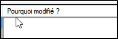
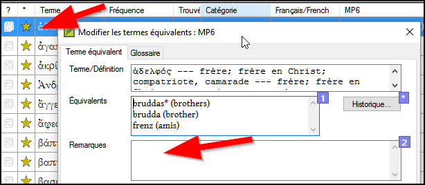

**Introduction**  The _Biblical terms rendering_ window and the separate _Biblical terms_ tool are very useful to make sure you are consistent in the use of terms, especially key terms. Avec de nombreux termes répartis sur de nombreux livres, cela peut devenir une véritable tâche. Ce module explique un simple processus de 4 étapes pour assurer que les termes bibliques sont cohérents. C'est un processus et doit être considéré comme une partie du processus de traduction et pas comme une vérification.

**Before you start**  You are translating a verse in Paratext 9, and you want to see what renderings have already been chosen for the terms in the current verse, and then make sure they are consistent with other verses.

**Why this is important**  For your readers to understand your text, you need to be consistent in your use of terms. C’est une grande tâche pour les rendre complètement cohérents. Si vous commencez à partir du verset que vous traduisez, et travaillez à partir de là, la tâche est plus facile à gérer. Le but est de s'assurer que vous avez été cohérent dans votre utilisation des termes bibliques et des décisions sont bien documentées sur les raisons pour lesquelles les changements ont été apportés.

**What you are going to do**  This method boils down to a short list of steps:

1. **[A]** Trouver tous les mots ou expressions que vous avez utilisés pour ce terme, et entrez les équivalents dans la boîte de dialogue des équivalents.
1. **[B]** Choisissez l’équivalent(s) qui est le meilleur, et enregistrez pourquoi il est préférable.
1. **[C]** Expliquez pourquoi vous avez rejeté les autres équivalents.
1. **[D]** Nettoyez votre traduction en appliquant cet équivalent partout dans votre traduction. (Faire cohérente, Standardiser, Normaliser, Harmoniser).
- Répétez ce processus avec le prochain terme biblique que vous trouvez dans la fenêtre d’équivalents de termes bibliques.

## 10.1 Ouvrir la fenêtre des équivalents de termes bibliques {#f8f57567e6ff4b9193367abfbee7302a}

1. Cliquez dans votre projet
1. **≡ Tab**, under **Tools** &gt; **Biblical terms rendering**
1. **≡ Tab** (of the new window), under **Biblical Terms** &gt; **Select Biblical terms list**
1. Choisissez la liste désirée
1. Click **OK**.

## 10.2 A : Trouver tous les équivalents pour ce terme {#df4c8121b667426ca013ce2feace7348}

### Trouver le terme pour le verset actuel {#3ffdc542c5f84c369b2c4cdfcc8569e1}

- Y a-t-il une coche dans la colonne trouvée ?
- S’il y a une coche, le verset utilise le terme et vous pouvez continuer avec le prochain terme.
- Sinon, vous devez soit corriger votre texte soit ajouter le nouveau terme que vous avez utilisé (voir ci-dessous)

### Ajouter un autre équivalent {#dae5da6bfb1b40c99e9eb4f0c7fe1f06}

Si l’équivalent que vous avez utilisé doit être ajouté à la liste :

1. Select the rendering of the term in your text.

1. Copy it (**Ctrl**+**C**)

1. Double-click in the renderings cell of the Biblical Terms rendering window.

1. Paste (**Ctrl**+**V**) the rendering in the dialog box.

1. Click **OK**.

### Find other verses in the current book with the same Biblical term {#bbdc4762638048adb945ccfff0f3c9e3}

In the Biblical Terms rendering window

1. Double-click on a word in the **Term** column

1. From the second filter button choose **current book**

1. Add renderings for the term in the verses until the terms in all verses have been identified (see below).

### Add renderings from the other verses {#a5212cc460da4fabb7cb3db81d405280}

1. Select the rendering in the verse
1. Add the rendering using **Ctrl**+**A**
1. Continue until all terms for those verses have been identified.

### Dealing with verses that do not use the term {#3867de64e3064e85a08eed2cdab64dad}

:::astuce

There are times when a verse is translated without using the actual term. For example, when a pronoun is used. In this case you need to deny that it is an error.

:::

- Click the red cross to the left of the verse reference link

:::caution

If you click on the cross by mistake, click the green tick and it will return to the red cross.

:::

## 10.3 B: Identify the best term {#55582923eae649c9964c1e0068ec29ac}

1. Double-click on the term in the top pane.

1. Decide on the best rendering

1. Section, then Cut (**Ctrl**+**x**) and paste (**Ctrl**+**v**) it to the top of the dialogue box

1. Add ***** as necessary to combine similar renderings

:::astuce

You can use ***** in a number of different ways: before the word for prefixes and after the word for suffixes. You can also put an ***** in the middle of a word. See the guide for more ways of using the *****.

:::

## 10.4 C: Reject all the others {#91a3dcb7525c41919b79cdc020e1ca63}

- Select and cut the other renderings.

## 10.5 D: Document the reason for the change {#c70df72e555f44d4a73cd41076bd8718}

- Click on the **History** button

- Type in the reason why the others were rejected and why the first was the best.

- Click **OK**

### If you need more than one rendering {#7efa68af7a544631bf7f24302fa0449e}

:::astuce

You can add more than one rendering if appropriate. It is good to add a back translation in brackets after the rendering. For example, slave (slave) guy * work fo (guy that works for)

:::

1. Open the Edit renderings dialog box
1. Edit the renderings as needed.

### Clean up other books (as time permits) {#ad15f3d2b6c24b35a1bb0ef7a8c04731}

1. Change the filter so that all the published books are displayed.
1. Clean up verses as necessary.

### Add the Biblical terms notes — ongoing discussion {#90110e260d7c40ca81c55c8e3604926b}

1. Double-click on the note icon (in the second column)

    

1. Type in the note
1. Assign the note as necessary.
1. Click **OK**.

### Add the decision to the renderings description {#1d89b36b75b14ab2a712924ef0e101e5}

1. Double-click on the term

1. Type the agreed-on rendering in the description field

1. Click **OK**

## 10.6 Add a term – from the source language text {#1ec5422db83c4bdeb51842a53f7df352}

:::astuce

You can create a list of verses for a specific Greek/Hebrew word and then use that list to add the word/phrase to your project Biblical terms list.

:::

1. Click in the window with the Source text.

1. Right-click on a lemma (blue word) in the source language text window

1. Choose **Add to project biblical terms for**

1. Choose your project

1. Edit the gloss if necessary

1. Click on the **Advanced** tab

1. Edit the terms if necessary

1. Click **OK**

### View the new term {#f269fc949f124cd5b1b68bb9a60766ad}

1. Change to the **Biblical Terms Tool**
1. Double-click on the term.

## 10.7 Add a term – from reference text search {#f683ccf4cdcf45f09c516c09c78ab277}

:::astuce

There will be terms which are important for your language and culture that are not in the list. You can add these terms to your project list.

:::

In Paratext

- From your reference text, do a find (using **≡ Tab**, under **Edit** &gt; **Find**) and search for the term.
    - _A list is displayed showing the verses with that term._

From the list of results

1. **≡ Tab**, under **Edit**> **Add to Project Biblical Terms**, then choose your project

1. Edit the gloss if necessary

1. Click on the **Advanced** tab

1. Type in a name for the term

1. Click **OK**

