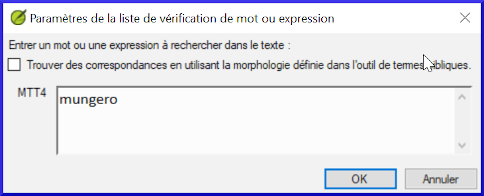
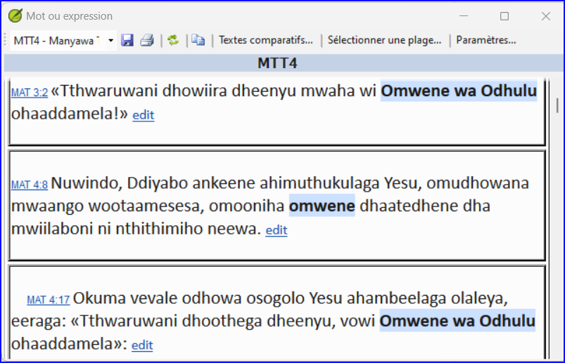
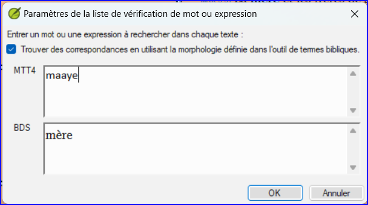
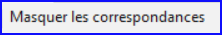
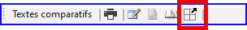

**Introduction** Dans ce module, vous allez chercher un mot ou phrase dans un projet et le comparer avec la traduction de ce mot ou phrase dans un autre projet.

**​Pourquoi cette aptitude est-elle importante ?** Dans Paratext 9 (et versions ultérieures), vous pouvez voir là où un mot ou une expression se trouve dans un projet et comparer comment le mot ou l’expression (ou une traduction du mot ou de l’expression) se produit dans un ou plusieurs autres projets. Par exemple, vous pouvez voir où le mot **roi** se produit dans un projet français et le comparer avec **rey** dans un projet espagnol.

Vous allez

- utiliser la liste récapitulative "Mot ou phrase", soit du texte, soit de l'outil "Termes bibliques".
- modifier les paramètres et les textes comparatifs
- saisir le mot ou l'expression à comparer

## 11.1 Comparer un mot ou expression - du texte {#659828b2f3ee4616a7b10dd9380b9ce2}

:::tip

Vous devez saisir un premier mot à rechercher avant de pouvoir définir les textes de comparaison. Votre toute première comparaison ne fonctionnera pas car aucun texte de comparaison n'a encore été choisi.

:::

1. Cliquez dans le projet que vous souhaitez comparer.

2. ≡ **onglet **, sous **Outils**, pointez sur **Listes récapitulatives** et sélectionnez **Mot ou expression**.

3. Tapez le mot ou la phrase que vous souhaitez voir dans la zone de texte pour chaque projet du dialogue
    - _La boîte de dialogue **Paramètres** est affichée_.

4. Cliquez sur **OK**

    - _Une fenêtre s'affiche_.

### Choisir les textes à comparer {#1b10fbeee1314150907b71b710e97dbd}

1. Cliquez sur **Textes comparatifs**…

2. Sélectionnez les textes que vous souhaitez comparer et cliquez sur **OK**.
    - Le dialogue _**Paramètres**_ s'affiche

### Tapez le mot ou expression à comparer {#ed9ce5e42eee4988945547297f12b1e0}

1. Saisissez le mot ou la phrase que vous souhaitez comparer dans la zone de texte pour chacun des projets

2. Cliquez sur **OK**.

    - _Une fenêtre s’affiche et le bouton **Masquer des correspondances** <em x-id="3">s’affiche sur la barre d’outils.</em> 
 

:::tip

Vous pouvez utiliser le bouton **Masquer les correspondances** pour n'afficher que les références où il y a des différences. Le mot ou expression est surligné en bleu clair.

:::

## 11.2 Comparer l'utilisation d’un mot ou expression – de l’outil termes bibliques {#14e18bd78f934875aa5084b16c1d7269}

### Dans l'outil des termes bibliques {#20feff24077248faa227e0c7cdef2fec}

1. Choisissez un terme qui a un équivalent

2. Cliquez sur l'icône de l'outil

    - _La boîte de dialogue Paramètres s'affiche avec l'équivalent rempli._

3. Tapez le mot ou l’expression pour les autres projets.

4. Cliquez sur **OK**

:::tip

Si vous souhaitez comparer plus d'un mot ou expression à la fois, tapez **Entrée** après chaque mot ou phrase pour qu'ils soient sur des lignes séparées.

:::

