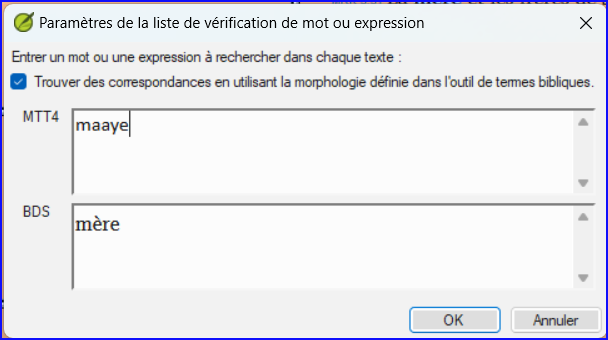
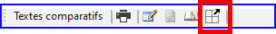

**Introduction**  In this module, you will search for a word or phrase in a project and compare it with the translation of that word or phrase in another project.

**Why this is important?**  In Paratext 9 (and above), you can see where a word or phrase is found in one project and compare it with the equivalent word or phrase in one or more other projects. Par exemple, vous pouvez voir où le mot <strong x-id="1">roi</strong> se produit dans un projet français et le comparer avec <strong x-id="1">rey</strong> dans un projet espagnol.

Vous allez

- utiliser la liste récapitulative "Mot ou phrase", soit du texte, soit de l'outil "Termes bibliques".
- modifier les paramètres et les textes comparatifs
- saisir le mot ou l'expression à comparer

## 11.1 Compare a word of phrase – from the text {#659828b2f3ee4616a7b10dd9380b9ce2}

:::tip

Vous devez saisir un premier mot à rechercher avant de pouvoir définir les textes de comparaison. Votre toute première comparaison ne fonctionnera pas car aucun texte de comparaison n'a encore été choisi.

:::

1. Click in the project that you want to compare

2. ≡ \*\*onglet \*\*, sous **Outils**, pointez sur **Listes récapitulatives** et sélectionnez **Mot ou expression**.

3. Enter the word or phrase that you want to see into the textbox for each project of the dialogue
   - _The Settings dialog is displayed_.

4. Cliquez sur **OK**

   - _A window is displayed_.

### Choose the texts to compare {#1b10fbeee1314150907b71b710e97dbd}

1. Cliquez sur **Textes comparatifs**…

2. Sélectionnez les textes que vous souhaitez comparer et cliquez sur **OK**.
   - _The_ _**Settings**_ _dialogue is displayed._

### Type the word or phrase to compare {#ed9ce5e42eee4988945547297f12b1e0}

1. Saisissez le mot ou la phrase que vous souhaitez comparer dans la zone de texte pour chacun des projets

2. Cliquez sur **OK**.

   - _A window is displayed with a button_ _**Hide matches**_ _on the toolbar._

:::tip

You can use the **Hide matches** button to show only those references where there are differences. Le mot ou expression est surligné en bleu clair.

:::

## 11.2 Compare using a Word or Phrase from the Biblical Terms tool {#14e18bd78f934875aa5084b16c1d7269}

### In the Biblical Terms tool {#20feff24077248faa227e0c7cdef2fec}

1. Choisissez un terme qui a un équivalent

2. Click on the tool icon

   - _The Settings dialogue is displayed with the rending filled-in._

3. Type the word or expression for the other projects

4. Cliquez sur **OK**

:::tip

If you want to compare more than one word or phrase at a time, type **Enter** after each word or phrase so that they are on separate lines.

:::
