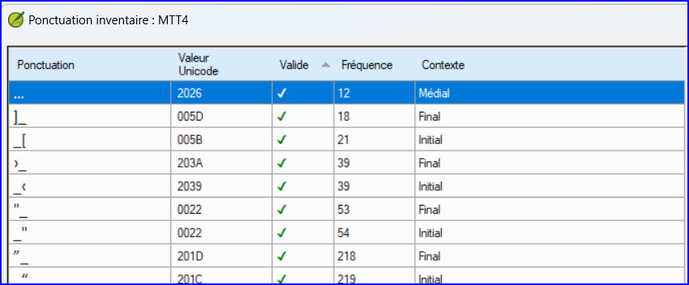

**Introduction** Dans ce module, vous apprendrez à faire plusieurs autres vérifications de base (les caractères, la ponctuation, les majuscules et les mots répétés).  Comme dans le premier module Vérifications de base (5. [Vérifications de base 1](https://sillsdev.github.io/paratext-manual/5.BC1)), il est plus facile d'exécuter ces vérifications à partir de les Tâches et avancement. Toutefois, si vous souhaitez vérifier plusieurs livres, vous devez utiliser le menu **Verification** .

**Avant de commencer**  Vous avez saisi votre traduction dans Paratext 9. Assurez-vous d'avoir vérifié les numéros de chapitre/verset et les marqueurs, comme indiqué au module. [Vérifications de base 1](https://sillsdev.github.io/paratext-manual/5.BC1), avant de continuer et que votre administrateur a complété la configuration des vérifications ou est là pour les faire avec vous.

**Pourquoi est-ce important ?**  Paratext 9 comporte onze **Vérifications de base**. Vous avez déjà vu les deux premières (le chapitre / les versets et les marqueurs). Bien que ces erreurs n’influent pas nécessairement le contenu du texte, de corriger ces erreurs rend le texte plus facile à lire. La prochaine série vous aide à localiser les erreurs liées à l’orthographe, la ponctuation, l’utilisation des majuscules et les mots répétés.

**Ce que nous allons faire :** La plupart des vérifications exigent qu’une certaine configuration soit faite par votre administrateur. Dans ce module, vous allez :

- assurer que la configuration a été effectuée (ou avoir l'administrateur les faire)
- faire les vérifications de base
- corriger toutes les erreurs.

## 12.1 Confirmer la configuration {#96b5c12dac164c719816a72af9b6bdea}

Avant de pouvoir exécuter ces autres contrôles de base, une certaine forme de configuration doit être effectuée. Certains contrôles nécessitent un inventaire, d'autres des règles ou des paramètres.

:::caution

Vous pouvez effectuer la plupart des inventaires, mais **seul votre administrateur** peut effectuer les règles ou les réglages.

:::

## 12.2 Utiliser les inventaires pour configurer les vérifications de base {#2af0f49b3c8248368dd82611ad6daed7}

:::tip

Ces inventaires montrent ce qui se trouve actuellement dans votre texte, c'est-à-dire ce qui est bon (valide) et ce qui ne l'est pas (non valide). Vous devez travailler en utilisant les inventaires et enseigner à Paratext 9 lesquels des éléments sont bons (valides) et lesquels sont des erreurs (non valides).

:::

Une fois l'inventaire terminé, vous serez prêt à procéder à la vérification.

1. **≡ Onglet**, sous **Outils** \&gt; **Inventaires des vérifications…** puis choisissez l’inventaire (par exemple l’inventaire de caractères).
1. Cliquez sur un élément dans la liste en haut.
    - _Les versets sont affichés dans le volet en bas._
1. Pour chaque élément, choisissez **Valide** ou **Non valide**.
1. Répétez pour chaque élément.
1. Cliquez sur **OK**.

:::tip

:::tip Dans certains cas, il est préférable d'utiliser la liste de mots ou **afficher l’orthographe** pour corriger plusieurs erreurs en même temps.

:::

## 12.3 Caractères {#62a1b14481984178905fe3720ad81e98}

:::tip

Cette vérification (et cet inventaire) vous permet d'identifier tous les caractères incorrects, c'est-à-dire les caractères qui ne font pas partie de votre alphabet (tel que défini dans les paramètres linguistiques **≡Onglet** , sous **Propriétés du projet** \&gt; **Paramètres de langue** \&gt; **Caractères alphabétiques**.

:::

### Configuration {#e87d6701d2f546faa45b5584b3b45d3a}

1. **≡ Onglet**, sous **Outils** \&gt; **Inventaires des vérifications** \&gt; **Inventaire de caractères**
1. Pour chaque élément, choisissez **Valide** ou **Non valide**.

:::caution

Si l'un de vos caractères alphabétiques est actuellement "inconnu", l'administrateur doit l'ajouter à vos paramètres de langue.

:::

### Vérification {#26d95e0dcad04a3a99dff3ea83702c82}

**≡ Onglet**, sous **Outils** \&gt; **Effectuer les vérifications de base**

1. Cochez **Caractères**
1. Cliquez sur **OK**.
    - _Une liste de problèmes s’affiche._
1. Faites les corrections nécessaires.

## 12.4 Ponctuation {#7a03d8fd1d3d4de38e992c7820f94bc7}

:::tip

:::tip Identifier et corriger tous les signes de ponctuation inadmissibles ou mal placés. (Utilisez la colonne de caractères Unicode pour identifier clairement la ponctuation)

:::

### Paramétrage requis {#21350c0dd462479184cc36dc9fc50d24}

1. **≡ Onglet**, sous **Outils** &gt; **Inventaires des vérifications** &gt; **Inventaire de signes de ponctuation**,
1. Vérifiez chaque signe de ponctuation et son contexte.
    - Les contextes peuvent être les suivants:
        - **mot initial**, **mot médial**, **mot final** ou **isolé**
    - Pour chaque ponctuation dans son contexte,
        - choisir **Valide** ou **Non valide** ou laisser comme **Inconnu**

        

1. Lorsque vous avez terminé, cliquez sur **OK**.
1. **≡ Onglet**, sous **Outils** \&gt; **Inventaires des vérifications** \&gt; **Inventaire des marqueurs sans ponctuation de fin de phrase**
1. Pour chaque élément, choisissez **Valide** ou **Non valide**.

### Vérification {#a24bedcb31944326a9c14889a7bf5a29}

1. **≡ Onglet**, sous **Outils** \&gt; **Effectuer les vérifications de base**
1. **guillemets** - règle
1. Cliquez sur **OK**.
    - _Une liste de problèmes s’affiche._
1. Faites les corrections nécessaires.

## 12.5 Paires correspondantes {#829c1d30e9d044ce9808a2a1c3ce63fd}

### Paramétrage requis {#458176d1cea940d5aa50db2af73cf078}

1. **≡ Onglet**, sous &gt; **Erreurs de ponctuation en paires correspondantes**:
1. Si la liste est vide, il n’y a pas d’erreurs.
1. Si nécessaire, cliquez sur **Options…** pour ajouter d'autres paires

### Vérification {#b1cbb995508b4d5eb82eec2f09af40ec}

1. **≡ Onglet**, sous **Outils** \&gt; **Effectuer les vérifications de base**
1. Pour chaque élément, choisissez **Valide** ou **Non valide**.
1. Cliquez sur **OK**.
    - _Une liste de problèmes s’affiche._
1. Faites les corrections nécessaires.

## 12.6 Mots répétés {#17ce3bddd4ed49c4afaceb8f4b874e20}

:::info

Cette vérification permet d'identifier les mots qui ont été répétés dans le texte. Ce qui peut indiquer une erreur, mais pas nécessairement.

:::

### Configuration {#9d08869684634685aa5a788e974cda3e}

1. **≡ Onglet**, sous **Outils** &gt; **Vérification des inventaires** &gt; **Inventaire des mots répétés :**
1. Pour chaque élément, choisissez **Valide** ou **Non valide**.

### Vérification {#ef2ea7921ac94cbca127e812b46341dc}

1. **≡ Onglet**, sous **Outils** \&gt; **Effectuer les vérifications de base**
1. **mots répétés** - inventaire de mots répétés
1. Cliquez sur **OK**.
    - _Une liste de problèmes s’affiche._
- Faites les corrections nécessaires.

## 12.7 Mise en majuscules {#7f4309ed10a44e7cae14a3c07da88d72}

:::info

Les vérifications de la mise majuscules recherchent plusieurs types de problèmes de capitalisation. Il y a trois inventaires concernant des majuscules, mais une seule vérification. Vous devrez peut-être cliquer sur le bouton **Options** pour ajouter des marqueurs ou de la ponctuation.

:::

### **Paramétrage requis** {#4ffe45925e6249d19d3c3d98f5a2a6eb}

1. **≡ Onglet**, sous **Outils** \&gt; **Inventaires des vérifications** \&gt; **Inventaire des marqueurs suivis d'une minuscule**
1. Pour chaque élément, choisissez **Valide** ou **Non valide**.
1. **≡ Onglet**, sous &gt; **Outils** &gt; **Vérifier les inventaires** &gt; **Ponctuation suivie d'une lettre minuscule**
1. Pour chaque élément, choisissez **Valide** ou **Non valide**.
1. **≡ Onglet**, sous **Outils** \&gt; **Inventaires des vérifications** \&gt; **Inventaire de mise en majuscules mixtes**
1. Si vous avez des préfixes en minuscules, cliquez sur **Options** et entrez les détails.
1. Pour chaque élément, choisissez **Valide** ou **Non valide**.

### **Vérification** {#491e80502e594776829f3545b770e886}

1. **≡ Onglet**, sous **Outils** \&gt; **Effectuer les vérifications de base**
1. Appuyez sur **Maj** + double-cliquez,
1. Cliquez sur **OK**.
    - _Une liste de problèmes s’affiche._
1. Faites les corrections nécessaires.

## 12.8 Faire de petites corrections {#69410b6613db4a8b8cba359728e2caf1}

:::caution

:::caution Il est possible d'effectuer des corrections mineures à partir d'un inventaire affiché. Toutefois, s'il y a plusieurs erreurs, il est préférable d'exécuter la vérification pour apporter les corrections.

:::

1. Cliquez sur un verset dans la liste en bas
1. **numération** - paramètres
1. Faites la correction,
1. Cliquez sur **OK**.

:::caution

Dans certains cas, il est préférable d'utiliser la liste de mots ou le correcteur orthographique pour corriger plusieurs erreurs à la fois.

:::

### **Réviseur** {#555ab76059a54d4689dd06ae94ccb00c}

Paratext 9 comporte de numerous vérifications de base. Le tableau ci-dessous résume la configuration nécessaire pour chacun des vérifications.

| **Vérification**                                 | **Configuration**                                                                                                                     |
| ------------------------------------------------ | ------------------------------------------------------------------------------------------------------------------------------------- |
| Numéros de Chapitre(s)/verset(s)                 | aucun                                                                                                                                 |
| Marqueurs                                        | aucun. (L'inventaire des marqueurs affiche tous les marqueurs actuels)                                                                |
| Caractères (combinaisons)                        | Inventaire de caractères                                                                                                              |
| Ponctuation                                      | Inventaire de la ponctuation Inventaire des marqueurs sans ponctuation de fin de phrase                                     |
| Mise en majuscules                               | 3 inventaires : Inventaire des marqueurs suivis d'une minuscule ; Ponctuation suivie d'une lettre minuscule ; Mise en majuscule mixte |
| Mots répétés                                     | Inventaire des mots répétés                                                                                                           |
| Erreurs de ponctuation en paires correspondantes | Erreurs de ponctuation en paires correspondantes                                                                                      |
| Citations                                        | **≡ Onglet**, sous **Paramètres de projet** > **Règles des guillemets**                                                               |
| Nombres                                          | **≡ Onglet**, sous **Paramètres de projet** > **Paramètres de chiffres**                                                              |
| Références                                       | **≡ Onglet**, sous **Paramètres de projet** > **Paramètres des références bibliques**                                                 |
| Texte cité                                       | aucun                                                                                                                                 |

:::caution

Il est possible d'effectuer toutes les vérifications en même temps. Toutefois, lorsque les vérifications sont effectuées pour la première fois, il est préférable de les effectuer un par un afin d'éviter une longue liste d'erreurs.

:::

