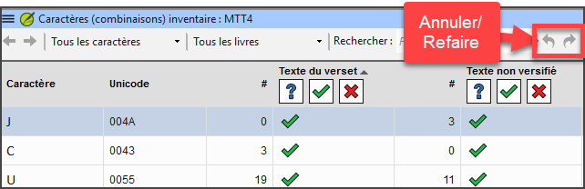

**Introduction**  In this module, you will learn to do several other basic checks (**Characters**, **punctuation**, **capitals**, and **repeated words)**. Comme dans le premier module Vérifications de base (5. [Vérifications de base 1](/5.BC1)), il est plus facile d'exécuter ces vérifications à partir de Tâches et avancement. Toutefois, si vous souhaitez vérifier plusieurs livres, vous devez utiliser le menu **Outils**.

**Avant de commencer**  Vous avez saisi votre traduction dans Paratext 9. Assurez-vous d'avoir vérifié les numéros de chapitre/verset et les marqueurs, comme indiqué au module. [Vérifications de base 1](/5.BC1), avant de continuer et que votre administrateur a complété la configuration des vérifications ou est là pour faire la configuration maintenant.

**Why is this important?**  Paratext 9 has eleven **Basic Checks**. Vous avez déjà vu les deux premières (le chapitre / les versets et les marqueurs). Bien que ces erreurs n’influent pas nécessairement le contenu du texte, de corriger ces erreurs rend le texte plus facile à lire. La prochaine série vous aide à localiser les erreurs liées à l’orthographe, la ponctuation, l’utilisation des majuscules et les mots répétés.

**What we will do:**  Most of the checks require that your administrator has completed an inventory. In this module, you will

- Confirmer que quelqu'un a effectué la configuration (ou demander à l'administrateur de le faire)
- faire les vérifications de base
- corriger toutes les erreurs.

## 12.1 Confirmer la configuration {#96b5c12dac164c719816a72af9b6bdea}

Before you can run these other basic checks, someone must set them up. Some checks require an inventory, and others require rules or settings.

:::caution

Vous pouvez faire la plupart des inventaires, mais **seul votre Administrateur** peut faire les règles ou les paramètres.

:::

## 12.2 Changes to inventories {#1ba598a5fd408085bb05d1fb347c38e9}

:::info

In Paratext 9.5, the inventories have changed. They now look and behave like the Wordlist panel. A new feature allows you to approve an item based on its location. That is, you can now approve an item based on whether it is in verse text or non-verse text.

- Click on the Inventory menu and choose “Set verse and non-verse status separately”.

:::

- there are an undo and redo icons (top right)
- **filtering** to help users easily find and organize inventory items.
- inventory panels can also be docked

## 12.3 Using inventories to setup {#2af0f49b3c8248368dd82611ad6daed7}

:::tip

Ces inventaires montrent ce qui se trouve actuellement dans votre texte, c'est-à-dire ce qui est bon (valide) et ce qui ne l'est pas (non valide). Vous devez travailler en utilisant les inventaires et enseigner à Paratext 9 lesquels des éléments sont bons (valides) et lesquels sont des erreurs (non valides).

:::

Once you have finished the inventory, you will be ready to check.

1. From the **≡ Tab**, under **Tools** &gt; **Checking inventories** menu, choose the appropriate inventory (for example, Character inventory).
2. Cliquez sur un élément dans la liste en haut.
    - _Les versets sont affichés dans le volet en bas._
3. Pour chaque élément du panneau supérieur, choisissez soit **Valide** soit **Non valide**.
4. Répétez pour chaque élément.
5. Cliquez sur **OK**.

:::tip

Au lieu d'utiliser la souris, vous pouvez utiliser **Ctrl** + **y** pour marquer une entrée comme **Valide** ou **Ctrl** + **n** pour marquer une entrée comme **Non valide**.

:::

## 12.4 Characters {#62a1b14481984178905fe3720ad81e98}

:::tip

Cette vérification (et cet inventaire) vous aide à identifier tous les caractères incorrects, c'est-à-dire les caractères qui ne sont pas dans votre alphabet (tel que défini dans les paramètres de langue **≡** Onglet, sous **Propriétés du projet** &gt; **Paramètres de langue** &gt; **Caractères alphabétiques**.

:::

### Configuration requise {#e87d6701d2f546faa45b5584b3b45d3a}

1. **≡ Onglet**, sous **Outils** &gt; **Inventaires des vérifications** &gt; **Inventaire de caractères**
2. Pour chaque élément, choisissez **Valide** ou **Non valide**.

:::caution

Si l'un de vos caractères alphabétiques est actuellement "inconnu", l'administrateur doit l'ajouter à vos paramètres de langue.

:::

### Vérification {#26d95e0dcad04a3a99dff3ea83702c82}

**≡ Tab**, under **Tools** &gt; **Run Basic Checks**

1. Vérification des **Caractères**
2. Cliquez sur **OK**.
    - _Une liste de problèmes s’affiche._
3. Faites les corrections nécessaires.

## 12.5 Punctuation {#7a03d8fd1d3d4de38e992c7820f94bc7}

:::tip

Identifier et corriger tous les signes de ponctuation inadmissibles ou mal placés. (Utilisez la colonne de caractères Unicode pour identifier clairement la ponctuation)

:::

### Configuration requise {#21350c0dd462479184cc36dc9fc50d24}

1. **≡ Onglet**, sous **Outils** &gt; **Inventaires des vérifications** &gt; **Inventaire de signes de ponctuation**

2. Vérifiez chaque signe de ponctuation et son contexte.
    - Les contextes peuvent être les suivants:
        - **initial**, **médial**, **final** ou **isolé**
    - Pour chaque ponctuation dans son contexte,

        - choisir **Valide** ou **Non valide** ou laisser comme **Inconnu**

        

3. Lorsque vous avez terminé, cliquez sur **OK**.

4. **≡ Onglet**, sous **Outils** > **Inventaires de vérifications** > **Inventaire des marqueurs sans ponctuation de fin de phrase**

5. Pour chaque élément, choisissez **Valide** ou **Non valide**.

### Vérification {#a24bedcb31944326a9c14889a7bf5a29}

1. **≡ Onglet**, sous **Outils** > **Effectuer les vérifications de base**
2. Cochez **Ponctuation**
3. Cliquez sur **OK**.
    - _Une liste de problèmes s’affiche._
4. Faites les corrections nécessaires.

## 12.6 Matched Pairs {#829c1d30e9d044ce9808a2a1c3ce63fd}

### Configuration requise {#458176d1cea940d5aa50db2af73cf078}

1. **≡ Onglet**, sous Outils > **Inventaires de vérifications** > **Erreurs de ponctuation en paires correspondantes**.
2. Si la liste est vide, il n’y a pas d’erreurs.
3. Si nécessaire, cliquez sur **Options…** pour ajouter d'autres paires

### Vérification {#b1cbb995508b4d5eb82eec2f09af40ec}

1. **≡ Onglet**, sous **Outils** > **Effectuer les vérifications de base**
2. Cochez **Erreurs de ponctuation en paires correspondantes**
3. Cliquez sur **OK**.
    - _Une liste de problèmes s’affiche._
4. Faites les corrections nécessaires.

## 12.7 Repeated words {#17ce3bddd4ed49c4afaceb8f4b874e20}

:::info

Cette vérification permet d'identifier les mots qui ont été répétés dans le texte. Ce qui peut indiquer une erreur, mais pas nécessairement.

:::

### Configuration requise {#9d08869684634685aa5a788e974cda3e}

1. **≡ Onglet**, sous **Outils** > **Inventaires de vérifications** > **Inventaire des mots répétés :**
2. Pour chaque élément, choisissez **Valide** ou **Non valide**.

### Vérification {#ef2ea7921ac94cbca127e812b46341dc}

1. **≡ Onglet**, sous **Outils** > **Effectuer les vérifications de base**
2. Cochez **mots répétés**
3. Cliquez sur **OK**.
    - _Une liste de problèmes s’affiche._

- Faites les corrections nécessaires.

## 12.8 Capitalization {#7f4309ed10a44e7cae14a3c07da88d72}

:::info

Les vérifications de la mise majuscules recherchent plusieurs types de problèmes de capitalisation. Il y a trois inventaires concernant des majuscules, mais une seule vérification. Vous devrez peut-être cliquer sur le bouton **Options** pour ajouter des marqueurs ou de la ponctuation.

:::

### **Configuration requise** {#4ffe45925e6249d19d3c3d98f5a2a6eb}

1. ≡ Onglet, sous Outils > Inventaires de vérifications > Inventaire des marqueurs suivis d'une minuscule
2. Pour chaque élément, choisissez **Valide** ou **Non valide**.
3. ≡ Onglet, sous Outils > Inventaires de vérifications > Ponctuation suivie d'une lettre minuscule
4. Pour chaque élément, choisissez **Valide** ou **Non valide**.
5. **≡ Onglet**, sous **Outils** > **Inventaires de vérifications** > **Mise en majuscule mixte**
6. Si vous avez des préfixes en minuscules, cliquez sur **Options** et entrez les détails.
7. Pour chaque élément, choisissez **Valide** ou **Non valide**.

### **Vérification** {#491e80502e594776829f3545b770e886}

1. **≡ Onglet**, sous **Outils** > **Effectuer les vérifications de base**
2. Cochez **Capitalisation**
3. Cliquez sur **OK**.
    - _Une liste de problèmes s’affiche._
4. Faites les corrections nécessaires.

## 12.9 Making minor corrections {#69410b6613db4a8b8cba359728e2caf1}

:::caution

Il est possible d'effectuer des corrections mineures à partir d'un inventaire affiché. Toutefois, s'il y a plusieurs erreurs, il est préférable d'exécuter la vérification pour apporter les corrections.

:::

1. Cliquez sur un verset dans la liste en bas
2. Maintenez la touche **Maj** enfoncée et double-cliquez
3. Faites la correction,
4. Cliquez sur **OK**.

:::caution

Dans certains cas, il est préférable d'utiliser la liste de mots ou le correcteur orthographique pour corriger plusieurs erreurs à la fois.

:::

### Bilan {#555ab76059a54d4689dd06ae94ccb00c}

Paratext 9 comporte de nombreuses vérifications de base. Le tableau ci-dessous résume la configuration nécessaire pour chacun des vérifications.

| Vérification                                                           | **Configuration**                                                                                                       |
| ---------------------------------------------------------------------- | ----------------------------------------------------------------------------------------------------------------------- |
| Numéros de Chapitre(s)/verset(s) | aucun                                                                                                                   |
| Marqueurs                                                              | aucun. (L'inventaire des marqueurs affiche tous les marqueurs actuels)               |
| Caractères (combinaisons)                           | Inventaire de caractères                                                                                                |
| Ponctuation                                                            | Inventaire de la ponctuation  Inventaire des marqueurs sans ponctuation de fin de phrase                            |
| Mise en majuscules                                                     | 3 inventories Markers followed by a lowercase letter; Punctuation Followed by a Lower Case letter; Mixed Capitalization |
| Mots répétés                                                           | Inventaire des mots répétés                                                                                             |
| Erreurs de ponctuation en paires correspondantes                       | Erreurs de ponctuation en paires correspondantes                                                                        |
| Citations                                                              | **≡ Onglet**, sous **Paramètres du projet** > **Règles des guillemets**                                                 |
| Nombres                                                                | **≡ Onglet**, sous **Paramètres du projet** > **Paramètres de chiffres**                                                |
| Références                                                             | **≡ Onglet**, sous **Paramètres du projet** > **Paramètres des références bibliques**                                   |
| Citations de note de bas de page                                       | aucun                                                                                                                   |

:::caution

It is possible to run all the checks at once; however, when running the checks for the first time, it is better to run them one at a time to avoid a long list of errors.

:::

