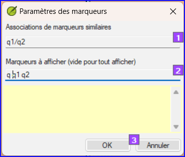

**Introduction** Dans ce module, vous apprendrez à trouver et à corriger les erreurs de mise en forme et de mise en page.

**Avant de commencer**  Vous devez saisi votre projet dans Paratext. Vous utiliserez les listes récapitulatives pour trouver et corriger les erreurs de formatage et de mise en page.

**Pourquoi cette aptitude est importante** Un Nouveau Testament contient plus que des chapitres et des versets. Il y a aussi des titres, des titres de section et plusieurs types de paragraphes. Ces vérifications vous permettent de vous assurer que la mise en page de votre texte est correcte et que vos titres, etc. sont cohérents.

**Qu'allez-vous faire ?**  Vous utiliserez les listes récapitulatives pour

- comparer vos titres et sous-titres ;
- vérifier vos sautes de paragraphes ;
- comparer les marqueurs de paragraphe de votre texte avec ceux de votre texte de référence ;
- ajouter des marqueurs pour la mise en forme des textes spéciaux.

## 13.1 Utilisation des listes de vérifications – générique {#ab06f030df1d407db09305cfb4731d3d}

:::caution

Il existe un certain nombre de Listes récapitulatives qui diffèrent légèrement les unes des autres, mais qui ont les points suivants en commun :

:::

**Comment afficher la liste**

- **≡ Onglet**, sous **Outils** &gt; **Listes récapitulatives** &gt; choisissez la liste désirée
- Ajoutez un texte comparatif (si voulu) en cliquant sur le bouton Textes comparatifs
- Sélectionnez la plage (si nécessaire) en utilisant le bouton **Sélectionner plage**

**Comment faire les modifications**

- Cliquez sur le lien Modifier pour corriger d'éventuelles erreurs
- Cliquez sur le lien de référence pour voir plus de contexte

**Fermer la liste**

- Une fois la liste terminée, fermez-la en cliquant sur le X dans le coin supérieur droit de la fenêtre.

## 13.2 Utilisation des listes de vérifications – En-têtes de section {#3bb3fb489ec245438ee65525a4671432}

- **≡ Onglet**, sous **Outils** &gt; **Listes récapitulatives** &gt; **En-têtes de section**

Vérifiez que

- les titres sont cohérents avec votre texte de référence (longueur, grammaire, style).
- tous les en-têtes commencent avec une majuscule.
- il n’y a pas de ponctuation à la fin
- ils ne sont pas trop longs.

## 13.3 Vérification des paragraphes {#4beb41c77b7b41588a954c89f01a44d6}

1. **≡ Onglet**, sous > **Outils** > **Listes récapitulatives** > **Marqueurs**

2. Choisissez votre texte de référence comme le **texte comparatif**

3. Cliquez sur **Paramètres**

4. Tapez les créateurs de paragraphes à afficher
   (par exemple, p m)

5. Cliquez sur **OK**.

6. Cliquez sur le lien bleu pour corriger des problèmes vus.

OU

1. Cliquez sur **le lien bleu**
2. Faites les corrections en Paratext
3. Retournez aux listes récapitulatives en cliquant sur l'icône dans la barre des tâches.

## 13.4 Mise en page et retraits {#17698276f8084544a20d3d426679de1d}

1. **≡ Onglet**, sous **Outils** &gt; **Listes récapitulatives** &gt; **Marqueurs**
2. Choisissez votre texte de référence comme texte comparatif
3. Cliquez sur **Paramètres**  

- Tapez les marqueurs à vérifier.

- Cliquez sur **OK**.

- Recherchez les passages qui ont été formatés avec des marqueurs différents, tels que q1 et q2

- Apportez les modifications nécessaires (voir ci-dessous).

## 13.5 Ajouter USFMs pour la mise en forme spéciale {#2fed410218164e21834d0949e5ab3c07}

- Voir la liste des passages avec un formatage spécial [Annexe A](https://manual.paratext.org/Training-Manual/Appendix/A.st).
- Ajoutez l'USFM si nécessaire (voir le module KD ou l'aide si nécessaire).
