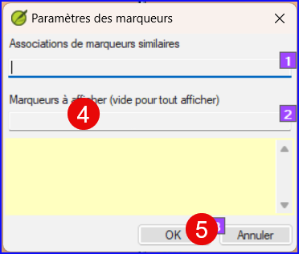

**Introduction** Dans ce module, vous apprendrez à trouver et à corriger les erreurs de mise en forme et de mise en page.

** Avant de commencer**  Vous devez saisi votre projet dans Paratext. Vous utiliserez les listes récapitulatives pour trouver et corriger les erreurs de formatage et de mise en page.

**Pourquoi cette aptitude est importante** Un Nouveau Testament contient plus que des chapitres et des versets. Il y a aussi des titres, des titres de section et plusieurs types de paragraphes. Ces vérifications vous permettent de vous assurer que la mise en page de votre texte est correcte et que vos titres, etc. sont cohérents.

**Qu'allez-vous faire ?**  Vous utiliserez les listes récapitulatives pour

- comparer vos titres et sous-titres ;
- vérifier vos sautes de paragraphes ;
- comparer les marqueurs de paragraphe de votre texte avec ceux de votre texte de référence ;
- ajouter des marqueurs pour la mise en forme des textes spéciaux.

## 13.1 Utilisation des listes de vérifications – générique {#ab06f030df1d407db09305cfb4731d3d}

:::caution

There are a number of checklists which differ slightly but they have the following in common:

:::

**Comment afficher la liste**

- **≡ Tab**, under &gt; **Tools** &gt; **Checklists** &gt; choose the desired list
- Add a comparative text (if desired) by clicking on the Texts button. **Comparative text** button
- Sélectionnez la plage (si nécessaire) en utilisant le bouton **Sélectionner plage**

**Comment faire les modifications**

- Click the Edit link to correct any errors
- Cliquez sur le lien de référence pour voir plus de contexte

**Fermer la liste**

- Une fois la liste terminée, fermez-la en cliquant sur le X dans le coin supérieur droit de la fenêtre.

## 13.2 Utilisation des listes de vérifications – En-têtes de section {#3bb3fb489ec245438ee65525a4671432}

- **≡ Tab**, under &gt; **Tools** &gt; **Checklists** &gt; **Section Headings**

Vérifiez que

- les titres sont cohérents avec votre texte de référence (longueur, grammaire, style)).
- tous les en-têtes commencent avec une majuscule.
- there is no punctuation at the end
- ils ne sont pas trop longs.

## 13.3 Vérification des paragraphes {#4beb41c77b7b41588a954c89f01a44d6}

1. **≡ Tab**, under > **Tools** > **Checklists** > **Markers**

1. Choose your reference text as the **comparative text**

1. Click **Settings**

1. Type the paragraph makers to be displayed
(e.g. p m)

1. Click **OK**.

1. Make any corrections by clicking on the blue **Edit** link.

OU

1. Cliquez sur __le lien bleu__
1. Faites les corrections en Paratext
1. Return to the checklist by clicking on the icon on the taskbar.

## 13.4 Mise en page et retraits {#17698276f8084544a20d3d426679de1d}

1. **≡ Tab**, under **Tools** &gt; **Checklists** &gt; **Markers**
1. Choisissez votre texte de référence comme texte comparatif
1. Cliquez sur **Paramètres**  

- Tapez les marqueurs à vérifier.

- Click **OK**.

- Look for passages that have been formatted with different markers such as q1 and q2

- Make any necessary changes (see below).

## 13.5 Ajouter USFMs pour la mise en forme spéciale {#2fed410218164e21834d0949e5ab3c07}

- See the list of passages with special formatting [Appendix A](https://manual.paratext.org/Training-Manual/Appendix/A.st).
- Add the USFM as necessary (see module KD or help if necessary).
