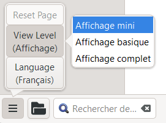

**Introduction** Dans ce module, vous apprendrez comment imprimer une ébauche de votre traduction pour la vérification et la révision.

**Où en sommes-nous dans le processus ?** Vous avez travaillé sur votre texte dans Paratext. Maintenant, vous voulez l’imprimer pour le donner aux réviseurs ou pour la vérification. Votre projet doit être inscrit dans le registre de Paratext 9 pour imprimer une ébauche. Dans Paratext 9.4, il n'est pas nécessaire d'enregistrer votre projet pour pouvoir l'imprimer.

**Pourquoi cette aptitude est-elle importante ?** Il est plus facile de faire réviser et vérifier votre travail sur le papier qu’à l’écran. Avec des copies imprimées, vous pouvez donner le texte à plusieurs personnes.

**Ce que vous allez faire**  Vous allez d'abord produire une version PDF de votre traduction, que vous pourrez imprimer ou partager avec d'autres personnes (y compris des utilisateurs non-Paratext). Si nécessaire, vous pouvez copier la version PDF sur votre clé USB pour la transférer sur un ordinateur connecté à une imprimante.

:::info Mise à jour de Paratext 9.4

**PTXPrint** has replaced the old Print Draft PDF.

It is currently only available in Arabic, Chinese (Simplified), English, French, Hungarian, Indonesian, Portuguese, Romanian, Russian and Spanish.

If it is not installed, it will ask you to download and install it first. PTXPrint is very powerful and has many options. We recommend that you select a language and then use **Mini View**.

:::

## 14.1 Créer votre premier fichier PDF {#f6c39f92a81d44aead7aa92c0f6bb317}

:::caution

Assurez-vous d’avoir fait la vérification des marqueurs avant d’imprimer l’ébauche.

:::

1. **≡ Onglet**, sous **Projet** &gt; **Exporter le brouillon PDF** **(PTX Print)**
2. En bas à gauche, cliquez sur le \*\*bouton du menu \*\*
3. Cliquez sur **View Level &gt;**  **Mini View**
4. Cliquez sur **Basic** en haut à gauche de la barre latérale
5. Vérifiez si votre projet est sélectionné.
6. **Soit** choisir **Livre unique**, puis choisir le livre et les chapitres
7. **OU** Si vous souhaitez imprimer votre priorité ou plus d'un livre, choisissez **Portions ou plusieurs livres** et introduisez les références manuellement.

### Choisissez les paramètres de la page comme suit {#ff7614d604f1485c8c6c4de117939575}

1. Cliquez sur **Layout** dans le panneau latéral gauche. Choisissez les paramètres de la page comme suit
2. Taille de page :
   - 210mm, 297mm (A4) ou
   - 148mm, 210mm (A5)
3. Ajustez la taille de \*\*la police de base de \*\* si nécessaire (normalement 11pt)
4. Ajustez \*\*l'interligne de base \*\* (l'interligne simple correspond à 120 % de la police)
5. Désactiver **Two Column Layout**

### Choisir la police pour le texte {#2f450c521a5a46e69f24dc8ef01b4262}

1. Cliquez sur **Fonts+Scripts** dans la barre latérale gauche
2. Choisissez la police de caractères pour le **Body Text (Regular)**: Charis SIL (ou Charis SIL Compact)
3. Taille : 10 (or 11)

### Imprimer (Créer le PDF) {#bcd83f846ef549d2ac75fcb83c8df8e6}

1. Cliquez sur le bouton **Print (Make PDF)**
2. PTXPrint créera le fichier PDF
   - _Le PDF s'ouvre dans votre programme PDF par défaut._

### D'autres modifications sont nécessaires ? {#d80d8aac8a4a43f7a53d3502637d61c0}

:::tip

La vue Mini est idéale pour tester votre PDF. If you want to make any changes, you can change the view level to **Basic View**. Full view est très avancé, mais bon pour votre publication finale.

:::

1. Passer à la vue de base
   1. En bas à gauche, cliquez sur le \*\*bouton du menu \*\*
   2. Cliquez sur **View Level >**  **Basic View**
2. Cliquez sur **Layout** en haut à gauche de la barre latérale
   1. Choose **Margins**
   2. Cochez **Pages miroirs**
3. Cliquez sur **Header+Footer** dans la barre latérale.
   1. Choisissez ce que vous voulez dans **les en-têtes de page**.
   2. Choisissez ce que vous voulez dans le **Footer**
   3. Faites les autres choix selon les besoins.
4. Click **Print (Make PDF)** and wait, the file will open in your PDF reader.

### Imprimer un livret A5 {#4ef8b4336abd46cf8f7383fcd9ae08c2}

:::tip

Assurez-vous que vous êtes passé à l'affichage de base (Basic View)

:::

Dans PTXPrint

1. Cliquez sur **Finishing** dans la barre latérale
2. Sous **Pagination du livret, pages par page**
3. Choisir **2-up**
4. Vérifiez que le format physique du papier est correct.
5. Cliquez sur **Imprimer (faire un PDF)**

Dans votre logiciel PDF

1. **Fichier &gt; Imprimer**
2. Imprimer la version 2-up en recto-verso

- Cliquez sur le bouton **Propriétés**
  - _A dialog is displayed which may be different but will have a way of setting double-sided._ For example
  - Cliquez pour cocher **Pages en vis-à-vis**
  - Choisissez **recto verso**
  - Cliquez sur **Finition**
- **≡ Onglet**, **Modifier la collection de textes**  

:::tip

Si vous voulez suivre un système de ponctuation qui ajoute un espace avant ou après un signe de ponctuation complexe, demandez à un encadreur de modifier votre PrintDraftChanges.txt

:::

## 14.3 Copiez le fichier PDF à une clé USB {#2f0e6aec647e495db41b1992e5f40094}

:::info

Paratext enregistre le fichier de PDF dans le dossier PrintDrafts de votre dossier de projet. Par exemple, C:\My Paratext 9 Projects\NXXX\local\ptxprint

:::

:::tip

Il y a beaucoup de façons de copier des fichiers. Une méthode est décrite ci-dessous.

:::

1. Maintenez la touche Windows et tapez **E**
   - _La fenêtre d'Explorateur s'affiche_
2. Accédez à dossier **My Paratext 9 Projects**
3. Double-cliquez sur votre dossier du projet
4. Double-cliquez sur le dossier **local** puis sur le dossier **ptxprint**
5. Cliquez droit sur le fichier PDF
6. Choisissez **Envoyer vers**
7. Choisissez votre clé USB.
