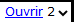

**Introduction**  As you are translating and checking you may want to make comments on various errors or issues. Il se peut aussi que vous souhaitiez enregistrer vos discussions sur des sujets des termes clés et des questions d’orthographe. Paratext 9 vous permet d’enregistrer de tels commentaires directement dans le texte, dans la liste des termes bibliques ou dans la liste des mots.

**Before you start**  You are typing or revising your text, wordlist or Biblical terms and need to make comments on an issue you have seen.

:::caution

Notes and footnotes are very different. Ces dernières apparaissent dans la Bible alors que les remarques servent à conserver les questions et les commentaires et ne s’affichent pas dans la Bible.

:::

**Qu’est-ce qu’on va faire ?** Vous allez

- ajoutez plus d'icônes de remarques (administrateur seulement)
- créer des remarques dans le texte en utilisant différentes icônes ;
- ouvrez, modifiez et résolvez les remarques ;
- ouvrir une liste des remarques à partir du texte ;
- filtrer la liste ;
- imprimer la liste des remarques ;

## 15.1 Les différentes icônes de remarques {#fe71e7bac96d4755bb40630bd0c2b1c0}

You can choose from many different icons for your project notes in Paratext 9:

:::astuce

:::tip Ne prenez pas trop d’icônes !

:::

**Les différentes formes d’icônes**

| Description                                                        | Signification                                                                                                                                                                                                    |
| ------------------------------------------------------------------ | ---------------------------------------------------------------------------------------------------------------------------------------------------------------------------------------------------------------- |
| Icon has a border and a **yellow background** color.               | The note has a least one unread comment.                                                                                                                                                                         |
| Icon is **red, purple, or light blue**.                            | Une note de projet confiée à vous ou à l’équipe entière.                                                                                                                                                         |
| Icon is **gray**.                                                  | Une note de projet confiée à quelqu’un d’autre ou non assigné.                                                                                                                                                   |
| Icon has a **border** and a **yellow background color**.           | The note has a least one unread comment.                                                                                                                                                                         |
| Icon is r**ed, purple,** or **light blue**.                        | Une note de projet confiée à vous ou à l’équipe entière.                                                                                                                                                         |
| Icon is **gray**.                                                  | Une note de projet confiée à quelqu’un d’autre ou non assigné.                                                                                                                                                   |
| Icon is **gray** with a **green tick**.                            | Une note de projet ayant le statut résolu. (This will not appear in the text, but only in the notes list.)                                                                                                       |
| Icon is a **white question mark** on the **cover of a book**.      | Il y a une note de discussion d’orthographe pour ce mot. (Liste de mots)                                                                                                                                         |
| Icon is **gray** with a **question mark** on the cover of a book.  | Il n’y a PAS de note de discussion d’orthographe pour ce mot. (Liste de mots)                                                                                                                                    |
| Icon is a **light blue plus** +.                                   | Une note du conseiller.                                                                                                                                                                                          |
| Icon is a **light blue globe**.                                    | Une note globale du conseiller.                                                                                                                                                                                  |
| Icon is a **black exclamation point !** within a **red triangle.** | Il y a un conflit de fusion Envoyer/Recevoir parce que deux utilisateurs ont fait de différents changements dans le même verset.                                                                                 |
| Icon is a **white arrow** on a **blue background**.                | Il y a une note de discussion des équivalents pour ce terme biblique. Cette icône apparaît uniquement dans l’outil Termes bibliques ou dans la fenêtre des équivalents des termes bibliques.                     |
| Icon is **gray** with an **arrow on the cover of a book**.         | Il n’y a PAS de note de discussion d’équivalent pour ce terme biblique (Termes bibliques) Cette icône apparaît uniquement dans l’outil Termes bibliques ou dans la fenêtre des équivalents des termes bibliques. |

### **Setup additional note tags** {#04231dff267d4df992012fdcfb7f5b49}

:::caution

One must be an Administrator

:::

1. **≡ Tab**, under &gt; **Project** &gt; **Project settings** &gt; **Project properties**
1. Cliquez sur l’onglet **Remarque**
1. Cliquez sur le bouton **Ajouter étiquette**
    - _Une nouvelle ligne est ajoutée_
1. Click the icon on the new tag line
1. Choose the desired icon
1. Type a name for the new note type
1. Continue for any other new notes.

## 15.2 Utilisation des remarques {#c8c21c6181cc4529a478dba32d984ba5}

**Insertion d’une remarque**

1. Cliquez dans le texte où vous voulez le note (et si désiré, sélectionnez du texte)

1. **≡ Tab**, under **Insert** > **Note**

1. Choose the desired tag for the note from the list

1. Type the text for the note

1. Click **OK**.

.

### **Ajouter des commentaires dans une remarque existante** {#958963568fb4491bb7fedc24d80585bb}

- Click the icon in the text

- Type a note
- **≡ Onglet**, **Modifier la collection de textes**  

### **Confier une remarque à quelqu’un** {#9a602aedc3974606bf478a02d0e2015a}

1. Click the icon in the text.

1. Saisissez le commentaire
1. Cliquez sur **Confier à (Affecter à)**
1. Choisissez comme désiré
1. **≡ Onglet**, **Modifier la collection de textes**  

### **Relie une remarque à plusieurs projets** {#6536405a9e4842f29a1f267c60b4337d}

1. Ouvrez la remarque
1. Cliquer sur le bouton **Multiple**
1. Choisissez les projets
1. **≡ Onglet**, **Modifier la collection de textes**  
1. Cliquez sur **OK**  encore une fois pour fermer la boîte de dialogue.

### **Rattacher une remarque** {#fe4f817bb1724ed6889d543fb3f4bbc8}

- Click the note icon in the text to open the note.

    

- Click the Reattach Note button (on the toolbar)

- Cliquez sur le(s) mot(s) à attacher
- Cliquez sur **OK**.
    - _La remarque est attachée au mot._

### **Marquer une remarque comme étant résolue** {#3f7599da36934413b855ecb7e595d63a}

1. Click on the icon in the text

1. Saisissez un autre commentaire si nécessaire.

1. Click the **Resolve** button

1. Click **OK**

.

### **Supprimer des remarques** {#2f83955761a8491fb260cae2b8a7515e}

1. Click the note icon

1. Click the small trash can

1. Click **Yes** to permanently delete you comment.

1. S’il y a plus qu’un commentaire, continuez à supprimer pour supprimer la remarque.

.

:::astuce

You can only delete your own comments if they are the last in the list.

:::

## 15.3 Ouvrir une liste des remarques {#c87dc9e1b95e46919469ec3681242fb0}

Lors de la révision des remarques, il est souvent utile de les voir sous forme de liste.

1. **≡ Tab**, under **Tools** &gt; **Notes list**
1. Sélectionnez votre projet.
1. Cliquez sur **OK**.
    - _A note list window opens (see below)._
1. Adjust the filters as needed.

    :::astuce

    Modifiez les filtres si nécessaire/ :::tip Si la fenêtre est vide, modifiez le filtre en utilisant les boutons des filtres.

:::

### **Barre d'outils de la fenêtre des remarques** {#16ec056e5f1a44c18f715698dcfd0baa}

Il y a quatre listes déroulantes sur la barre d’outils

1. Filtre de remarques
1. Filtre de versets
1. Recherche
1. Trier par [verset, date, confiée (affectée) à]

### **Filtre la liste de remarques** {#58384e92b3154b6d87c93ea6b7fc5073}

- Cliquez sur le premier bouton/liste
- Choisissez un filtre existant

### **Définir un nouveau filtre de remarques** {#ae915757c45d40c79820d8588c7173c9}

- Click the first button/list

- Choose **New filter**

- Choose the status, tag, person and date as desired.

- Cliquez sur **OK**

### **Enregistrer un filtre** {#c943f2ad210e4b65b07b60a324e4331b}

1. Définissez le filtre selon votre besoin.

1. Cliquez sur la case de texte en haut.

1. Type a name for the filter

1. Cliquez sur l’icône de la disquette pour enregistrer (2).

## 15.4 Ajouter des commentaires dans une remarque d'une fenêtre de remarques {#229174addf7e4280a3da1b08d9b11d7c}

- Click arrow to expand the note

- Saisissez un commentaire dans la case de texte en bas.  
   

    

- Résolvez ou confiez (affectez) la remarque comme désiré.
- Cliquez sur la flèche pour réduire la remarque.

:::astuce

Cliquez sur **Nom** et saisissez un nom

:::

## 15.5 Imprimer un rapport des remarques {#a6ef1b8b74ec4e569f5211f8384d8c8e}

1. Cliquez dans la fenêtre des remarques.
1. Filter the list as desired.
1. **≡ Tab**, under **Project** &gt; **Print**
1. Choisissez l’imprimante et les options désirées.
1. Cliquez sur **OK**.
1. Fermez la fenêtre.
