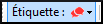

**Introduction**  As you are translating and checking you may want to make comments on various errors or issues. Il se peut aussi que vous souhaitiez enregistrer vos discussions sur des sujets des termes clés et des questions d’orthographe. Paratext 9 vous permet d’enregistrer de tels commentaires directement dans le texte, dans la liste des termes bibliques ou dans la liste des mots.

**Before you start**  You are typing or revising your text, wordlist or Biblical terms and need to make comments on an issue you have seen.

:::caution

Les notes (remarques) et les notes de bas de page sont très différentes. Ces dernières apparaissent dans la Bible alors que les remarques servent à conserver les questions et les commentaires et ne s’affichent pas dans la Bible.

:::

**What you are going to do**
You will:

- ajoutez plus d'icônes de remarques (administrateur seulement)
- créer des remarques dans le texte en utilisant différentes icônes ;
- ouvrez, modifiez et résolvez les remarques ;
- ouvrir une liste des remarques à partir du texte ;
- filtrer la liste ;
- imprimer la liste des remarques ;

:::info Mise à jour

In Paratext 9.4 there is an Option to **show/hide project notes.**

- **≡ Project** under **View &gt; Show Project Notes**.
  - _Note icons will be either shown or hidden._

:::

## 15.1 Different types of project notes {#fe71e7bac96d4755bb40630bd0c2b1c0}

Vous pouvez choisir parmi plusieurs icônes différentes pour vos remarques de projet dans Paratext 9 :

:::tip

Ne prenez pas trop d’icônes !

:::

**An icon can have four different colours or shapes**

| Description                                                                        | Signification                                                                                                                                                                                                                                       |
| ---------------------------------------------------------------------------------- | --------------------------------------------------------------------------------------------------------------------------------------------------------------------------------------------------------------------------------------------------- |
| Icon has a **border** and a **yellow background color**.           | La remarque a au moins un commentaire non lu.                                                                                                                                                                                       |
| Icon is r**ed, purple,** or **light blue**.                        | Une remarque de projet confiée à vous ou à l’équipe entière.                                                                                                                                                                        |
| Icon is **gray**.                                                  | Une remarque de projet confiée à quelqu’un d’autre ou non assigné.                                                                                                                                                                  |
| Icon is **gray** with a **green tick**.                            | Une remarque de projet ayant le statut résolu. (Cela n'apparaîtra pas dans le texte, mais seulement dans la Liste des remarques)                                                                                 |
| Icon is a **white question mark** on the **cover of a book**.      | Il y a une note de discussion d’orthographe pour ce mot. (Liste de mots)                                                                                                                                         |
| Icon is **gray** with a **question mark** on the cover of a book.  | Il n’y a PAS de note de discussion d’orthographe pour ce mot. (Liste de mots)                                                                                                                                    |
| Icon is a **light blue plus** +.                                   | Une note du conseiller.                                                                                                                                                                                                             |
| Icon is a **light blue globe**.                                    | Une note globale du conseiller.                                                                                                                                                                                                     |
| Icon is a **black exclamation point !** within a **red triangle.** | Il y a un conflit de fusion Envoyer/Recevoir parce que deux utilisateurs ont fait de différents changements dans le même verset.                                                                                                    |
| Icon is a **white arrow** on a **blue background**.                | Il y a une note de discussion des équivalents pour ce terme biblique. Cette icône apparaît uniquement dans l’outil Termes bibliques ou dans la fenêtre des équivalents des termes bibliques.                        |
| Icon is **gray** with an **arrow on the cover of a book**.         | Il n’y a PAS de note de discussion d’équivalent pour ce terme biblique (Termes bibliques) Cette icône apparaît uniquement dans l’outil Termes bibliques ou dans la fenêtre des équivalents des termes bibliques. |

### **Setup additional note tags** {#04231dff267d4df992012fdcfb7f5b49}

:::caution

On doit être un administrateur pour le faire

:::

1. **≡ Tab**, under &gt; **Project** &gt; **Project settings** &gt; **Project properties**
2. Click the **Notes** tab
3. Click on the **Add** Tab button
   - _A new line is added._
4. Cliquez sur l'icône de la nouvelle ligne
5. Choisir l'icône désirée
6. Saisir un nom pour le nouveau type de remarque
7. Continuer pour toute autre nouvelle remarque.

## 15.2 Using notes {#c8c21c6181cc4529a478dba32d984ba5}

**Inserting a project note**

1. Cliquez dans le texte où vous voulez la remarque (et si désiré, sélectionnez du texte).

2. **≡ Tab**, under **Insert** > **Note**

3. Choose the desired tag for the note from the list

4. Type the text for the note

5. Cliquez sur **OK**.
   - _An icon is displayed beside the text._

.

### **Add comments to an existing note** {#958963568fb4491bb7fedc24d80585bb}

- Click the icon in the text
  - _The note opens_.

    

- Saisissez une remarque
- Cliquez sur **OK**

### **Assign a note to someone** {#9a602aedc3974606bf478a02d0e2015a}

1. Cliquez sur l'icône dans le texte.

1. Saisissez le commentaire
2. Click **Assign to**
3. Choisissez comme désiré
4. Cliquez sur **OK**

### **Apply notes to multiple projects** {#6536405a9e4842f29a1f267c60b4337d}

1. Ouvrez la remarque
2. Click the **Multiple** button
3. Choisissez les projets
4. Cliquez sur **OK**
5. Click **OK** again to close the dialog box.

### **Reattach note** {#fe4f817bb1724ed6889d543fb3f4bbc8}

- Cliquez sur l'icône de la remarque dans le texte pour ouvrir la remarque.

  

- Click the Reattach Note button (on the toolbar)

- Cliquez sur le(s) mot(s) à attacher
- Cliquez sur **OK**.
  - _The note is attached to the word(s)._

### **Resolve a note** {#3f7599da36934413b855ecb7e595d63a}

1. Click on the icon in the text

2. Saisissez un autre commentaire si nécessaire.

3. Click the **Resolve** button

4. Cliquez sur **OK**

.

### **Delete notes** {#2f83955761a8491fb260cae2b8a7515e}

1. Click the note icon

2. Click the small trash can

3. Cliquez sur **Oui** pour supprimer définitivement le commentaire.

4. S’il y a plus qu’un commentaire, continuez à supprimer pour supprimer la remarque.

.

:::tip

Vous ne pouvez supprimer vos propres commentaires que s'ils sont les derniers de la liste.

:::

## 15.3 Open a Notes List {#c87dc9e1b95e46919469ec3681242fb0}

Lors de la révision des remarques, il est souvent utile de les voir sous forme de liste.

1. **≡ Tab**, under **Tools** &gt; **Notes list**

2. Sélectionnez votre projet.

3. Cliquez sur **OK**.
   - _A note list window opens (see below)._

4. Ajustez les filtres si nécessaire.

   :::tip

   Si la fenêtre est vide, modifiez le filtre en utilisant les boutons des filtres.

   :::

### **Notes list toolbar** {#16ec056e5f1a44c18f715698dcfd0baa}

Il y a quatre listes déroulantes sur la barre d’outils

1. Filtre de remarques
2. Filtre de versets
3. Recherche
4. Trier par [verset, date, confiée (affectée) à]

### **Notes list filter** {#58384e92b3154b6d87c93ea6b7fc5073}

- Cliquez sur le premier bouton/liste
- Choisissez un filtre existant

### **Define a new filter** {#ae915757c45d40c79820d8588c7173c9}

- Cliquez sur le premier bouton/liste

- Choose **New filter**

- Choose the status, tag, person and date as desired.

- Cliquez sur **OK**

### **Save a filter** {#c943f2ad210e4b65b07b60a324e4331b}

1. Définissez le filtre selon votre besoin.

2. Cliquez sur la case de texte en haut.

3. Type a name for the filter

4. Cliquez sur l’icône de la disquette pour enregistrer (2).

## 15.4 Add comments in the notes list {#229174addf7e4280a3da1b08d9b11d7c}

- Click arrow to expand the note
  - _The note opens_

- Saisissez un commentaire dans la case de texte en bas.

  

- Résolvez ou confiez (affectez) la remarque comme désiré.

- Cliquez sur la flèche pour réduire la remarque.

:::tip

You can also click the **Open** link to open the note window.

:::

## 15.5 Print a notes report {#a6ef1b8b74ec4e569f5211f8384d8c8e}

1. Cliquez dans une fenêtre de liste des remarques.
2. Filtrez la liste comme vous le souhaitez.
3. **≡ Tab**, under **Project** &gt; **Print**
4. Choisissez l’imprimante et les options désirées.
5. Cliquez sur **OK**.
6. Fermez la fenêtre.
