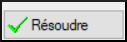

**Introduction** Il est possible que pendant de faire la traduction et les vérifications, vous ayez envie de faire des commentaires sur divers problèmes que vous rencontrez ou erreurs que vous ayez trouvées. Il se peut aussi que vous souhaitiez enregistrer vos discussions sur des sujets des termes clés et des questions d’orthographe. Paratext 9 vous permet d’enregistrer de tels commentaires directement dans le texte, dans la liste des termes bibliques ou dans la liste des mots.

**Avant de commencer**  Vous êtes en train de taper ou de réviser votre texte, votre liste de mots ou vos termes bibliques et vous devez faire des commentaires sur une question que vous avez vue.

:::caution

Les notes (remarques) et les notes de bas de page sont très différentes. Ces dernières apparaissent dans la Bible alors que les remarques servent à conserver les questions et les commentaires et ne s’affichent pas dans la Bible.

:::

**Qu’est-ce qu’on va faire ?** Vous allez

- ajoutez plus d'icônes de remarques (administrateur seulement)
- créer des remarques dans le texte en utilisant différentes icônes ;
- ouvrez, modifiez et résolvez les remarques ;
- ouvrir une liste des remarques à partir du texte ;
- filtrer la liste ;
- imprimer la liste des remarques ;

## 15.1 Les différentes icônes de remarques {#fe71e7bac96d4755bb40630bd0c2b1c0}

Vous pouvez choisir parmi plusieurs icônes différentes pour vos remarques de projet dans Paratext 9 :

:::tip

Ne prenez pas trop d’icônes !

:::

**Les différentes formes d’icônes**

| Description                                                                          | Signification                                                                                                                                                                                                    |
| ------------------------------------------------------------------------------------ | ---------------------------------------------------------------------------------------------------------------------------------------------------------------------------------------------------------------- |
| L'icône a une **bordure** et un **fond jaune**.                                      | La remarque a au moins un commentaire non lu.                                                                                                                                                                    |
| L'icône est **rouge, violet,** ou **bleu clair**.                                    | Une remarque de projet confiée à vous ou à l’équipe entière.                                                                                                                                                     |
| L'icône est **gris**.                                                                | Une remarque de projet confiée à quelqu’un d’autre ou non assigné.                                                                                                                                               |
| L'icône est **gris** avec une **coche verte**.                                       | Une remarque de projet ayant le statut résolu. (Cela n'apparaîtra pas dans le texte, mais seulement dans la Liste des remarques)                                                                                 |
| L'icône est un **point d'interrogation blanc** sur la **couverture d'un livre**.     | Il y a une note de discussion d’orthographe pour ce mot. (Liste de mots)                                                                                                                                         |
| L'icône est **gris** avec un **point d'interrogation** sur la couverture d'un livre. | Il n’y a PAS de note de discussion d’orthographe pour ce mot. (Liste de mots)                                                                                                                                    |
| L'icône est un **bleu clair plus**+.                                                 | Une note du conseiller.                                                                                                                                                                                          |
| L'icône est un globe **bleu clair**.                                                 | Une note globale du conseiller.                                                                                                                                                                                  |
| L'icône est un **point d'exclamation noir !** dans un **triangle rouge**             | Il y a un conflit de fusion Envoyer/Recevoir parce que deux utilisateurs ont fait de différents changements dans le même verset.                                                                                 |
| L'icône est une **flèche blanche** sur un **fond bleu**.                             | Il y a une note de discussion des équivalents pour ce terme biblique. Cette icône apparaît uniquement dans l’outil Termes bibliques ou dans la fenêtre des équivalents des termes bibliques.                     |
| L'icône est **gris** avec une flèche **sur la couverture d'un livre**.               | Il n’y a PAS de note de discussion d’équivalent pour ce terme biblique (Termes bibliques) Cette icône apparaît uniquement dans l’outil Termes bibliques ou dans la fenêtre des équivalents des termes bibliques. |

### **Configuration d'étiquettes de remarque supplémentaires** {#04231dff267d4df992012fdcfb7f5b49}

:::caution

On doit être un administrateur pour le faire

:::

1. **≡ Onglet**, sous **Projet** \&gt; **Paramètres du projet** \&gt; **Propriétés du projet**
1. Cliquez sur l’onglet **Remarque**
1. Cliquez sur le bouton **Ajouter étiquette**
    - _Une nouvelle ligne est ajoutée_
1. Cliquez sur l'icône de la nouvelle ligne
1. Choisir l'icône désirée
1. Saisir un nom pour le nouveau type de remarque
1. Continuer pour toute autre nouvelle remarque.

## 15.2 Utilisation des remarques {#c8c21c6181cc4529a478dba32d984ba5}

**Insertion d’une remarque**

1. Cliquez dans le texte où vous voulez le note (et si désiré, sélectionnez du texte)

1. **≡ Onglet**, sous **Insérer** > **Note de bas de page**

1. Choisissez l'étiquette souhaitée pour la remarque dans la liste

1. Saisissez le texte de la remarque. Cliquez sur **OK**.

.

### **Ajouter des commentaires dans une remarque existante** {#958963568fb4491bb7fedc24d80585bb}

- Cliquez sur l'icône dans le texte

- Saisissez une remarque
- **≡ Onglet**, **Modifier la collection de textes**  

### **Confier une remarque à quelqu’un** {#9a602aedc3974606bf478a02d0e2015a}

1. Cliquez sur l'icône dans le texte.

1. Saisissez le commentaire
1. Cliquez sur **Confier à (Affecter à)**
1. Choisissez comme désiré
1. **≡ Onglet**, **Modifier la collection de textes**  

### **Relie une remarque à plusieurs projets** {#6536405a9e4842f29a1f267c60b4337d}

1. Ouvrez la remarque
1. Cliquer sur le bouton **Multiple**
1. Choisissez les projets
1. **≡ Onglet**, **Modifier la collection de textes**  
1. Cliquez sur **OK**  encore une fois pour fermer la boîte de dialogue.

### **Rattacher une remarque** {#fe4f817bb1724ed6889d543fb3f4bbc8}

- Cliquez sur l'icône de la remarque dans le texte pour ouvrir la remarque.

    

- Cliquez sur le bouton Rattacher la remarque (dans la barre d'outils)

- Cliquez sur le(s) mot(s) à attacher
- Cliquez sur **OK**.
    - _La remarque est attachée au mot._

### **Marquer une remarque comme étant résolue** {#3f7599da36934413b855ecb7e595d63a}

1. Cliquez sur l'icône dans le texte.

1. Saisissez un autre commentaire si nécessaire.

1. Cliquez sur le bouton **Résoudre**

1. Cliquez sur **OK**

.

### **Supprimer des remarques** {#2f83955761a8491fb260cae2b8a7515e}

1. Cliquez sur l’icône de la remarque. Cliquez sur la petite corbeille

1. Click **Yes** to permanently delete your comment.

1. S’il y a plus qu’un commentaire, continuez à supprimer pour supprimer la remarque.

.

:::tip

Vous ne pouvez supprimer vos propres commentaires que s'ils sont les derniers de la liste.

:::

## 15.3 Ouvrir une liste des remarques {#c87dc9e1b95e46919469ec3681242fb0}

Lors de la révision des remarques, il est souvent utile de les voir sous forme de liste.

1. **≡ Onglet**, sous **Outils** &gt; **Liste des remarques**
1. Sélectionnez votre projet.
1. Cliquez sur **OK**.
    - _Une fenêtre de Liste des remarques affiche(voir ci-dessous)._
1. Ajustez les filtres si nécessaire.

    :::tip

    Si la fenêtre est vide, modifiez le filtre en utilisant les boutons des filtres.

:::

### **Barre d'outils de la fenêtre des remarques** {#16ec056e5f1a44c18f715698dcfd0baa}

Il y a quatre listes déroulantes sur la barre d’outils

1. Filtre de remarques
1. Filtre de versets
1. Recherche
1. Trier par [verset, date, confiée (affectée) à]

### **Filtre la liste de remarques** {#58384e92b3154b6d87c93ea6b7fc5073}

- Cliquez sur le premier bouton/liste
- Choisissez un filtre existant

### **Définir un nouveau filtre de remarques** {#ae915757c45d40c79820d8588c7173c9}

- Cliquez sur le premier bouton/liste

- Choisissez **Nouveau filtre**

- Choisissez le statut, l'étiquette, la personne et la date souhaités.

- Cliquez sur **OK**

### **Enregistrer un filtre** {#c943f2ad210e4b65b07b60a324e4331b}

1. Définissez le filtre selon votre besoin.

1. Cliquez sur la case de texte en haut.

1. Saisissez un nom pour le filtre. Cliquez sur l’icône de la disquette pour enregistrer (2).

## 15.4 Ajouter des commentaires dans une remarque d'une fenêtre de remarques {#229174addf7e4280a3da1b08d9b11d7c}

- Cliquez sur la flèche pour développer la remarque

- Saisissez un commentaire dans la case de texte en bas.

    

- Résolvez ou confiez (affectez) la remarque comme désiré.
- Cliquez sur la flèche pour réduire la remarque.

:::tip

Cliquez sur **Nom** et saisissez un nom

:::

## 15.5 Imprimer un rapport des remarques {#a6ef1b8b74ec4e569f5211f8384d8c8e}

1. Cliquez dans la fenêtre des remarques.
1. Filtrez la liste comme vous le souhaitez.
1. **≡ Onglet**, sous **Projet** &gt; **Imprimer**
1. Choisissez l’imprimante et les options désirées.
1. Cliquez sur **OK**.
1. Fermez la fenêtre.
