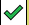
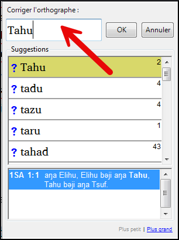
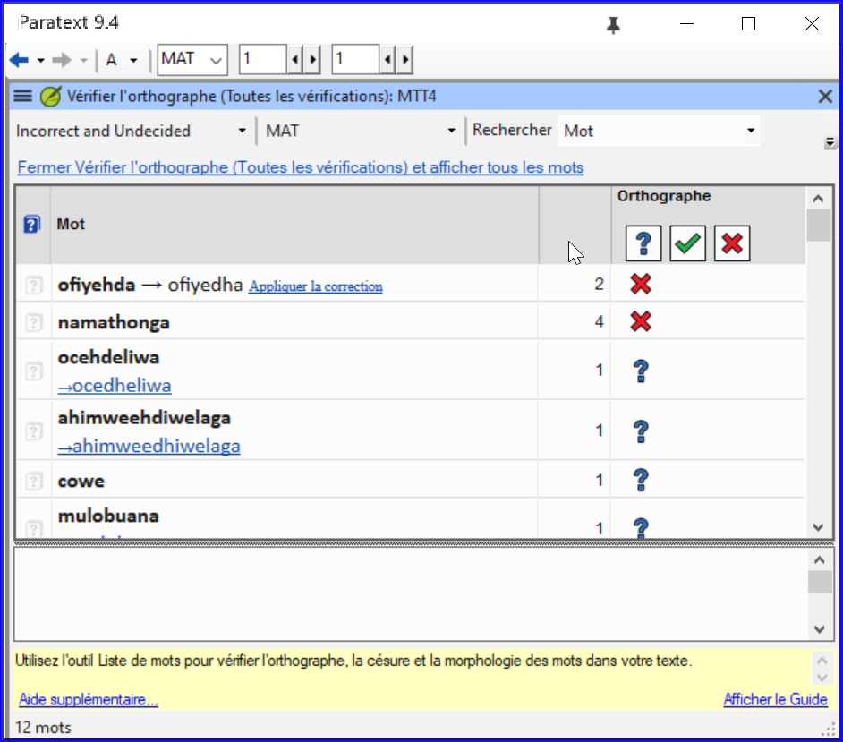
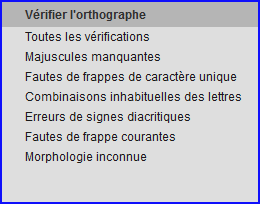
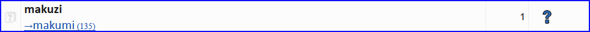
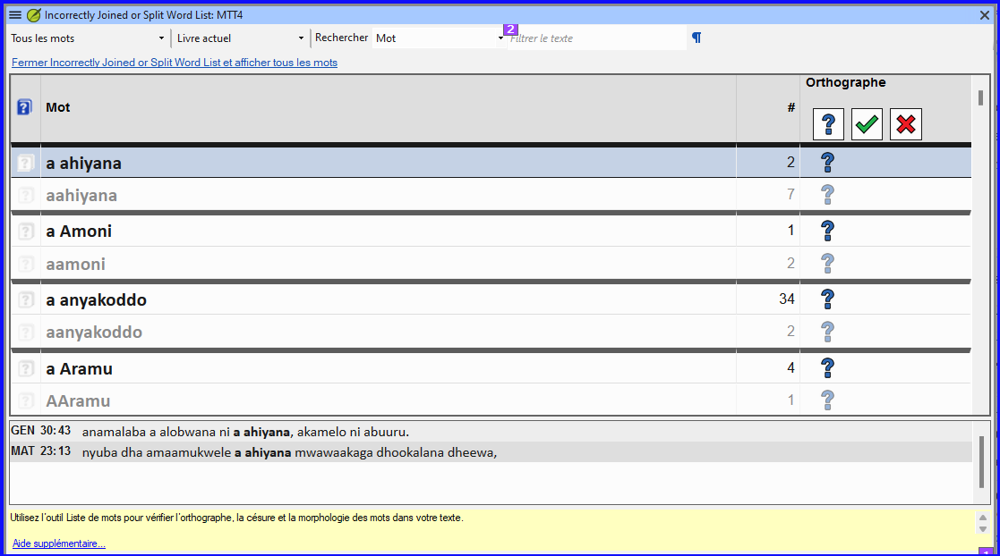

**Introduction** Ce module explique comment utiliser une fonctionnalité de Paratext 9 pour la vérification des fautes d’orthographe.

**Avant de commencer**  Vous avez saisi votre texte dans Paratext 9 et effectué quelques vérifications, mais il se peut qu'il y ait encore des fautes d'orthographe.

**Pourquoi cette fonction est-elle importante ?** Vous devez corriger les fautes d’orthographe, afin que votre texte communique le message clairement.

**Ce que vous allez faire**  Configurer la liste de mots pour construire une base de mots corrects.

- Travaillez dans votre texte avec des lignes ondulées rouges montrant les mots que Paratext ne sait pas être corrects.
- Parcourez votre liste de mots, en corrigeant les erreurs ou en indiquant à Paratext 9 que les mots sont corrects.
- Utilisez une variété de vérifications de la liste de mots.
- Ajoutez une note de discussion sur l'orthographe aux mots qui nécessitent une discussion plus approfondie avant de décider de l'orthographe correcte.

## 8.1 Configure the wordlist {#7490cb4639dc4f2d9eb8ac343d7e79c2}

:::tip

Before you can check the spelling, it is important to have a base of words that you know are correct. Il y a trois choses à faire :

:::

### Approuver l’orthographe des mots fréquents {#c86b35e4794640e980a0796316c04f29}

Dans Paratext

- **≡ Onglet**, sous **Outils** \&gt; **Liste de mots**

Dans la liste de mots

1. **≡ Onglet,** sous **Outils** \&gt; **Approuver l’orthographe des mots fréquents**
2. Saisissez un chiffre

    :::tip

    The number is the number of times the words must appear to automatically mark it as spelled correctly. La valeur par défaut est 100, mais vous pouvez choisir plus (si vous avez des doutes sur le texte) ou moins (si vous avez confiance en la précision du dactylographe).

:::

3. **≡ Onglet**, **Modifier la collection de textes**  
4. Cliquez sur **Oui** (pour confirmer que vous savez que vous ne pouvez pas l'annuler)

### Vérifier les mots que Paratext pense être erronés {#bf5578928c41416f955b0ffa478e72af}

- Assurez-vous d'être dans la liste de mots.
    - _Si vous êtes dans la fenêtre Paratext, allez dans la liste de mots (__**≡ Onglet**_ _sous_ _**Outils**_ _>_ _**Liste de mots****)*
- **≡ Onglet**, sous **Outils** \&gt; **Vérifier l’orthographe** \&gt; <0>Toutes les vérifications</0>
    - _Une liste de mots s'affiche._

- Click on a word in the top pane.
    1. If the word is **correct** – click on the green icon at the top of the column
    2. If the word is **incorrect**, but Paratext 9 has **suggested** the correct word, then click the **blue link** for the correct word.
    3. If the word is **incorrect**, and Paratext 9 **hasn’t suggested** the correct word, click on the red checkbox and correct the word. (See 8.1)

### Vérifier les mots qui se ressemblent beaucoup dans l'écriture {#1fdc348be8334ff6841f08689c4aaae5}

Dans la liste de mots

1. **≡ Onglet**, sous **Outils** \&gt; **Rechercher les mots semblables**
2. Remplissez la boîte de dialogue avec les paires de lettres qui peuvent être confondues séparé par / (p.e.x s/sh)

    :::tip

    Un mètre de progrès s’affiche puis tous les mots inconnus ou incorrects sont soulignés, avec les lignes ondulées rouges.

:::

3. **≡ Onglet**, **Modifier la collection de textes**  
    - _Une liste de mots s'affiche._
4. Correct the words (as described above).

## 8.2 Vérifier l’orthographe — dans le texte {#66602cff1c654a81ae88a1f8b7e7842f}

Dans Paratext

- **≡ Tab**, under **View** &gt; **Display spelling**

:::tip

Si vous ne décidez pas définitivement de l'orthographe, vous pouvez ajouter une remarque de discussion orthographique.

:::

### Comment faire les modifications {#a468ce2f5f594dcbbd8446fd4225814b}

:::tip

Paratext 9 will underline in red the words that you have not approved in the wordlist. Cela signifie que le mot est mal orthographié ou inconnu.

:::

1. Right-click a word which is underlined in either red or grey
    - _A dialogue is displayed_

2. Either type the correction in the box or select the correct word from the list

3. Click **OK**

:::tip

C’est mieux parce que Paratext 9 va se rappeler la correction pour l’appliquer aussi dans les autres chapitres.

:::

Quand il y a plus d’une correction, une boîte de dialogue s’affiche.

Choisissez comme désiré:

- **Yes** = changes this verse and looks for the next
- **No** = skips this verse and looks for the next
- Yes to all – **is dangerous**, use with caution
- **Cancel** = stops further changes

## 8.3 Vérifier l’orthographe du livre actuel {#8e6b30ac29584b0a89ef0fee37d20f8f}

1. **≡ Tab**, under **Tools** > **Spell Check Current Book**
    - _A window appears with a list of some words in the current book._

2. Make corrections as explained above [8.2](/8.SP#66602cff1c654a81ae88a1f8b7e7842f)

3. Cliquez sur **Davantage d’éléments disponibles** pour afficher d'autres mots.

4. Continuez si nécessaire.

## 8.4 Vérification d’orthographe dans la liste de mots {#5de76f0b6fe1460ea6c8a341b2fff194}

### Utiliser les vérifications {#a440e07d85cf494eb7a3263ba280aa60}

Dans la liste de mots

1. **≡ Tab**, under **Tools**> **Spell check >**

2. Choose the desired check (see descriptions below)
    - _A list of words is displayed_.

3. Faites les corrections comme ci-dessus

4. Cliquez sur **Davantage d’éléments disponibles** pour afficher d'autres mots.

5. Continuez si nécessaire.

6. When you have finished the list, a message is displayed

    

7. Cliquez sur **Oui**.

### Toutes les vérifications {#039b8b6f676f4a8fbe3e75ec8918ecb6}

Cela gère tous les contrôles. Ceci est très utile, car il trouvera tous les types d'erreurs et surtout des mots avec plusieurs types d'erreurs.

### Lettres majuscules manquantes {#cfe2c818fa2249c0bcb5d219ae76e8eb}

1. Une liste de mots s’affiche avec les liens d’autres mots qui n’ont pas toujours de majuscules (c'est-à-dire que les deux formes sont utilisées). Le mot avec la minuscule se trouve au-dessus du mot avec la majuscule, qui a un lien bleu

    

2. Cliquez sur le lien bleu pour le mot en majuscule

    

3. Cliquez sur le lien bleu qui convient.
4. _Afficher les erreurs_ (pour voir tous les versets)
5. _Toutes les deux formes sont acceptables_ (pour accepter les deux formes)
6. _Tout mettre en majuscule_ (corriger tous les mots en minuscule)

### Faute de frappe d’un caractère unique {#92974e1cd65443aeb4191d34b42a0468}

Une liste de mots s’affiche avec les liens d’autres mots qui ressemblent au mot en question, mais qui diffèrent d'une seule lettre.

### Combinaisons inhabituelles des lettres {#d8cc2055dd494b7ab955c85deb277795}

Une liste de mots s’affiche. Ces mots ont une séquence des caractères rares, par exemple plus d’une consonne ou plusieurs voyelles…

### Erreurs de signes diacritiques {#a802e37a792c4d63b2eb3c041d251e7d}

Si le mot est incorrect, et Paratext a proposé le mot juste, cliquez sur le lien bleu du mot juste

### Fautes de frappe courantes {#718eac9af3e8429da63cb91677bc90fd}

A list of words is displayed which have the same type of problem which have already been corrected, in other words. Par ex. if you have already corrected ‘teh’ as ‘the’, and it finds ‘tehm’ it will suggest ‘them’.

### Morphologie inconnue {#bfac7ce2ba6a48449f1af20604181ae6}

A list of words is displayed that the computer has not been able to guess the morphology based on other words.

### Rechercher des mots mal liés ou mal divisés {#2f1d11a1518a454d8cc4d33c9c70ef3f}

Dans la Liste des Mots

- **≡ Tab**, under **Tools**&gt; **Find Incorrectly Joined or Split Words**

    

- Type in any punctuation which can be in the middle of a word e.g. - '
- **≡ Onglet**, **Modifier la collection de textes**  
    - _A list of words is displayed with similar words grouped together._

        

### Corriger un mot mal marqué {#db3081f9aaa14b6299225b8af9fb3be0}

1. Trouvez le mot dans la liste de mots (en utilisant un filtre si nécessaire)
2. Cliquez sur la ligne pour voir le mot dans son contexte
3. Cliquez sur l’état d’orthographe désiré.

## 8.5 Remarque de discussion orthographique {#0fc290656fb540eda14989e1ad48876b}

:::tip

Si vous n'avez pas pris de décision définitive sur l'orthographe, vous pouvez ajouter une note de discussion sur l'orthographe.

:::

1. Double-cliquez sur l'icône de la note (dans la première colonne)

    

2. Saisissez la remarque
3. Confiez la note si nécessaire et cliquez sur **OK**.
