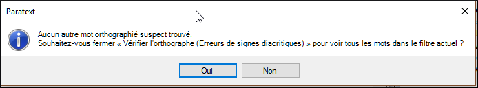

**Introduction** Ce module explique comment utiliser une fonctionnalité de Paratext 9 pour la vérification des fautes d’orthographe.

**Avant de commencer** Vous avez tapé votre texte dans Paratext 9 et l'avez vérifié, mais il peut encore y avoir des fautes d'orthographe.

Vous devez corriger les fautes d’orthographe, afin que votre texte communique le message clairement.

**Qu’est-ce qu’on va faire**  Configurez la liste de mots pour constituer une base de mots corrects.

- Travaillez dans votre texte avec des lignes ondulées rouges montrant les mots que Paratext ne sait pas être corrects.
- Parcourez votre liste de mots, en corrigeant les erreurs ou en indiquant à Paratext 9 que les mots sont corrects.
- Utilisez une variété de vérifications de la liste de mots.
- Ajoutez une remarque de discussion sur l'orthographe aux mots qui nécessitent une discussion plus approfondie avant de décider de l'orthographe correcte.

## 8.1 Configurer la liste de mots {#7490cb4639dc4f2d9eb8ac343d7e79c2}

:::tip

Avant de vérifier l'orthographe, il est important de disposer d'une base de mots dont on sait qu'ils sont corrects. Il y a trois choses à faire :

:::

### Approuver l'orthographe des mots courants {#c86b35e4794640e980a0796316c04f29}

Dans Paratext

- **≡ Onglet**, sous **Outils** > **Liste de mots**

Dans la liste de mots

1. **≡ Onglet**, sous **Outils** > **Approuver l’orthographe des mots fréquents**

2. Saisissez un chiffre

   :::tip

   Le nombre est le nombre de fois que le mot doit apparaître pour qu'il soit automatiquement marqué comme étant correctement orthographié. La valeur par défaut est 100, mais vous pouvez choisir plus (si vous avez des doutes sur le texte) ou moins (si vous avez confiance en la précision du dactylographe).

   :::

3. Cliquez sur **OK**

4. Cliquez sur Oui (pour confirmer que vous savez que vous ne pouvez pas l'annuler)

### Vérification des mots que Paratext considère comme incorrects {#bf5578928c41416f955b0ffa478e72af}

- Assurez-vous d'être dans la liste de mots.
  - _Si vous êtes de retour dans la Fenêtre Paratext, allez à la Liste de mots (__**≡ Onglet**_ _sous_ _**Outils**_ _>_ _**Liste de mots**__)_
- **≡ Onglet**, sous **Outils** > **Vérification d'orthographe > Toutes les vérifications**
  - _Une liste de mots s'affiche._

- Cliquez sur un mot dans le volet supérieur.
  1. Si le mot est **correct** - cliquez sur l'icône verte en haut de la colonne
  2. Si le mot est **incorrect**, mais que Paratext 9 a **suggéré** le mot correct, cliquez sur le **lien bleu** pour le mot correct.
  3. Si le mot est **incorrect**, et que Paratext 9 **n'a pas suggéré** le mot juste, cliquez sur la case rouge et corrigez le mot. (Voir 8.1)

### Vérifiez les mots orthographiés de la même manière {#1fdc348be8334ff6841f08689c4aaae5}

Dans la liste de mots

1. **≡ Onglet**, sous **Outils** > **Rechercher les mots semblables**

2. Remplissez la boîte de dialogue avec les paires de lettres qui peuvent être confondues séparé par / (p.e.x s/sh)

   :::tip

   Un mètre de progrès s’affiche puis tous les mots inconnus ou incorrects sont soulignés, avec les lignes ondulées rouges.

   :::

3. Cliquez sur **OK**
   - _Une liste de mots s'affiche._

4. Corrigez les mots (comme décrit ci-dessus).

## 8.2 Vérification de l'orthographe - à partir du texte {#66602cff1c654a81ae88a1f8b7e7842f}

Dans Paratext

- **≡ Onglet**, sous **Affichage** > **Afficher les fautes d'orthographe**

:::tip

Un mètre de progrès s’affiche puis tous les mots inconnus ou incorrects sont soulignés, avec les lignes ondulées rouges.

:::

### Apporter des corrections {#a468ce2f5f594dcbbd8446fd4225814b}

:::tip

Paratext 9 soulignera en rouge les mots dans le texte qui ne sont pas marqués corrects dans la liste de mots. Cela signifie que le mot est mal orthographié ou inconnu.

:::

1. Cliquez à droite sur un mot souligné en rouge ou gris
   - _Une boîte de dialogue s'affiche_

2. Saisissez la correction ou bien choisissez un mot de la liste

3. Cliquez sur **OK**

:::tip

C’est mieux parce que Paratext 9 va se rappeler la correction pour l’appliquer aussi dans les autres chapitres.

:::

Quand il y a plus d’une correction, une boîte de dialogue s’affiche.

Choisissez comme désiré:

- **Oui** = change ce verset et cherche le suivant
- **Non** = sauter ce verset et chercher le suivant
- Oui à tout – **est dangereux**, utilisez avec prudence
- **Annuler** = arrêt des modifications

## 8.3 Vérification de l'orthographe - livre actuel {#8e6b30ac29584b0a89ef0fee37d20f8f}

1. **≡ Onglet**, sous **Outils** > **Vérifier l'orthographe du livre actuel**
   - _Une fenêtre apparaît avec une liste de quelques mots dans le livre actuel._

2. Effectuer les corrections comme expliqué ci-dessus [8.2](/8.SP#66602cff1c654a81ae88a1f8b7e7842f)

3. Cliquez sur **Davantage d’éléments disponibles** pour afficher d'autres mots.

4. Continuez si nécessaire.

## 8.4 Vérification de l'orthographe – à partir de la liste de mots {#5de76f0b6fe1460ea6c8a341b2fff194}

### Utiliser les vérifications {#a440e07d85cf494eb7a3263ba280aa60}

Dans la liste de mots

1. **≡ Onglet**, sous **Outils**> **Vérification orthographique >**

2. Choisissez la vérification souhaitée (voir les descriptions ci-dessous)
   - _Une liste de mots s'affiche_.

3. Faites les corrections comme ci-dessus

4. Cliquez sur **Davantage d’éléments disponibles** pour afficher d'autres mots.

5. Continuez si nécessaire.

6. Lorsque vous avez terminé la liste, un message s'affiche

   

7. Cliquez sur **Oui**.

### Tous les chèques {#039b8b6f676f4a8fbe3e75ec8918ecb6}

Cela gère tous les contrôles. Ceci est très utile, car il trouvera tous les types d'erreurs et surtout des mots avec plusieurs types d'erreurs.

### Majuscules manquantes {#cfe2c818fa2249c0bcb5d219ae76e8eb}

1. Une liste de mots s’affiche avec les liens d’autres mots qui n’ont pas toujours de majuscules (c'est-à-dire que les deux formes sont utilisées). Le mot avec la minuscule se trouve au-dessus du mot avec la majuscule, qui a un lien bleu

   

2. Cliquez sur le lien bleu pour le mot en majuscule

   

3. Cliquez sur le lien bleu qui convient.

4. _Afficher les erreurs (pour voir tous les versets)

5. _Toutes les deux formes sont acceptables_ (pour accepter les deux formes)

6. _Tout mettre en majuscule_ (corriger tous les mots en minuscule)

### Fautes de frappe d'un seul caractère {#92974e1cd65443aeb4191d34b42a0468}

Une liste de mots s’affiche avec les liens d’autres mots qui ressemblent au mot en question, mais qui diffèrent d'une seule lettre.

### Combinaisons de lettres inhabituelles {#d8cc2055dd494b7ab955c85deb277795}

Ces mots ont une séquence des caractères rares, par exemple plus d’une consonne ou plusieurs voyelles…

### Erreurs de diacritiques {#a802e37a792c4d63b2eb3c041d251e7d}

Une liste de mots s’affiche.

### Fautes de frappe courantes {#718eac9af3e8429da63cb91677bc90fd}

Une liste de mots s'affiche qui présentent le même type de problème et qui ont déjà été corrigés, en d'autres termes. Par ex. Par ex. si vous avez déjà corrigé "teh" en "the", et qu'il trouve "tehm", il suggérera "them’.

### Morphologie inconnue {#bfac7ce2ba6a48449f1af20604181ae6}

Une liste de mots s’affiche dont l’ordinateur ne peut pas deviner la morphologie basée sur d’autres mots.

### Rechercher les mots mal reliés ou mal divisés {#2f1d11a1518a454d8cc4d33c9c70ef3f}

Dans la Liste de mots (**≡ Onglet**, sous **Outils** – Liste de mots)

- **≡ Onglet**, sous **Outils** > **Rechercher les mots mal reliés ou mal divisés**

  

- Tapez toute ponctuation pouvant se trouver au milieu d'un mot, par exemple - '

- Cliquez sur **OK**
  - _Une liste de mots est affichée avec des mots similaires regroupés._

    

### Corrigez un mot qui a été incorrectement marqué {#db3081f9aaa14b6299225b8af9fb3be0}

1. Trouvez le mot dans la liste de mots (en utilisant un filtre si nécessaire)
2. Cliquez sur la ligne pour voir le mot dans son contexte
3. Cliquez sur l’état d’orthographe désiré.

## 8.5 Remarque de discussion sur l'orthographe {#0fc290656fb540eda14989e1ad48876b}

:::tip

Si vous n'avez pas pris de décision définitive sur l'orthographe, vous pouvez ajouter une note de discussion sur l'orthographe.

:::

1. Double-cliquez sur l'icône de la remarque (dans la première colonne)

   

2. Saisissez la remarque

3. Confiez la remarque si nécessaire, et cliquez sur **OK**.
