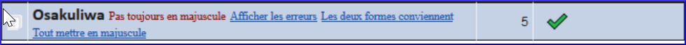

**Introduction**  This module explains how to check for spelling mistakes in the text you have typed into your project in Paratext 9.

**Before you start**  You have typed your text in Paratext 9 and have done some checks, but there may still be spelling mistakes.

**Why is this important?**  It is important to correct any spelling mistakes so that your text will communicate clearly.

**What you are going to do**  Configure the wordlist to build up a base of correct words.

- Travaillez dans votre texte avec des lignes ondulées rouges montrant les mots que Paratext ne sait pas être corrects.
- Parcourez votre liste de mots, en corrigeant les erreurs ou en indiquant à Paratext 9 que les mots sont corrects.
- Use a variety of checks from the wordlist.
- Ajoutez une note de discussion sur l'orthographe aux mots qui nécessitent une discussion plus approfondie avant de décider de l'orthographe correcte.

## 8.1 Configurer la liste de mots {#7490cb4639dc4f2d9eb8ac343d7e79c2}

:::tip

Before you can check the spelling, it is important to have a base of words that are known to be correct. Il y a trois choses à faire :

:::

### Approuver l’orthographe des mots fréquents {#c86b35e4794640e980a0796316c04f29}

Dans Paratext

- **≡ Tab**, under **Tools** &gt; **Wordlist**

Dans la liste de mots

1. **≡ Tab**, under **Tools** &gt; **Approve spelling of common words**
1. Saisissez un chiffre

    :::tip

    The number is the number of times the words must appear to automatically mark it as being spelled correctly. The default is 100, but you can choose more (if you have doubts about the text) or less (if you are confident about the accuracy of the typist).

:::

1. **≡ Onglet**, **Modifier la collection de textes**  
1. Cliquez sur **Oui** (pour confirmer que vous savez que vous ne pouvez pas l'annuler)

### Vérifier les mots que Paratext pense être erronés {#bf5578928c41416f955b0ffa478e72af}

- Make sure you are in the Wordlist.
    - _If you are back in Paratext Window, go to the Wordlist (__**≡ Tab**_ _under_ _**Tools**_ _>_ _**Wordlist****)*
- **≡ Tab**, under **Tools** &gt; **Spell Check &gt; All checks**
    - _Une liste de mots s'affiche._

- Click on a word in the top pane.

### Vérifier les mots qui se ressemblent beaucoup dans l'écriture {#1fdc348be8334ff6841f08689c4aaae5}

Dans la liste de mots

1. **≡ Tab**, under **Tools** &gt; **Find Similar Words**
1. Remplissez la boîte de dialogue avec les paires de lettres qui peuvent être confondues séparé par / (p.e.x s/sh)

    :::tip

    :::tip Un mètre de progrès s’affiche puis tous les mots inconnus ou incorrects sont soulignés, avec les lignes ondulées rouges.

:::

 3.  **≡ Onglet**, **Modifier la collection de textes**  

    - _Une liste de mots s'affiche._

 4.  (Les mots qui sont incorrects ou incertains.

## 8.2 Vérifier l’orthographe — dans le texte {#66602cff1c654a81ae88a1f8b7e7842f}

Dans Paratext

- **≡ Tab**, under **View** &gt; **Display spelling**

:::note

:::tip Si vous ne décidez pas définitivement de l'orthographe, vous pouvez ajouter une remarque de discussion orthographique.

:::

### Comment faire les modifications {#a468ce2f5f594dcbbd8446fd4225814b}

:::tip

Paratext 9 soulignera en rouge les mots dans le texte qui ne sont pas marqués corrects dans la liste de mots. This either means that the word is misspelled or unknown.

:::

1. Right-click a word which is underlined in either red or grey

1. Either type the correction in the box or select the correct word from the list

1. Click **OK**

:::tip

C’est mieux parce que Paratext 9 va se rappeler la correction pour l’appliquer aussi dans les autres chapitres.

:::

When there is more than one correction, a dialog box is displayed.

Choisissez comme désiré:

- **Oui** = change ce verset et cherche d’autres.
- **Non** = ne change pas ce verset, mais cherche d’autres
- Double-cliquez sur l’icône de remarque (dans la première colonne)  
   
- **Annuler** = arrête ici, ne change rien d’autre
:::

## 8.3 Vérifier l’orthographe du livre actuel {#8e6b30ac29584b0a89ef0fee37d20f8f}

1. **≡ Tab**, under **Tools** > **Spell Check Current Book**

1. Make corrections as explained above [8.2](https://manual.paratext.org/next/Training-Manual/Stage-2/SP#82mc)

1. Click **More items available** to see additional words.

1. Continuez si nécessaire.

## 8.4 Vérification d’orthographe dans la liste de mots {#5de76f0b6fe1460ea6c8a341b2fff194}

### Utiliser les vérifications {#a440e07d85cf494eb7a3263ba280aa60}

Dans la liste de mots

1. **≡ Tab**, under **Tools**> **Spell check >**

1. Choose the desired check (see descriptions below)

1. Faites les corrections comme ci-dessus

1. Click **More items available** to see more words.

1. Continuez si nécessaire.

1. When the list is finished, a message is displayed

1. Click **Yes**.

### Toutes les vérifications {#039b8b6f676f4a8fbe3e75ec8918ecb6}

Cela gère tous les contrôles. Ceci est très utile, car il trouvera tous les types d'erreurs et surtout des mots avec plusieurs types d'erreurs.

### Lettres majuscules manquantes {#cfe2c818fa2249c0bcb5d219ae76e8eb}

1. Une liste de mots s’affiche avec les liens d’autres mots qui n’ont pas toujours de majuscules (c'est-à-dire que les deux formes sont utilisées). Le mot avec la minuscule se trouve au-dessus du mot avec la majuscule, qui a un lien bleu.

    

1. Cliquez sur le lien bleu pour le mot en majuscule.  
    

    

1. Cliquez sur le lien bleu qui convient.
1. _Afficher les erreurs_ (pour voir tous les versets)
1. _Toutes les deux formes sont acceptables_ (pour accepter les deux formes)
1. _Tout mettre en majuscule_ (corriger tous les mots en minuscule)

### Faute de frappe d’un caractère unique {#92974e1cd65443aeb4191d34b42a0468}

Une liste de mots s’affiche avec les liens d’autres mots qui ressemblent au mot en question, mais qui diffèrent d'une seule lettre.

### Combinaisons inhabituelles des lettres {#d8cc2055dd494b7ab955c85deb277795}

Une liste de mots s’affiche. Ces mots ont une séquence des caractères rares, par exemple plus d’une consonne ou plusieurs voyelles…

### Erreurs de signes diacritiques {#a802e37a792c4d63b2eb3c041d251e7d}

Si le mot est incorrect, et Paratext a proposé le mot juste, cliquez sur le lien bleu du mot juste

### Fautes de frappe courantes {#718eac9af3e8429da63cb91677bc90fd}

Une liste de mots s'affiche qui vous montre les mêmes types de problèmes qui ont déjà été corrigés ailleurs. E.g. if you have already corrected "teh" as "the", and it finds "tehm" it will suggest "them".

### Morphologie inconnue {#bfac7ce2ba6a48449f1af20604181ae6}

Une liste de mots s’affiche dont l’ordinateur ne peut pas deviner la morphologie basée sur d’autres mots.

### Rechercher des mots mal liés ou mal divisés {#2f1d11a1518a454d8cc4d33c9c70ef3f}

Dans la Liste des Mots

- **≡ Tab**, under **Tools**&gt; **Find Incorrectly Joined or Split Words**

    

- Type in any punctuation which can be in the middle of a word e.g. - '
- **≡ Onglet**, **Modifier la collection de textes**  
    - _A list of words is displayed with similar words grouped together._

        

### Corriger un mot mal marqué {#db3081f9aaa14b6299225b8af9fb3be0}

1. Trouvez le mot dans la liste de mots (en utilisant un filtre si nécessaire)
1. Cliquez sur la ligne pour voir le mot dans son contexte
1. Cliquez sur l’état d’orthographe désiré.

## 8.5 Remarque de discussion orthographique {#0fc290656fb540eda14989e1ad48876b}

:::tip

If you have not made a final decision on the spelling, you can add a spelling discussion note.

:::

1. Double-click on the note icon (in the first column)

    

1. Type in the note
1. Cliquez sur **OK**.
