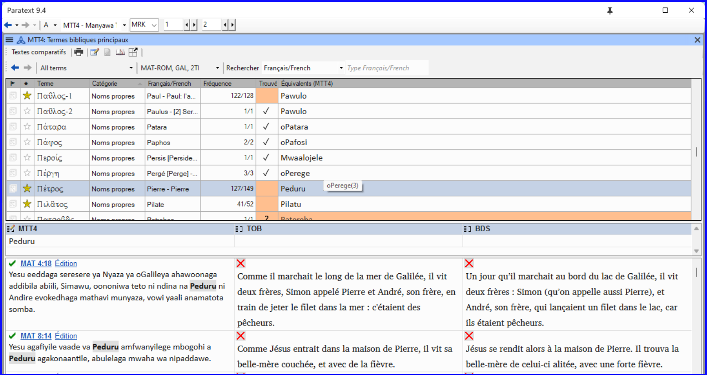
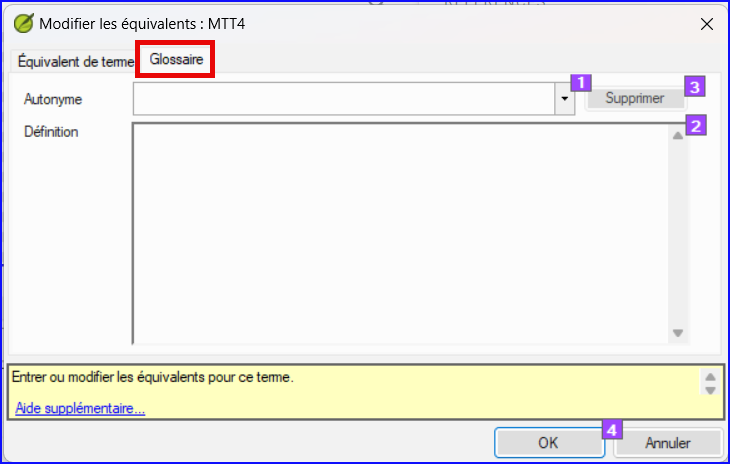
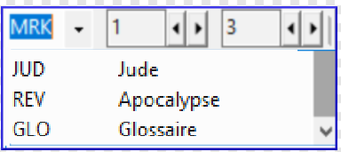

**Introduction** Ce module explique comment ajouter des entrées dans le glossaire avec l’outil **Termes bibliques**.

**Avant de commencer ?** Vous avez déjà saisi et vérifié votre texte dans Paratext 9. Maintenant, vous voulez ajouter des mots importants dans le glossaire.

**Pourquoi cette aptitude est-elle importante ?** Il est bon d’avoir une liste des mots importants ainsi que leur explication pour que les gens puissent mieux comprendre le texte. Il est préférable d’utiliser l’outil **Termes bibliques**, parce qu’il va garder la liste en ordre alphabétique. Si vous ajoutez les mots manuellement, le glossaire est plus difficile à gérer. L'outil permet également de suivre les modifications apportées au glossaire.

**Qu’est-ce qu’on va faire ?** Vous utiliserez l’outil Termes bibliques et modifierez l’équivalent d'un terme. L’onglet glossaire vous permet d’ajouter la forme de citation et la définition.

Quatre vidéos de formation sont disponibles sur [ajouter](https://vimeo.com/manage/videos/451195974), [lier](https://vimeo.com/manage/videos/499553868) et [éditer](https://vimeo.com/manage/videos/503489533) et obtenir [l'autorisation d'éditer](https://vimeo.com/manage/videos/476293601) glossaires. (P9 1A.4a-d).

## 9.1 Ouvrir l'outil termes bibliques {#137d8af8c8314fdba16891790c49c178}

1. Dans Paratext, déplacez à un verset qui contient le(s) mot(s) que vous voulez ajouter au glossaire.
1. Cliquez à droite et choisissez **Afficher les termes bibliques**, puis choisissez **Verset(s) actuel(s)**
1. Vérifiez que vous avez ouvert la bonne liste (par exemple, votre liste de projets ou la liste des termes bibliques clés de NT [SIL])

    

1. Pour changer la liste, **≡ Onglet**, sous **Termes Bibliques**, choisissez **Sélectionner la liste de termes bibliques**

:::info

Si le terme biblique ne figure dans aucune de ces listes, demandez à votre administrateur de l'ajouter à votre liste de projets.

:::

## 9.2 Ajouter une entrée {#99fd9ee0be454494b0e01a773eee6f96}

1. Double-cliquez sur le mot dans la liste du haut. Cliquez sur l’onglet **Glossaire**

1.
. Saisissez le mot dans la forme de citation (c.-à.-d. ce que vous voulez dans le glossaire) [1]. Saisissez la définition [2]

1. Cliquez sur **OK**

## 9.3 Lier une entrée existante {#b9f4ff025225434cbba15665f0894328}

:::tip

Plus tard, dans l'étape 6, vous relierez le terme biblique au texte pour ajouter le \* dans le texte imprimé ou le lien dans l'application électronique. Plus tard, à l'étape 6, vous établirez un lien entre le terme biblique et le texte pour ajouter le * dans le texte imprimé ou le lien dans l'application électronique.

:::

### Trouver le terme biblique {#120bd663b5ff4b7a840f4ef3c26b06d8}

1. Dans l’outil **Termes bibliques**
1. Vérifiez que vous avez ouvert la bonne liste (par exemple, votre liste de projets ou la liste des termes bibliques clés de NT [SIL])
1. Double-cliquez sur le mot dans la liste sur le volet de haut

### Lien avec l'entrée du glossaire {#dd6a347260a34a9ab7c52f8b91f9b165}

1. Cliquez sur l’onglet **Glossaire**
1. Cliquez sur la flèche à côté de Forme de citation (1)
1. Choisissez l’entrée du glossaire
1. **≡ Onglet**, **Modifier la collection de textes**  

## 9.4 Afficher le glossaire {#ebf2c2a15ff946199b5764dfe7af56a8}

Dans Paratext

1. Utilisez la barre de navigation pour changer le livre

1. Choisissez le livre **GLO**.

## 9.5 Modifier une entrée – dans le livre GLO {#059626f045a34c24bcdd466553c8e18a}

Dans Paratext

:::tip

Il est recommandé d'utiliser l'outil Termes bibliques pour travailler sur les entrées du glossaire. Cependant, il peut être utile d'éditer les définitions du livre GLO.

:::

1. Ouvrez le livre **GLO**
1. Modifiez le texte comme d'habitude.

## 9.6 Modifier une entrée – dans les termes bibliques {#b1ea5eaaee78499bbffe70a892a4ce81}

1. **≡ Onglet**, sous **Outils**\&gt; **Termes bibliques**…
1. Double-cliquez sur le mot dans la liste en haut
1. Cliquez sur l’onglet **Glossaire**
1. Modifiez la définition
1. Cliquez sur **OK**.

:::info PARATEXT 9.3
Vous pouvez désormais modifier le formulaire de citation dans cet onglet sans rompre le lien avec l'entrée.
:::

## 9.7 Ajouter un terme biblique {#717471a3fbf3477fbab8e730af1b1ad7}

- voir la section [**10.7 Ajouter un terme - à partir d'une recherche dans le texte de référence**](/10.BT#f683ccf4cdcf45f09c516c09c78ab277)

## 9.8 Bilan {#2843edbecf5e4950944e24a78538bc99}

- Vous pouvez ouvrir l'outil Termes bibliques à partir du menu _**__**_ .
- L'onglet **glossaire** se trouve dans la boîte de dialogue \________. Pour ouvrir cette boîte de dialogue \________-clique sur le terme dans le volet en \_____.
- Pour voir le glossaire, vous changez au livre \____\_ (après Apocalypse).

:::info

[Réponses : clic droit, Éditer l'équivalent, double, haut, GLO]

:::

