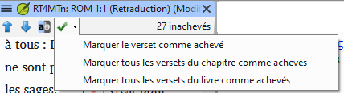
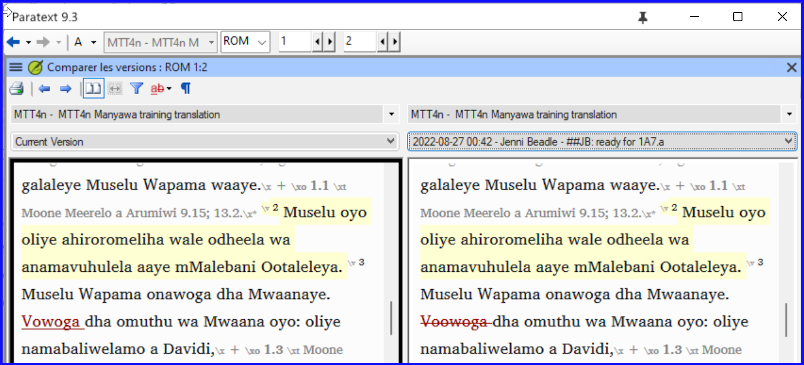
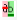
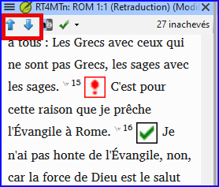
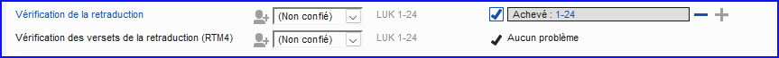

**Introduction** En préparant une vérification, le conseiller aura besoin d’une ou plusieurs versions de votre texte dans une langue qu’il comprend. C’est souvent appelé une retraduction. Il y a deux types de retraduction. Ce module explique comment faire une retraduction libre et la tenir à jour. Le prochain module explique comment faire une retraduction mot à mot.

**Avant de commencer**  Vous avez tapé, vérifié et révisé votre traduction dans Paratext et vous vous préparez maintenant à une vérification par un consultant. Avant de commencer, votre administrateur doit créer un projet pour la retraduction mot à mot.

**Pourquoi est-il important ?** Il est essentiel que votre texte soit vérifié par votre conseiller. Mais puisque votre conseiller ne connaît pas votre langue, il vous faut retraduire votre texte dans une langue que votre conseiller peut comprendre. D’où le terme **retraduction**. Le conseiller utilisera cette traduction pour aider votre équipe à améliorer vos choix exégétiques dans le texte.

Il est préférable qu'une personne non impliquée dans votre traduction la vérifie. Dans ce cas, il rendra ce que le texte dit et pas ce que vous avez voulu que le texte dise. Ils ne doivent pas regarder d'aides ou d'autres Bibles.

**Que ferez-vous ?**

- Ouvrir votre projet et votre projet de retraduction (libre).
- Disposez votre texte à l'écran.
- Saisir votre retraduction
- Marquez le chapitre comme achevé.
- Vérifiez que votre texte est à jour (ou synchronisé), visualisez les éventuelles différences en passant à la modification suivante le cas échéant.

:::info Mise à jour

Votre projet est le projet de base de votre projet de retraduction. Dans la version 9.4, vous pouvez désormais ouvrir votre projet à partir de la retraduction (**≡ Projet** choisir **Ouvrir le projet de base …**).

:::

## 16.1 Créer un nouveau projet pour la retraduction {#44530c9822fc4c2d9677cc06c747491c}

:::caution

Le projet est créé une fois par un administrateur. Si un projet existe, voir [16.2 ci-dessous](/16.BT1#e6cb21ddb31146938d0576ea7f4f3b06).

:::

- **≡ Paratext**, sous **Paratext** &gt; **Nouveau Projet**

### **Saisissez les noms du projet** {#c929f129f8d848d890d32d1ed85ed86a}

- Cliquez sur le bouton **Édition**
- Saisissez un nom complet pour le projet et un nom abrégé
- Cliquez sur **OK**

### **Choisir les paramètres** **du projet** {#2db659565b714589be113884683c1f1f}

1. Choisissez la langue
2. Laissez la versification
3. Comme type de projet, choisissez **Retraduction**
4. Choisissez votre projet de la liste **Basé sur**.
    - _Si nécessaire, Paratext modifiera la versification pour l'adapter à votre projet._
5. **≡ Onglet**, **Modifier la collection de textes**  
    - _Le nouveau projet s'ouvre avec des liens vers Créer livre(s) ou Importer livre(s)_.

:::info

Ce projet ne doit pas être inscrit, car il hérite de l'inscription de votre projet.

:::

### **Créer les livres** {#53659e0ab6c34a939d0e69dcdfd786e4}

- Cliquez sur l’onglet **Livres**
- Créez des livres comme voulu.

:::caution

Utilisez l'option **Créer sur la base de** [votre projet]. afin que tous les marqueurs soient ajoutés en fonction de votre projet.

:::

## 16.2 Saisir votre retraduction{#162} {#e6cb21ddb31146938d0576ea7f4f3b06}

1. Ouvrez votre projet
2. Ouvrez votre retraduction
3. Arrangez les fenêtres côté à côté pour facilement voir les deux fenêtres.
4. Cliquez dans la fenêtre de retraduction (le verset dans votre projet est surligné)
5. Saisissez la retraduction dans chaque verset (après la case à cocher).
6. Continuez à saisir chaque verset.

## 16.3 Marquer le chapitre comme Achevé {#a1bc8a251f9148009ea57dd4fbd96e44}

Quand vous avez fini le chapitre

- De la barre d’outils en haut de la fenêtre de retraduction, cliquez sur la coche.  

    

- Choisissez **Marquer tous les versets du chapitre comme achevés**.
    - _Toutes les cases à cocher du chapitre sont marquées d'une croix verte._

## 16.4 Lorsque vous modifiez votre projet {#0f230b5f95404967a3537e86379eaf33}

Paratext détectera tout changement dans votre texte (au moment où le texte est enregistré) et va changer la case de traduction vers un point d’interrogation rouge et ajouter des problèmes à l’état de la retraduction dans Tâches et avancement.

1. Cliquez dans un verset avec un point d’interrogation rouge.
2. Revoyez et corrigez la retraduction.
    - _Si les changements ne sont pas clairs, voir la section "Voir les différences pour les versets périmés" ci-dessous._
3. Lorsqu'il est correct, cliquez sur le point d'interrogation rouge
    - _Il se transforme en une coche verte_

    :::info

    Les projets dérivés peuvent ouvrir le projet de base.

:::

### **Afficher les différences pour les versets qui ne sont pas à jour** {#fe5fdc6b632b4f3cbafe2f390961a391}

- Cliquez sur l'icône de la barre d'outils pour voir les différences.
    - _Une fenêtre de comparaison s’affiche_.

        

### **Passer aux différences suivantes** {#b59e604df6cc42b7b68abda3173fde99}

- Cliquez sur les flèches de haut et de bas pour passer aux différences précédentes ou suivantes.

    

## 16.5 Vérifiez vos **Tâches et avancement** {#860fd280ce5d4bb2bed1d1e4fb5d878c}

- Cliquez sur l'icône Tâches et avancement

- Développez l'étape 3, les vérifications de la retraduction sont à la fin
    - _Le nombre de versets non approuvés ou modifiés (le cas échéant) est indiqué dans la liste _ comme _problèmes_

        

### 16.6 Vérification de versets de la retraduction (dans le plan du projet) {#e861e8ecf8a142e99d31c5630c1f21a4}

- Cliquez sur le lien "problèmes"
    - _Une liste de toutes les erreurs trouvées s’affiche._
    - _Et la fenêtre de retraduction s’affiche avec le curseur dans le premier verset qui a des problèmes._
- Corrigez le problème et passez au verset périmé suivant en cliquant sur les flèches de la barre d'outils.

### 16.7 Statut de la retraduction {#631313ddd7ac4707adba5762ef16b842}

- L'état de la retraduction est achevé lorsqu'il n'y a pas de problème.

### 16.8 Tâche d’apprentissage {#639f58c0e08342e390afddee7236d11f}

Les cases à cocher dans une retraduction peuvent avoir un certain nombre de symboles différents.

| 1 | numéro de verset incohérent |
| - | --------------------------- |
| 2 | Pas de texte/verse          |
| 3 | inachevé (unfinished)       |
| 4 | Achevé (Finished)           |
| 5 | Dépassé (Out of date)       |

:::info

[Réponses : A3, B4, C5, D1, E2]

:::

