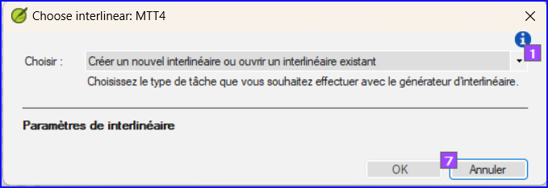
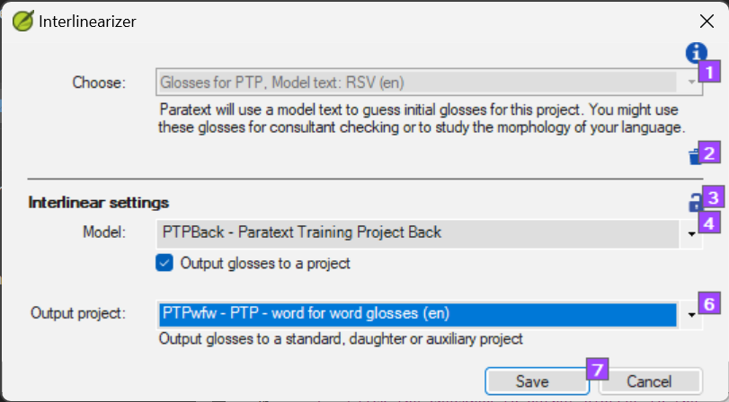
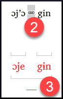

**Introduction**  The previous module explained how to create a back translation that expresses what a reader understands when he reads or hears the text. Il existe un autre type de retraduction qui est parfois utilisé et qui est une retraduction mot à mot. Certains consultants peuvent demander ce style de retraduction. Vous pouvez utiliser la fonctionnalité générateur d’interlinéaire de projet.

:::caution

Please note that in Paratext 9 you can only use the Interlinearizer on registered projects.

:::

**Before you start:** You have typed, checked, and revised your translation in Paratext and are now preparing for a consultant check by doing a word-for-word back translation. If you want to export the interlinear to a separate project, then before you can start, your administrator must have created a separate project for your word-for-word back translation. [Ceci est distinct de la retraduction libre dans le module précédent.]

**Why this is important:** Your consultant needs to have a copy of your translation in a language they can understand. La retraduction effectuée dans le module précédent est très utile, mais il y a des moments où une traduction littérale est plus utile.

**What you will do:** You will use the project interlinearizer to produce a word-for-word gloss of the text. Firstly, you will set up the interlinearizer and then correct any errors. The computer's initial guesses are often wrong, but it learns as it goes and becomes quite accurate quickly. The idea is for the gloss to be correct even though the word order is not correct. When you are happy with the verse, you can approve the glosses and move to the next verse with unapproved glosses.

## 17.1 Configure the project interlinearizer {#85a79610577747e588eb6de3f3764b58}

1. Cliquez dans votre projet
1. **≡ Tab**, under **Tools** &gt; **Interlinearizer**

    

1. Cliquez sur la liste déroulant [1]
1. Choisissez de créer des gloses à partir d'un texte modèle. This is usually your reference text or your free back translation project [2].

### Export glosses to a project {#187c0a7da78942f085a0b0ce7cd23c79}

1. If necessary, click the lock icon [3] to unlock the settings.
1. Choisissez votre texte modèle [4].

    

1. Click the checkbox to output glosses to the project that the administrator created
1. Choose the output project created by your administrator

    

1. **≡ Onglet**, **Modifier la collection de textes**  

## 17.2 Corriger l’interlinéaire {#5692bdbcfc5e493e9eaca52bf0dbcaa0}

Pour corriger les gloses incorrectes

1. Cliquez sur la glose
    - _A list is displayed_.
1. Either click on the correct gloss in the list
    - _or type the correct gloss in the textbox_
1. Cliquez sur **Entrée**

## 17.3 Traduire/gloser une expression {#5dcf6d99cb4c4653a4d3426c32e41623}

1. Click between two words
2. Click the chain icon  **(Link words)**
3. Click the red line
4. Type the gloss

## 17.4 Ajouter des mots supplémentaires {#397336e9e1e34f43953ba179210b763c}

1. Cliquez entre deux gloses
1. Saisissez le(s) mot(s) supplémentaires

## 17.5 Spécifier la morphologie {#4be396e96f22469ea459ab6501e55386}

1. Cliquez sur un mot dans la ligne de la langue de la traduction
1. Cliquez sur **Ajouter analyse de mot**
1. Ajouter **des espaces** entre les morphèmes et « + » aux limites du morphème
1. **≡ Onglet**, **Modifier la collection de textes**  

## 17.6 Exporter/approuver le texte {#9295ee6e6c294b8591bbab695a814ea1}

Quand vous approuvez et exportez le texte, toutes gloses rouges restantes seront approuvées.

1. Cliquer sur **Approuver les gloses**
1. Pour continuer, cliquez sur **Verset suivant non approuvé**

## 17.7 Aide {#192a271a080f459886a47400bde27014}

Pour plus d'aide lors de l'utilisation de la fonction Interlinéariser, voir les rubriques suivantes dans l'Aide de Paratext :

1. Introduction pour générateur d'interlinéaire (Introduction to Project Interlinearizer)
1. (How do I open the Project Interlinearizer?)
1. (How do I generate an interlinear back translation?)
1. ((How do I create a back translation project with the Interlinearizer?)
1. (How do I create a text revision/adaptation project with the Interlinearizer?)
1. (What do the colours of glosses mean in the Interlinearizer?)
