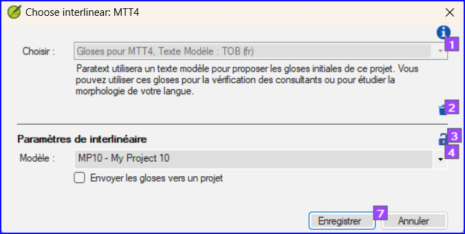
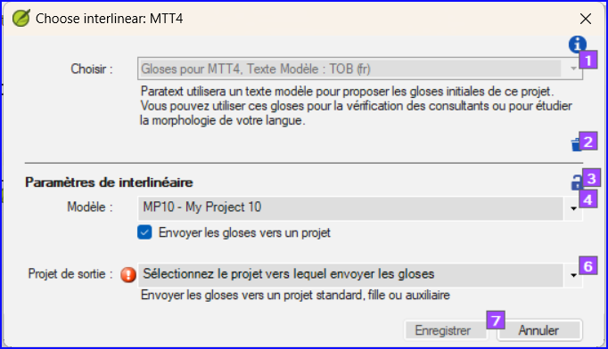

**Introduction** Le module précédent a expliqué comment créer une retraduction qui exprime ce que le lecteur comprend quand il lit ou entend le texte. Il existe un autre type de retraduction qui est parfois utilisé et qui est une retraduction mot à mot. Certains consultants peuvent demander ce style de retraduction. Vous pouvez utiliser la fonctionnalité générateur d’interlinéaire de projet.

:::caution

En Paratext 9 vous ne pouvez qu’utiliser le générateur d’interlinéaire avec des projets inscrits.

:::

**Avant de commencer :** Vous avez saisi, vérifié et révisé votre traduction dans Paratext et vous vous préparez maintenant à un vérification par un consultant en effectuant une retraduction mot à mot. Si vous souhaitez exporter l'interlinéaire vers un projet distinct, votre administrateur doit avoir créé un projet distinct pour votre retraduction mot à mot. [Ceci est distinct de la retraduction libre dans le module précédent.]

**Pourquoi c'est important** Votre consultant doit avoir une copie de votre traduction dans une langue qu'il comprend. La retraduction effectuée dans le module précédent est très utile, mais il y a des moments où une traduction littérale est plus utile.

**Que ferez-vous ?** Premièrement, on configure le générateur d'interlinéaire puis on utilisera la fonction du générateur d’Interlinéaire de projet pour créer automatiquement une glose interlinéaire mot à mot du texte. Tout d'abord, vous configurerez le générateur d'interlinéaire, puis vous corrigerez les éventuelles erreurs. Les premières estimations de l'ordinateur sont souvent erronées, mais il apprend au fur et à mesure et devient rapidement très précis. L'idée est que la glose soit correcte même si l'ordre des mots n'est pas correct. Lorsque vous êtes satisfait du verset, vous pouvez approuver les gloses et passer au verset suivant avec des gloses non approuvées.

## 17.1 Configurer le générateur d'interlinéaire du projet {#85a79610577747e588eb6de3f3764b58}

1. Cliquez dans votre projet

2. **≡ Onglet**, sous **Outils** &gt; **Générateur d’Interlinéaire**  

   

3. Cliquez sur la liste déroulant [1]

4. Choisissez de créer des gloses à partir d'un texte modèle. Il s'agit généralement de votre texte de référence ou de votre projet de retraduction libre [2].

### Exporter des gloses vers un projet {#187c0a7da78942f085a0b0ce7cd23c79}

1. Si nécessaire, cliquez sur l'icône de verrouillage [3] pour déverrouiller les paramètres.

2. Choisissez votre texte modèle [4].

   

3. Cliquez sur la case à cocher pour éditer les gloses dans le projet créé par l'administrateur

4. Choisissez le projet de sortie créé par votre administrateur

   

5. Cliquez sur **Ajouter analyse de mot**

## 17.2 Corriger l’interlinéaire {#5692bdbcfc5e493e9eaca52bf0dbcaa0}

Pour corriger les gloses incorrectes

1. Cliquez sur la glose
   -
2. Soit cliquer sur la glose correct dans la liste
   - _soit tapez la glose correcte dans la zone de texte_
3. Cliquez sur **Entrée**

## 17.3 Traduire/gloser une expression {#5dcf6d99cb4c4653a4d3426c32e41623}

1. Cliquez entre deux mots
2. Cliquez sur l'icône de la chaîne **(Mots liés)**
3. Cliquez sur la ligne rouge
4. Tapez la glose

## 17.4 Ajouter des mots supplémentaires {#397336e9e1e34f43953ba179210b763c}

1. Cliquez entre deux gloses
2. Saisissez le(s) mot(s) supplémentaires

## 17.5 Spécifier la morphologie {#4be396e96f22469ea459ab6501e55386}

1. Cliquez sur un mot dans la ligne de la langue de la traduction
2. **≡ Onglet**, **Modifier la collection de textes**  
3. Ajouter **des espaces** entre les morphèmes et « + » aux limites du morphème
4. **≡ Onglet**, **Modifier la collection de textes**  

## 17.6 Exporter/approuver le texte {#9295ee6e6c294b8591bbab695a814ea1}

Quand vous approuvez et exportez le texte, toutes gloses rouges restantes seront approuvées.

1. Cliquer sur **Approuver les gloses**
2. Pour continuer, cliquez sur **Verset suivant non approuvé**

## 17.7 Aide {#192a271a080f459886a47400bde27014}

Pour plus d'aide lors de l'utilisation de la fonction Interlinéariser, voir les rubriques suivantes dans l'Aide de Paratext :

1. Introduction pour générateur d'interlinéaire (Introduction to Project Interlinearizer)
2. (How do I open the Project Interlinearizer?)
3. (How do I generate an interlinear back translation?)
4. ((How do I create a back translation project with the Interlinearizer?)
5. (How do I create a text revision/adaptation project with the Interlinearizer?)
6. (What do the colours of glosses mean in the Interlinearizer?)
