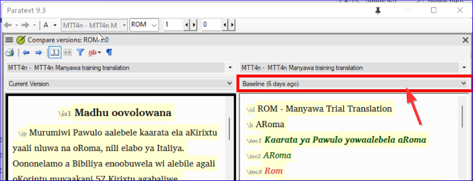
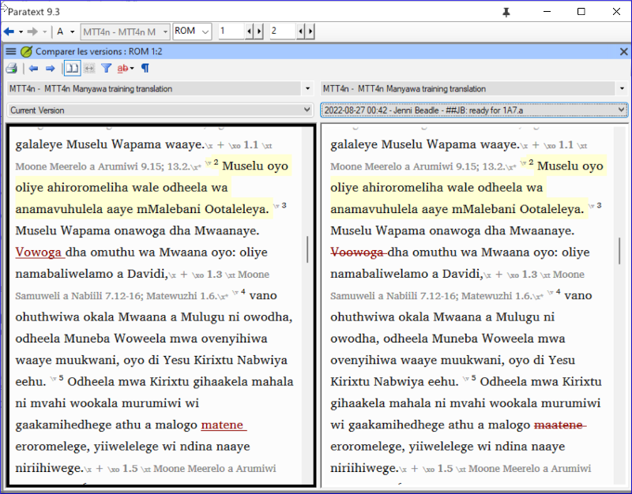

**Introduction** Dans ce module, vous apprendrez comment enregistrer les versions anciennes de votre texte pour les revoir plus tard.

**Avant de commencer** Vous avez saisi votre texte et vous êtes arrivé à une étape importante de votre projet.

**Pourquoi cette aptitude est-elle importante ?** Lorsque vous travaillez sur votre traduction, vous faites continuellement des changements. Il est bon d’avoir une copie des anciennes versions de votre texte, par exemple, le texte avant la vérification du conseiller.

**Qu’est-ce qu’on va faire ?** Vous allez marquer un point de repère dans l’historique du projet auquel vous pourrez revenir plus tard afin de comparer votre travail. Plus tard, vous pourrez comparer le texte à différents moments.

### 18.1 Point de repère dans l'historique du projet {#6bc0d79911234870b4fe00d7193f8414}

1. Cliquez dans votre fenêtre de projet (dans Paratext )
2. **≡ Onglet**, sous **Projet** &gt; **Marquer un point de repère dans l’historique du projet**
3. Saisissez un commentaire pour décrire l'étape du projet.
4. Cliquez sur **OK**

:::tip

C’est bon de commencer le commentaire avec quelques symboles, comme **\#\#\#**, pour bien trouver les points que vous avez ajoutés dans la liste longue de points automatiques que Paratext crée.

:::

### 18.2 Voir les différences entre deux points (ou versions) {#b1533bd8ac644603a394e939685a6d4a}

:::tip

Tout texte supprimé est barré. Par défaut, tout texte ajouté est en rouge ou souligné.

:::

- **≡ Onglet**, développez le menu, sous **Projet** &gt; **Comparer les versions.**

- Cliquez sur la liste déroulante de la version de base
  - _Une liste de versions s'affiche_.

- Choisissez le point de repère souhaité dans l'historique
  - _L'écran affiche les différences_.

