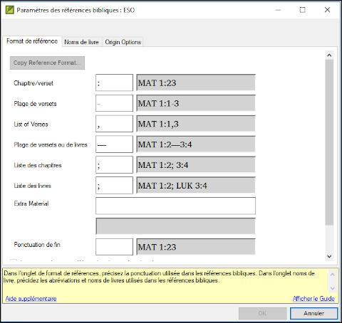
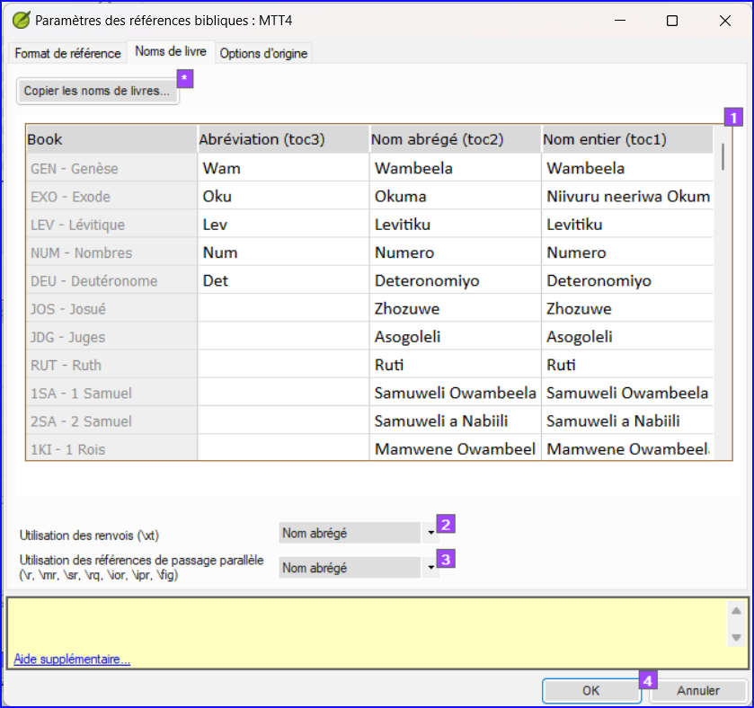
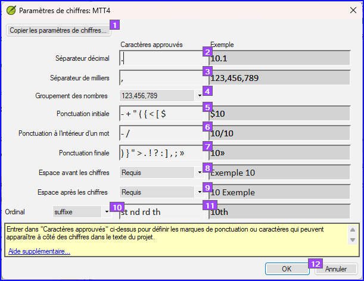

**Introduction**  In this module you will learn how to run the remaining basic checks (references, quoted text, numbers, punctuation in pairs and quotations). Comme dans les deux premiers modules de vérifications de base, il est plus facile de diriger les vérifications du plan de projet. Toutefois, si vous voulez vérifier plus qu'un livre, vous devez effectuer les vérifications du menu vérification.

**Before you start**  You have typed your translation into Paratext. Make sure you have done the checks described in modules [BC1](https://sillsdev.github.io/paratext-manual/5.BC1) and [BC2](https://sillsdev.github.io/paratext-manual/12.BC2) before continuing. Et que votre administrateur a soit fait l'installation pour les vérifications soit est disponible pour faire l'installation avec vous.

**Why this is important**  Paratext has eleven basic checks. Vous avez déjà vu les six premières vérifications. Cette dernière série de contrôles vous aide à trouver les erreurs liées au matériel mentionné d'autres livres. Vous voulez être sûr que les références sont exactes pour que le lecteur puisse trouver ces passages.

**What you are going to do**  As before, most of the checks require some setup to be done by your administrator. Dans ce module, vous allez

- Confirmer que l'installation a été faite
- Lancer la vérification de base
- Corrigez les erreurs.

## 19.1 Erreurs de ponctuation en paires correspondantes {#37c2805933944d69852bddc3b8b8c520}

:::astuce

:::tip
Cette vérification regarde la ponctuation qui se produit dans les paires (une ouverture et une fermeture) et énumère des erreurs où un élément du paire n'a pas sa correspondance. This may be deliberate but is more likely to be an error, e.g. ( ), [ ], etc.

:::

**Setup – inventory**

1. **≡ Tab**, under **Tools** &gt; **Checking Inventories** &gt; **Unmatched pairs of punctuation**:
    - _Si la liste est vide, donc il n'y a aucune erreur._
1. Si nécessaire, cliquez sur **Options…** pour ajouter d'autres paires.
1. Cliquez sur **OK**.

**Effectuer  la vérification**

1. **≡ Tab**, under **Tools** &gt; **Run Basic Checks**
1. Cochez “**Erreurs de ponctuation en paires correspondantes**”
1. **≡ Onglet**, **Modifier la collection de textes**  
    - _Une liste de problèmes s’affiche._
1. Faites les corrections nécessaires.

## 19.2 Références {#03533bb10f7a4a0a9d600b3684876edf}

### Paramètres des chiffres {#13450fc38203431a8a92bfadc41599a8}

:::caution

:::caution
Avant que vous puissiez effectuer la vérification de références, votre **Administrateur** doit définir des paramètres différents.

:::

1. **≡ Tab**, under **Project** > **Scripture reference settings**

1. Pour chaque paramètre, tapez la ponctuation dans la boîte

Book names

1. Click the **Book names** tab

1. Remplissez les trois colonnes [1] avec l'abréviation, le nom court et le long nom.

1. Choose **Abbreviations** [2] and [3] for both cross-references and references

1. Click **OK.**

:::caution

 Paratext will inform you if there are any inconsistencies between these book name settings and the \toc lines and will advise you to Resolve conflicts. This needs to be done by the Administrator.

:::

### Vérification {#fb34163adfba4da4980a20476539efe8}

1. **≡ Tab**, under **Tools** &gt; **Run Basic Checks**
1. Cochez **Citations**
1. **≡ Onglet**, **Modifier la collection de textes**  
1. Corrigez les erreurs.

## 19.3 Nombres {#038fe67d3fd342c591ee4004ab5d4819}

### Paramètres des chiffres {#e3ccf79de0524459a0cb1c6860b1c22c}

:::caution

Before you can run the numbers check, your Administrator must define various number settings.

:::

1. **≡ Tab,** under **Project settings** > **Number settings**

1. Fill in the dialog box with the correct information.

1. Click **OK.**

:::caution

:::caution
Avant que vous puissiez lancer la vérification de citation, votre Administrateur doit définir les règles pour vos citations.

:::

### Vérification {#6bc0906c4efa4d44bc49ef74f42c53b5}

1. **≡ Tab**, under **Tools** &gt; **Run basic checks**
1. Cliquez sur **OK**
1. **≡ Onglet**, **Modifier la collection de textes**  

## 19.4 Quotation {#9764347cc21744099fe2122e180c5cd2}

La vérification de citations est utilisée pour garantir que vous avez été cohérent avec les guillemets du discours direct.

### Paramètres des chiffres {#22033012b57b40c7a8e2a901cd735140}

:::caution

Before you can run the quotation check, your Administrator must define the rules for your quotations.

:::

1. **≡ Tab**, under **Project settings** &gt; **Quotation rules**
1. Remplisissez les guillemets utilisé pour chaque niveau \[1\] \[2\] [3]
1. **Check Flag all quotes near other errors [8]**
1. Cliquez sur **OK**.

### Quotation check {#62f2574a47824607bcca515faed0a6da}

1. **≡ Tab**, under **Tools** &gt; **Run basic checks**
1. **Quotations**
1. Cliquez sur **OK**.
    - _Une liste de problèmes s’affiche. Il montre des erreurs possibles, mais inclut quatre citations correctes auparavant et après l'erreur possible._
1. Double-cliquez sur le premier élément qui ne commence pas par «…»
1. Corrigez si nécessaire.
1. Cliquez sur le bouton **Relancer** pour confirmer que vous avez corrigé l'erreur.

## 19.5 Texte cité {#dba28acec0d943519d752763b6afa537}

:::caution

The Quoted text check looks at text in a footnote (after the \fk or the \fq marker) or in a cross reference (after the \xk or the \xq marker) matches text in the verse where the footnote or cross reference is located .

:::

1. **≡ Tab**, under **Tools** &gt; **Run basic checks**
1. **Quoted text**
1. Cliquez sur **OK**.
    - _Une liste de problèmes s’affiche._
1. Règles de guillemets
