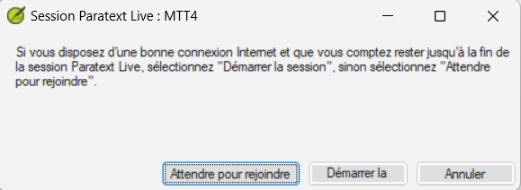
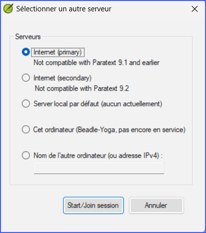
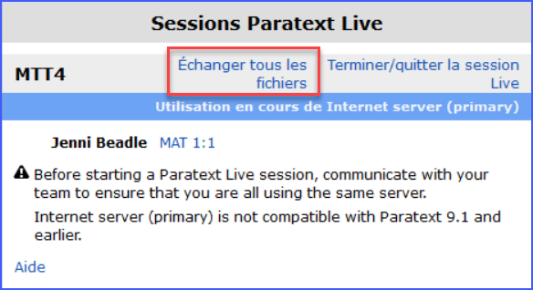

:::caution

Paratext Live has changed in Paratext 9.3.

:::

**Introduction**  In this module you will use Paratext Live as a way that the team can collaborate together so that everyone can see the changes to the text on their own computers.

**Before you start**  We have already seen how to collaborate with Send/Receive. La vérification par un conseiller est l'une des nombreuses occasions où plusieurs personnes doivent examiner le même texte, voire l'éditer ensemble. Paratext Live permet à chacun de consulter le texte sur son propre ordinateur et de voir les modifications apportées en temps réel.

**Why this is important**  There are several other ways to let everyone look at the same text. Mais Paratext Live permet non seulement à tout le monde de voir le texte, mais il permet également à plusieurs personnes de modifier le texte.

**Que ferez-vous ?**

- Connectez tous les utilisateurs au même réseau.
- Envoyer/Recevoir
- Démarrer Paratext Live et se joindre la session live
- Faire les modifications
- Échanger tous les fichiers
- Terminer/quitter la session Live
- Envoyer/Recevoir

:::info

 [4.1 Collaboration Tools](https://vimeo.com/641947293)  The video has been revised for Paratext 9.3.

:::

:::astuce

You may want to try switching to screen sharing (using a tool like Skype or Zoom) while working on spelling, Biblical terms, etc, so everyone can see the changes. And then switch back to using Paratext Live as it requires lower bandwidth.

:::

:::caution Upgrade

Mais c'était fait en Paratext 9.2. Everyone in a particular live session still needs to use the same server (either Primary or Secondary), it is just that from 9.3 you can work with someone on 9.1 or someone else on 9.2 (**just not at the same time**.)

:::

## 20.1 Paratext Live {#cfbebfcb20e14db89426a01336737f92}

:::astuce

It is no longer required for all users to do a **send/receive** before starting but if Paratext detects too many changes it will advise that you do a send/receive. Everyone must be connected to the same network.

:::

### Connecter tous les utilisateurs au même réseau {#8778ba22200442839f4c522b484c84a0}

Paratext Live peut utiliser

- l'Internet
- un réseau local
- offline WiFi router
- un hotspot avec données mobiles désactivées.

## Démarrer Paratext Live {#2e0fa70f644940e48f58e61cd2d84e22}

1. Ouvrez le **menu** du projet.
1. Sous **Outils**, cliquez sur **Paratext Live**.
1. Ou utilisez l'icône de la barre d'outils.
    - _Two choices are displayed_

## Choisir le serveur {#b0daa071fd094d97ae558c23c7708d56}

- If all users are using 9.2 or above, you can choose the first option **Internet (primary)** to connect to the Internet.

- Cliquez sur "Attendre pour rejoindre" ou "Démarrer la session" (pour être "l'hôte") selon le cas.
    - _*Une boîte de dialogue peut s'afficher*.*
    - _If Autosave in Paratext Settings is not on, the Live session will turn it on for the duration of the session._

Si ce n'est pas le cas,

- Choose the second option **Select different server**.

**Laquelle choisissez-vous ?**

- Choose the first option Internet (primary) if all users have Paratext 9.2 or above
- Choisissez la deuxième option **Internet (secondaire)** si un utilisateur a Paratext 9.0 ou 9.1.
- Choisissez la troisième option si vous êtes tous connectés à un réseau local et que vous souhaitez utiliser ce réseau pour vous connecter.
- Cliquez sur **OK**.

**Start or wait**

- Click **Start/Join Live session**.
    - _Paratext then effectively asks if you are the host (that is, you will remain until the end)_
- Si vous n'êtes **pas** le rédacteur principal/hôte, cliquez sur **attendre pour rejoindre**, *n'appuyez pas sur annuler* car cela annulerait votre participation à la session en direct.
- Si vous **êtes l'hôte**, cliquez sur **Démarrer la session**.
    - _Lorsqu'une session est active, le bouton Paratext Live est vert_

## Partager les modifications fait à partir d'outils {#33584bd1b18248b3bc576745a8aba544}

All scripture text is shared in Paratext Live. Cependant, les modifications apportées à l'aide de divers outils ne sont pas partagées automatiquement. Examples of these unshared changes are to spelling status, Parallel passage status, Biblical Terms and their identified renderings, and Notes. Pour partager ces changements

- Cliquez sur le bouton Paratext Live dans la barre d'outils,

- Cliquez sur "**Échanger tous les fichiers**"
    - _Tous les utilisateurs reçoivent alors les mises à jour de ces fichiers._

:::caution

:::caution
Les modifications de tous les utilisateurs sont partagées, mais si deux personnes ont modifié différemment le même élément, seule la modification d'une personne sera enregistrée.

:::

## Terminer la session Paratext Live {#092ea72d954c4c68a6f1c1fc61a7f15e}

- Cliquez sur le bouton Paratext Live
- Cliquez sur **Terminer/quitter la session Live**
- Si vous êtes le rédacteur principal, vous verrez une boîte de message.
- Cliquez sur **Terminer la session normalement**.
- Envoyer/Recevoir

:::info

:::info
**Pour plus d'aide**, recherchez **live** dans le champ de recherche de la barre de titre. Il existe de nombreuses rubriques utiles pour vous aider à utiliser Paratext Live.

:::

