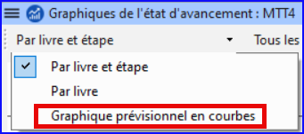

**Introduction** Dans ce module vous créerez un rapport sur l'état d'avancement.

**Où en sommes-nous dans le processus ?** Comme vous avez travaillé sur votre traduction, vous avez actualisé votre plan de projet avec votre progrès sur les chapitres accomplis et les livres. Maintenant vous préparerez un rapport.

**Pourquoi est-il important ?** Vos administrateurs et bailleurs ont besoin des rapports exacts de votre progrès.

**Que ferez-vous ?**

- Vérifiez que vos Tâches et avancement sont à jour.
- Vous allez produire plusieurs rapports.

## 21.1 Vérifiez votre plan de projet {#6e6096ccce1e431a9cd5997eeed7e123}

1. Ouvrez votre projet
2. Cliquez sur l'icône **Tâches et avancement**
3. Actualisez votre progrès comme nécessaire.

## 21.2 Produire les courbes de progression {#92fecf537c1b45be9afc57099f361f65}

1. Du menu **Onglet**, sous **Projet** choisissez **Graphiques de l'état d'avancement**

2. Cliquez sur la liste déroulante en haut à gauche.

   

3. Graphique prévisionnel en courbes).
   - _Une fenêtre s'affiche avec un graphique_

4. Cliquez sur l'icône d'imprimante
   - _Une fenêtre s'affiche_

5. Cliquez sur l'icône **Imprimer**
   - _La boîte de dialogue d'impression s'affiche._

6. Choisissez votre imprimante (ou imprimante PDF)

7. Cliquez sur **OK**.
