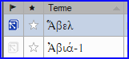

**Introduction** Une tâche dans cette étape est de produire un rapport des changements faits dans les termes bibliques.

**Avant de commencer** Dans le fait de travailler sur votre traduction, vous avez identifié et avez changé un certain nombre de termes bibliques clés.

**Pourquoi est-il important ?** Bien que vous ne puissiez pas utiliser Paratext pour écrire le rapport, il peut produire une liste des termes dont vous auriez besoin d'inclure dans votre rapport.

**Que ferez-vous ?** Dans l'outil de termes biblique, vous filtrez les livres que vous voulez inclure dans votre rapport. Vous sauverez alors la liste des termes comme un Fichier HTML séparé. Vous pouvez également filtrer la liste en fonction des remarques de discussion que vous avez pu rédiger.

### 22.1 Outil de termes biblique {#4623aa1ae72343009f7497174d3c68ca}

1. Cliquez dans votre projet
2. **≡ Onglet**, sous **Outils**\&gt; **Termes bibliques**
    - Si cette option de menu n'est pas affichée, cliquez sur la flèche vers le bas au bas des menus pour afficher les menus complets.
3. Activez le filtre des termes comme désiré.
4. Activez le filtre des versets (des livres que vous voulez inclure).
5. Triez la liste comme désiré.

### 22.2 Enregistrer la liste comme fichier HTML {#ea281a10dd8242029b54b4fa3e413408}

1. **≡ Onglet**, sous **Termes bibliques** &gt; **Exporter au format HTML**
2. Tapez un nom pour le fichier
3. Cliquez sur **Save/Enregistrer**
4. Ouvrez le fichier dans **Word/LibreOffice**

### 22.3 D'autres façons d'identifier des équivalents {#73e7e3a90122427a8502e3c2df78672f}

**Trier par les remarques des équivalents**

Cliquez sur l'icône de drapeau (l'en-tête de la première colonne) pour tirer par les remarques des équivalents.
 .

**Rechercher des termes avec un texte spécifique dans la** **Description des équivalents**

1. Cliquez sur le premier filtre dans la barre d'outils
2. Choisir **Description**
3. Dans la case à droite, tapez le texte à rechercher
    - _La liste est filtrée._
4. Enregistrez la liste à HTML (comme au-dessus).
