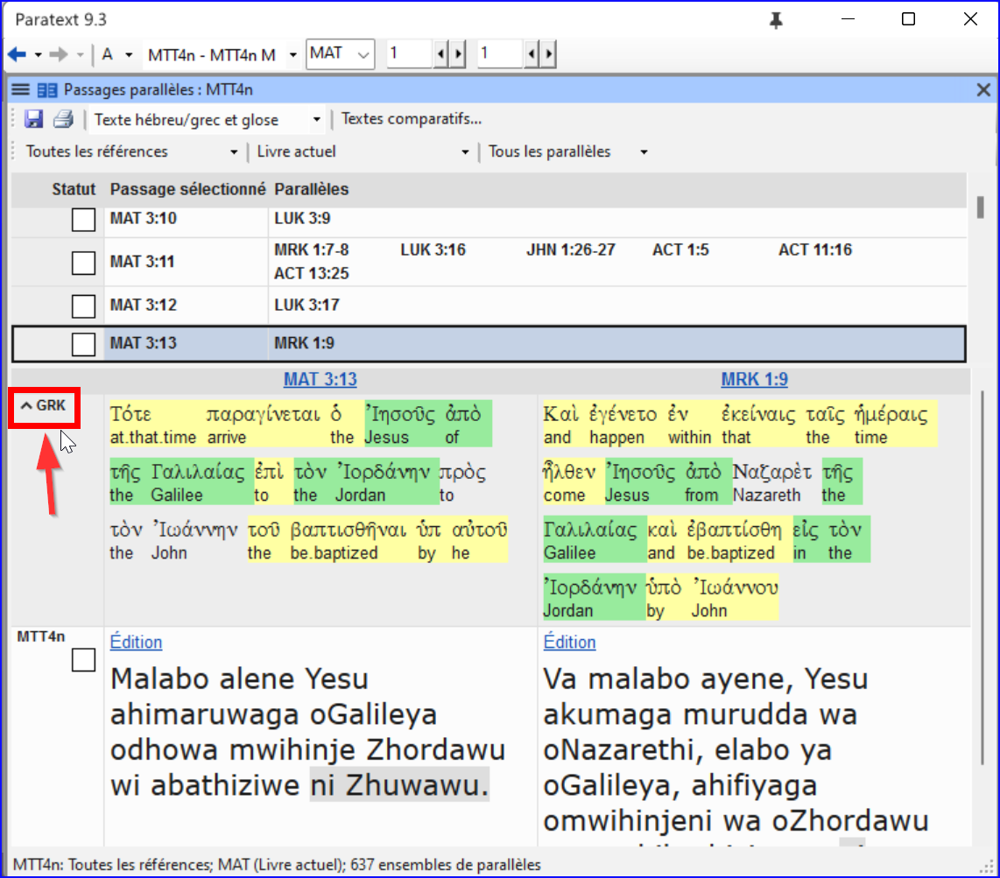
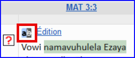
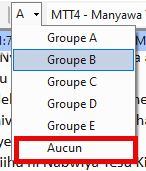

**Introduction**
There are thousands of passages in the NT where either the same event is being described or where another verse is being quoted from the Old or New Testament. On doit comparer ces textes pour vérifier qu’il est cohérent.

**Before you start**
Normally you will have translated and checked the text of both books with a consultant first before comparing the texts. Bien qu'il y ait des temps que vous voudrez comparer les autres versets avant que vous traduisez le deuxième passage.

**Why this is important**
The parallel passages need to be consistent but they do not always need to be exactly the same. L'outil Passages parallèles affiche les différents passages et met en évidence le texte qui est identique. Mais c'est le sens (et pas nécessairement la forme) qui est important.

Souvent ces comparaisons sont faites après avoir traduit les passages parce qu’on ne veut pas être influencé par ce que peut être une mauvaise traduction. Mais il peut arriver que vous souhaitiez voir un deuxième passage pendant que vous traduisez.

**What you are going to do**

- vous utilisez l’outil Textes parallèle pour comparer les textes.
- utiliser les cases à cocher pour indiquer à Paratext que vous avez vérifié les passages
- filtrer pour voir les versets qui étaient changé
- ouvrez une fenêtre de référence rapide dans Paratext pour voir un autre passage pendant que vous traduisez.
- ouvrir un troisième passage dans une fenêtre.

### 23.1 Open the Parallel passages window {#925421753cc849dbb0b0e5c29c6f549c}

1. Déplacez jusqu'au chapitre et au verset souhaités.
2. **≡ Tab**, under **Tools** &gt; **Parallel passages**
   - _A window is displayed showing a list and parallel passages_.

### 23.2 Display source texts {#63b7d3882a4f4eb7845d2ed8e45ca813}

1. Cliquez sur la flèche déroulante à côté des options de texte source

   

2. Choisissez comme désiré
   - _The display changes to show the source language text at the top of the table._

:::tip

Dans Paratext 9.3, vous pouvez réduire ou développer le grec/hébreu en cliquant sur la petite flèche.

:::

### 23.3 Select comparative texts {#2341540c08b34e67b22aa556a7a3d12d}

1. Click the **Comparative texts** button
2. Cliquez sur une ressource (à gauche)
3. Cliquez sur la flèche droite
4. Répétez si nécessaire
5. Cliquez sur **OK**

### 23.4 Filters {#bddd1bb153c84ee9bca3bc97ffb62b3b}

- Choisissez les filtres comme désiré: [Tous les parallèles, NT/NT, NT/AT, AT/AT, Evangiles synoptiques]

### 23.5 Compare the passages {#15c4aeb5a832426887603cefb4fe4e37}

- Cliquez dans une ligne dans la partie en haut.
  - _The texts are displayed in the bottom pane._

:::info

- Text is shown in **grey** in a project (or **green** in source texts) when the text is exactly the same as in the other passage.
- Text is shown in **yellow** (in source texts) when it has the same meaning (or thought) even though it is not exactly the same as in the other passage.
- Pour de nombreuses personnes, le gris est très difficile à voir. You can make this darker by going to the main Paratext Settings and changing the highlight to **Bright**. Cela affecte également les surbrillances dans le texte et les menus.

:::

:::tip

If the text is **green** in Greek, then **your text** should also be the same (but **darker green**).
Normalement, si le texte est différent dans le grec, il devrait être différent dans votre texte, mais ce n'est pas toujours le cas.

:::

### 23.6 To correct the text {#7337f71cd3c44034befaf9a302214031}

1. Click the blue link **Edit**
2. Faites les corrections.
3. Cliquez sur **OK**.

### 23.7 Copying a text {#f792366370e34edaa04a467ba812183e}

:::tip

Si les deux passages doivent d'être le même, vous devriez choisir un (normalement votre traduction dernière) et le copier sur l'autre.

:::

**Copy**

1. Click the blue link **Edit**
2. Sélectionnez le texte
3. Copiez (Ctrl+C)
4. Cliquez sur **OK**.

**Paste**

1. Cliquez sur le lien bleu d’autre texte
2. Sélectionnez le texte
3. Collez (Ctrl+V)
4. Cliquez sur **OK**.

:::caution

Attention lorsqu'il y a plus d'un verset. Il ne faut pas coller l'\v.

:::

### 23.8 Mark the passage as checked {#d2196130c2104131b84a2bea4a95ad68}

- Cliquez sur la case à cocher à côté de la référence.
  - _The set of references are approved_.

### Three modes for approving {#08445ce9fc804dc1afac9e744e6025c0}

Dans cette version de Paratext, il existe trois modes d'approbation.

1. Open the **menu** for the window.
2. Under **View** you can choose between
   - **Approve Sets of Parallels** - which is the default
   - **Approve Passages individually** individual checkboxes
   - **Approve by Set or Individually**, which allows you to switch back and forth between modes.

### To change from set to individually {#d8817e289b6245e385115906581f599b}

1. Ouvrez le menu de la fenêtre.
2. Sous Affichage, choisissez Approuver par ensemble ou séparément.
   - _Initially, a checkbox for the entire set is shown in the Status column_.
3. Passez la souris sur la case à cocher inférieure de l'ensemble.
4. _A pencil icon is shown_.
5. Click the **pencil**
   - _The checkboxes move to the other mode but only for this set of passages._

### 23.9 Passages which have changed {#e989e64519384fff9e358789ba19411e}

Identifier les passages qui ont été modifiés après avoir marqué comme finis.

1. Dans l'outil Passages parallèles
2. Change the passage filter to **Changed Text**
3. Click **ab** icon under the passage reference.

   

   - _A comparison window is displayed in Paratext._
4. Modifiez le texte si nécessaire.
5. Retourner à l'outil Passages parallèles (à l'aide des icônes de la barre des tâches)
6. Cliquez sur la case pour le cocher est marqué comme fini.

### 23.10 Compare the text as you translate {#ff56ce1d6f24468a8b5c84e7eedbf652}

1. Cliquez dans votre projet.
2. **≡ Tab**, under **Tools** &gt; **Quick reference** (Ctrl+q)
   - _A floating_ _window_ _opens with the scroll group set to none._
3. Changez la référence à un autre passage.

### 23.11 To see a third passage {#c0a5d24f77314597a326fd75e4fbc55c}

1. Open you project a second time [**≡ Paratext** > **Paratext** > **Open** and double-click your project]

2. Modifier le groupe de défilement de **[A]** à **Aucun**.

3. Changez la référence à un autre passage.

