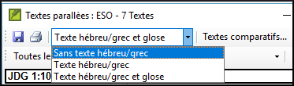

**Introduction** Il y a des milles des passages dans un NT où le même événement est décrié ou qui citent un autre verset. On doit comparer ces textes pour vérifier qu’il est cohérent.

**Où en sommes-nous dans le processus ?** Normalement, vous aurez déjà traduit et vérifié les textes avec un conseiller avant de comparer les textes. Bien qu'il y ait des temps que vous voudrez comparer les autres versets avant que vous traduisez le deuxième passage.

**​Pourquoi cette aptitude est-elle importante ?** Les passages parallèles doivent être cohérents, mais ils ne doivent pas toujours être exactement le même. The Parallel Passages tool displays the various passages and highlights the text which is the same. But it is the meaning (not necessarily the form) that is important.

Souvent ces comparaisons sont faites après avoir traduit les passages parce qu’on ne veut pas être influencé par ce que peut être une mauvaise traduction. But there are times when you will want to be able to see a second passage while you are translating.

**Qu’est-ce qu’on va faire ?**

- vous utilisez l’outil Textes parallèle pour comparer les textes.
- use the check boxes to tell Paratext that you have checked the passages
- filtrer pour voir les versets qui étaient changé
- ouvrez une fenêtre de référence rapide dans Paratext pour voir un autre passage pendant que vous traduisez.
- open a third passage in a window.

### 23.1 Ouvrir la fenêtre de Textes parallèles {#925421753cc849dbb0b0e5c29c6f549c}

1. Navigate to the desired chapter and verse.
1. **≡ Tab**, under **Tools** &gt; **Parallel passages**
    - _A window is displayed showing a list and parallel passages_.

### 23.2 Afficher les textes sources {#63b7d3882a4f4eb7845d2ed8e45ca813}

1. Click the dropdown arrow beside the source text options

    

1. Choisissez comme désiré
    - _The display changes to show the source language text at the top of the table._

:::astuce

In Paratext 9.3 you can reduce or expand the Greek / Hebrew by clicking the little arrow.

:::

### 23.3 Sélectionner des Textes comparatifs {#2341540c08b34e67b22aa556a7a3d12d}

1. Cliquez sur le bouton **Textes comparatifs**
1. Cliquez sur une ressource (à gauche)
1. Cliquez sur la flèche droite
1. Répétez si nécessaire
1. **≡ Onglet**, **Modifier la collection de textes**  

### 23.4 Filtres {#bddd1bb153c84ee9bca3bc97ffb62b3b}

- Choisissez les filtres comme désiré: [Tous les parallèles, NT/NT, NT/AT, AT/AT, Evangiles synoptiques]  
   

### 23.5 Comparer des passages {#15c4aeb5a832426887603cefb4fe4e37}

- Cliquez dans une ligne dans la partie en haut.
    - _Les textes s’affichent en bas._

:::info

- :::tip Si le texte est en **vert** en grec votre texte doit être la même (mais **gris**).
- Text is shown in **yellow** (in source texts) when it has the same meaning (or thought) even though it is not exactly the same as in the other passage.
- For many people the grey is very hard to see. You can make this darker by going to the main Paratext Settings and changing the highlight to **Bright**. This will also affect highlights in the text and menus.

:::

:::astuce

If the text is **green** in Greek, then **your text** should also be the same (but **grey**). Normally, if the text is different in the Greek than it should be different in your text, but not always.

:::

### 23.6 Pour faire des corrections {#7337f71cd3c44034befaf9a302214031}

1. Cliquez sur le lien bleu **Édition**
1. Faites les corrections.
1. Cliquez sur **OK**.

### 23.7 Copier un texte {#f792366370e34edaa04a467ba812183e}

:::astuce

Si les deux passages doivent d'être le même, vous devriez choisir un (normalement votre traduction dernière) et le copier sur l'autre.

:::

**Copier**

1. Cliquez sur le lien bleu **Édition**
1. Sélectionnez le texte
1. Copiez (Ctrl+C)
1. Cliquez sur **OK**.

**Coller**

1. Cliquez sur le lien bleu d’autre texte
1. Sélectionnez le texte
1. Collez (Ctrl+V)
1. Cliquez sur **OK**.

:::caution

Be careful when there is more than one verse. You don’t want to paste the \v.

:::

### 23.8 Marquer un texte comme vérifié {#d2196130c2104131b84a2bea4a95ad68}

- Click the check box beside the reference.
    - _The set of references are approved_.

### Trois modes d'approbation {#08445ce9fc804dc1afac9e744e6025c0}

In this version of Paratext there are three modes for approving.

1. Ouvrez le **menu** de la fenêtre.
1. Sous **Affichage**, vous pouvez choisir entre
    - **Approve Sets of Parallels** - which is the default -
    - **Approuver les passages individuellement** les cases à cocher individuel
    - **Approve by Set or Individually**, which allows you to switch back and forth between modes.

### To change from set to individually {#d8817e289b6245e385115906581f599b}

1. Ouvrez le menu de la fenêtre.
1. Under View, choose Approve by Set or Individually.
    - _Initially, a checkbox for the entire set is shown in the Status column_.
1. Passez la souris sur la case à cocher inférieure de l'ensemble.
1. _Une icône en forme de crayon s'affiche_.
1. Cliquez sur le **crayon**
    - _*Les cases à cocher passent à l'autre mode, mais uniquement pour cet ensemble de passages*.*

### 23.9 Les passages qui ont été modifié {#e989e64519384fff9e358789ba19411e}

Identifier les passages qui ont été modifiés après avoir marqué comme finis.

1. In the Parallel passage tool

1. Change the passage filter to **Changed Text**

1. Click **ab** icon under the passage reference.

1. Modifiez le texte si nécessaire.

1. Return to the Parallel passages tool (using the task bar icons)

1. Cliquez sur la case pour le cocher est marqué comme fini.

.

### 23.10 Comparer les textes pendant la traduction {#ff56ce1d6f24468a8b5c84e7eedbf652}

1. Cliquez dans votre projet.
1. **≡ Tab**, under **Tools** &gt; **Quick reference** (Ctrl+q)
    - _A floating_ _window_ _opens with the scroll group set to none._
1. Changez la référence à un autre passage.

### 23.11 Voir un troisième passage {#c0a5d24f77314597a326fd75e4fbc55c}

1. Open you project a second time [**≡ Paratext** > **Paratext** > **Open** and double-click your project]

1. Change the scroll group from **[A]** to **None**.

1. Changez la référence à un autre passage.

