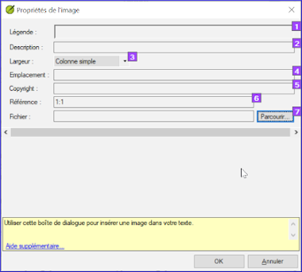

**​Introduction** Ce module traite la variété de tâches qu'on doit faire pour finaliser le texte pour la publication.

**Qu’est-ce que vous allez faire ?**

- Ajouter des **images** et légendes
- Trouver les noms des villes pour les cartes
- Ajouter l’introduction au NT / Bible
- Vérifier les passages parallèles
- Vérifier que tous les contrôles sont complets
- Vérification finale des noms propres
- Vérifier les chiffres, l’argent, les poids et les mesures
- Vérification du de la mise en forme.

## 24.1 Choisir les illustrations et légendes {#f380fb1fc81e4cbbb72d511558a49bb6}

Il y a plus de 2800 images disponibles, il peut donc être difficile de choisir les illustrations. Heureusement, il est désormais possible de rechercher des images par référence de chapitre et par mots-clés en français. Notez que toute illustration que vous insérez dans Paratext augmentera la taille de votre projet. N'ajoutez que ces petits fichiers jpg (ou alternativement juste le nom du fichier). Au moment de la composition, elles seront remplacées par des images plus grandes en haute définition.

**Créer un dossier d'images à rechercher**

Premier fois:

1. Ouvrez le lien https://tiny.cc/sampleimages sur l’Internet
2. Cliquez-droit sur le dossier **Illustrations - Français**,
3. Sélectionnez **Télécharger**
    - _Il téléchargera environ 121 Mo_.
4. Recherchez et ouvrez le **fichier .zip** téléchargé
5. Extrayez l’unique dossier dans l’archive : **Illustrations - Français** et mètre-le dans votre dossier **Images** (PIctures)
    - _(Windows commence à indexer les contenus des images…)_

**Tester différentes recherches**

Lorsque vos images sont indexées, vous pouvez tester différentes recherches.

1. Open this new folder in the **File Explorer**.

    

2. Type in the search field:
3. **A search word**, like cross, sheep, house, etc.
4. **A Bible reference**, like MAT27, ACT03, etc. (using at least 2 digits for the chapter).
5. Add **black** or **color** to display only black and white images.

## 24.2 Ajouter des illustrations et légendes {#b8896167ea3a4f46945fbab4670e0e58}

1. Dans votre projet, accédez au verset désiré.
2. From the **Insert** menu, choose **Figure**

    

3. Enter a **caption** to be printed with the image (in your language)[1].
4. Enter a **description** to be printed with the image (in your language) [2].
5. Indiquez si l’image doit remplir la largeur d’une colonne ou d’une page. [3]
6. S'il y a lieu, tapez une plage de vers comme emplacement acceptable. \[*\] \[Optional\]
7. Enter the necessary copyright information about the image [4]
8. Paratext va remplir la référence de chapitre et verset qui concerne l’image. [5]

**Parcourir pour rechercher le fichier de l'image**

1. Click **Browse**… to search for the image file. [7]
    - _A dialog box is displayed_.
2. In the dialog, select the **Pictures - Illustrations - English** folder on the left

    

3. Click in the **Search** field (top right) and type to filter the images (as above)
4. Click on the desired image and click on the **Open** button.
5. Click on **OK**.

:::caution

Pour faciliter la recherche, double-cliquez sur la barre de titre pour **agrandir la fenêtre**, **afficher** les très grandes icônes et **masquer le volet d'aperçu**.

:::

## 24.3 Trouver les noms des villes pour les cartes {#e649bd9a447840cf8dcc7737ef3ba118}

:::caution

La liste des noms des villes (CombinedNTMapBiblicalTerms. xml) n'est pas encore disponible dans Paratext 9. Alors, le fichier peut être [**télécharger ici**](pathname:///img/CombinedNTMapBiblicalTerms.xml) et, une fois téléchargé, le fichier doit être copier vers "My Paratext 9 Projects"

:::

1. Cliquez dans votre projet.
2. **≡ Onglet**, sous **Outils** &gt; **Termes bibliques**
3. **≡ Onglet**, sous **Termes bibliques** &gt; **Sélectionner la liste des termes bibliques**
4. Choisir NTMapBiblicalTerms
5. Ajouter des équivalents pour tous les termes
6. **≡ Onglet**, sous **Termes bibliques** &gt; **Exporter au format HTML**
7. Tapez un nom pour le fichier
8. Cliquez sur **Save/Enregistrer**.

### 24.4 Ajouter l’introduction au NT/Bible {#8dbe5d1eded645b4b7399b7445e87c9b}

1. Déplacez au livre INT
2. Vérifiez qu'il y a un ligne \\h
3. Tapez votre introduction en utilisant les marqueurs suivants :
    - \mt1
    - \is
    - \ip
4. Tapez l’introduction du Bible dans le livre **INT**

## 24.5 Vérifier les textes parallèles {#41283e7f0e9e4ad0b0cc096515eaea02}

- Voir le module [Comparer les passages parallèles](https://sillsdev.github.io/paratext-manual/23.PP)

## 24.6 Vérifier que toutes les vérifications soient achevé {#bad57bb5b1164152978a284244e46078}

**Livre actuel**

1. Ouvrez **Tâches et avancement**.
2. Vérifiez qu’il n’y a plus de problèmes pour les vérifications.

**Plusieurs livres**

1. Refaites les inventaires.
2. **≡ Onglet**, sous **Outils** &gt; **Effectuer les vérifications de base**
3. Cochez toutes les vérifications.
4. Sélectionnez tous les livres à publier.
5. Cliquez sur **OK**.
6. Corrigez les erreurs.

**Vérifications du liste de mots**

A partir de la liste de mots, effectuez les vérifications suivantes

1. **≡ Onglet**, sous **Outils** &gt; **Vérifier l’orthographe** &gt; **Toutes les vérifications**
2. **≡ Onglet**, sous **Outils** &gt; **Rechercher les mots semblables**
3. **≡ Onglet**, sous **Outils** &gt; **Rechercher les mots mal reliés ou mal divisés**

## 24.7 Vérification finale des noms propres {#9848258611574d89b055afe4eb493920}

1. **≡ Onglet**, sous **Outils** &gt; **Termes bibliques**
2. **≡ Onglet**, sous **Termes bibliques** &gt; **Sélectionner la liste des termes bibliques** et choisissez **Termes bibliques principaux**
3. Faites un filtre de noms propres avec les équivalents manquants
4. Vérifier que tous les noms ont un équivalent (ajoutez si nécessaire).

## 24.8 Les chiffres, l’argent, les poids et les mesures {#1ab8c0f85ac14e36ba936d5d546c8dbd}

1. Cliquez dans votre projet.
2. **≡ Onglet**, sous **Outils** &gt; **Termes bibliques**
3. **≡ Onglet**, sous **Termes bibliques** &gt; **Sélectionner la liste des termes bibliques**
4. Choisissez la liste approprié.
5. Ajouter les équivalents comme normaux.

## 24.9 Vérification du mise en forme {#6468aa6cc0bb4ed7bc531a2111ee63ee}

1. Refaire le module 13. Vérifications de formatage.
2. **≡ Onglet**, sous **Outils** &gt; **Listes récapitulatives** &gt; **Versets longs/Versets courts**
3. **≡ Onglet**, sous **Outils** &gt; **Listes récapitulatives** &gt; **Mot ou expression**
4. **≡ Onglet**, sous **Outils** **Listes récapitulatives** &gt; **En-têtes de sections**
5. **≡ Onglet**, sous **Outils** &gt; **Listes récapitulatives** &gt; **Titres de livres**
6. **≡ Onglet**, sous **Outils** &gt; **Listes récapitulatives** &gt; **Références**
7. **≡ Onglet**, sous **Outils** &gt; **Listes récapitulatives &gt; Notes de bas de pages**
