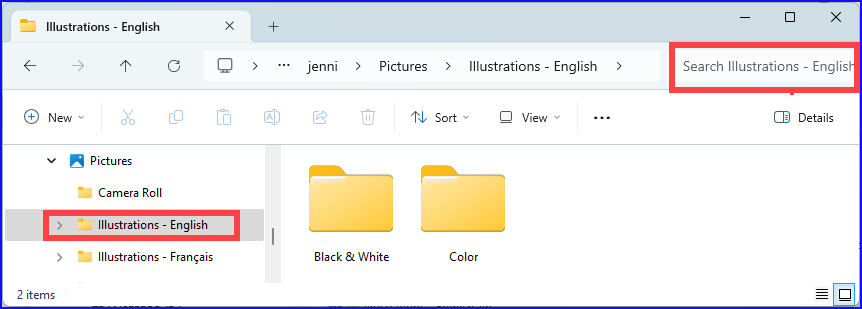
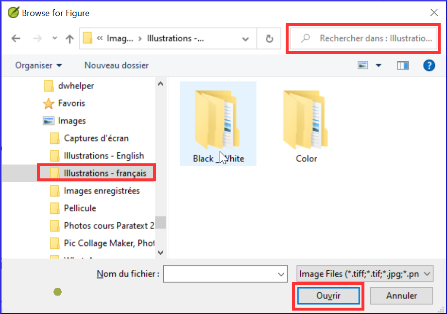

**Introduction**
This module looks at the variety of tasks needed to finalise the text for publication.

**What you will do**

- Add **illustrations** and captions
- Trouver les noms des villes pour les cartes
- Ajouter l’introduction au NT / Bible
- Vérifier les passages parallèles
- Vérifier que tous les contrôles sont complets
- Vérification finale des noms propres
- Vérifier les chiffres, l’argent, les poids et les mesures
- Vérification du de la mise en forme.

## 24.1 Choosing illustrations and captions {#f380fb1fc81e4cbbb72d511558a49bb6}

Il y a plus de 2800 images disponibles, il peut donc être difficile de choisir les illustrations. Fortunately, it is now possible to search for images by chapter reference and by keywords in English. Notez que toute illustration que vous insérez dans Paratext augmentera la taille de votre projet. N'ajoutez que ces petits fichiers jpg (ou alternativement juste le nom du fichier). Au moment de la composition, elles seront remplacées par des images plus grandes en haute définition.

**Create a folder of images to search**

Première fois :

1. Ouvrez le lien https://tiny.cc/sampleimages sur l’Internet
2. Right-click on the folder **Illustrations - English**,
3. Select **Download**
   - _It will download about 121MB_.
4. Search and open the downloaded **zip file**.
5. Extract the single folder in the archive: **Illustrations - English** and put it in your **Pictures** folder
   - _(Windows starts to index the contents of the images…)_

**Try various searches**

Lorsque vos images sont indexées, vous pouvez tester différentes recherches.

1. Open this new folder in the **File Explorer**.

   

2. Tapez dans le champ de recherche :

3. **A search word**, like cross, sheep, house, etc.

4. **A Bible reference**, like MAT27, ACT03, etc. (using at least 2 digits for the chapter).

5. Add **black** or **color** to display only black and white images.

## 24.2 Adding illustrations and captions {#b8896167ea3a4f46945fbab4670e0e58}

1. Dans votre projet, accédez au verset désiré.

2. From the **Insert** menu, choose **Figure**

   

3. Enter a **caption** to be printed with the image (in your language)[1].

4. Enter a **description** to be printed with the image (in your language) [2].

5. Indiquez si l’image doit remplir la largeur d’une colonne ou d’une page. [3]

6. S'il y a lieu, tapez une plage de vers comme emplacement acceptable. [\*] [Facultatif]

7. Saisir les informations nécessaires sur le copyright de l'image [4]

8. Paratext va remplir la référence de chapitre et verset qui concerne l’image. [5]

**Browse to find the image file**

1. Click **Browse**… to search for the image file. [7]
   - _A dialog box is displayed_.

2. In the dialog, select the **Pictures - Illustrations - English** folder on the left

   

3. Click in the **Search** field (top right) and type to filter the images (as above)

4. Click on the desired image and click on the **Open** button.

5. Click on **OK**.

:::caution

To make searching easier, double click on the title bar to **enlarge the window**, **show** the very large icons and **hide the viewing pane**.

:::

## 24.3 Map names {#e649bd9a447840cf8dcc7737ef3ba118}

:::info

A plug-in for doing map names will soon be available (Map Labeler Plugin). In the meantime you can continue with the old system of identifying map names as explained below.

:::

:::caution

La liste des noms des villes (CombinedNTMapBiblicalTerms. xml) n'est pas encore disponible dans Paratext 9. It is [**available here**](pathname:///img/CombinedNTMapBiblicalTerms.xml): and once downloaded, the file should be copied into "My Paratext 9 Projects"

:::

1. Cliquez dans votre projet.
2. **≡ Tab**, under **Tools** &gt; **Biblical Terms**
3. **≡ Tab**, under **Bibllical Terms** &gt; **Select Biblical Terms List**
4. Choisir NTMapBiblicalTerms
5. Ajouter des équivalents pour tous les termes
6. **≡ Tab**, under **Biblical terms** &gt; **Export as HTML**
7. Tapez un nom pour le fichier
8. Click **Save**.

### 24.4 Draft Introduction to the NT/Bible {#8dbe5d1eded645b4b7399b7445e87c9b}

1. Déplacez au livre INT
2. Vérifiez qu'il y a un ligne \\h
3. Tapez votre introduction en utilisant les marqueurs suivants :
   - \mt1
   - \is
   - \ip
4. Type in the overall introduction to the Bible/NT in the book **INT**

## 24.5 Check parallel passages {#41283e7f0e9e4ad0b0cc096515eaea02}

- See module [PP Compare Parallel passages](https://sillsdev.github.io/paratext-manual/23.PP)

## 24.6 Verify all checks are complete {#bad57bb5b1164152978a284244e46078}

**Current book**

1. Open the **Assignments and Progress**.
2. Vérifiez qu’il n’y a plus de problèmes pour les vérifications.

**Several books**

1. Refaites les inventaires.
2. **≡ Tab** under **Tools** &gt; **Run basic checks.**
3. Cochez toutes les vérifications.
4. Sélectionnez tous les livres à publier.
5. Cliquez sur **OK**.
6. Corrigez les erreurs.

**Word list checks**

A partir de la liste de mots, effectuez les vérifications suivantes

1. **≡ Tab**, under **Tools** &gt; **Spell check** &gt; **All checks**
2. **≡ Tab**, under **Tools** &gt; **Find Similar Words**
3. **≡ Tab**, under **Tools** &gt; **Find Incorrectly Joined or Split Words**

## 24.7 Proper Names final check {#9848258611574d89b055afe4eb493920}

1. **≡ Tab**, under **Tools** &gt; **Biblical Terms**
2. **≡ Tab**, under **Biblical terms** &gt; **Select Biblical Terms list** and choose the **Major Biblical Terms** list
3. Faites un filtre de noms propres avec les équivalents manquants
4. Vérifier que tous les noms ont un équivalent (ajoutez si nécessaire).

## 24.8 Numbers, money, weights and measures {#1ab8c0f85ac14e36ba936d5d546c8dbd}

1. Cliquez dans votre projet.
2. **≡ Tab**, under **Tools** &gt; **Biblical Terms**
3. **≡ Tab**, under **Biblical terms** &gt; **Select Biblical Terms list**
4. Choisissez la liste approprié.
5. Ajouter les équivalents comme normaux.

## 24.9 Formatting checks {#6468aa6cc0bb4ed7bc531a2111ee63ee}

1. Refaire le module 13. Vérifications de formatage.
2. **≡ Tab**, under **Tools** &gt; **Checklists** &gt; **Long/short verses**
3. **≡ Tab**, under **Tools** &gt; **Checklists** &gt; **Word or phrase**
4. **≡ Tab**, under **Tools** &gt; **Checklists** &gt; **Section headings**
5. **≡ Tab**, under **Tools** &gt; **Checklists** &gt; **Book titles**
6. **≡ Tab**, under **Tools** &gt; **Checklists** &gt; **References**
7. **≡ Tab**, under **Tools** &gt; **Checklists &gt; Footnotes**
