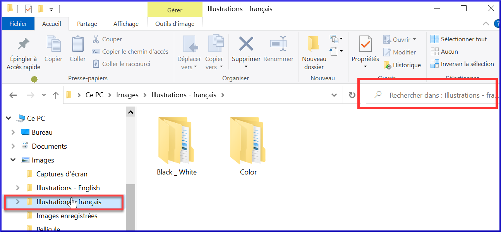

**Introduction** This module looks at the variety of tasks needed to finalise the text for publication.

**Qu’est-ce que vous allez faire ?**

- Ajouter des **images** et légendes
- Trouver les noms des villes pour les cartes
- Ajouter l’introduction au NT / Bible
- Vérifier les passages parallèles
- Vérifier que tous les contrôles sont complets
- Vérification finale des noms propres
- Vérifier les chiffres, l’argent, les poids et les mesures
- Vérification du de la mise en forme.

## 24.1 Choisir les illustrations et légendes {#f380fb1fc81e4cbbb72d511558a49bb6}

Il y a plus de 2800 images disponibles, il peut donc être difficile de choisir les illustrations. Heureusement, il est désormais possible de rechercher des images par référence de chapitre et par mots-clés en français. Notez que toute illustration que vous insérez dans Paratext augmentera la taille de votre projet. Only add these small jpg files (or alternatively just the file name). Au moment de la composition elles seront remplacées par des images plus grandes en haute résolution.

**Créer un dossier d'images à rechercher**

Premier fois:

1. Ouvrez le lien https://tiny.cc/sampleimages sur l’Internet
1. Right-click on the folder **Illustrations - French**,
1. Sélectionnez **Télécharger**
    - _It will download about 121MB_.
1. Recherchez et ouvrez le **fichier .zip** téléchargé
1. Extract the single folder in the archive: **Illustrations - French** and put it in your **Images** folder
    - _(Windows commence à indexer les contenus des images…)_

**Tester différentes recherches**

Lorsque vos images sont indexées, vous pouvez tester différentes recherches.

1. Open this new folder in the **File Explorer**.

1. Type in the search field:

1. **A search word**, like cross, sheep, house, etc.

1. **A Bible reference**, like MAT27, ACT03, etc. (using at least 2 digits for the chapter).

1. Add **black** or **color** to display only black and white images.

## 24.2 Ajouter des illustrations et légendes {#b8896167ea3a4f46945fbab4670e0e58}

1. Dans votre projet, accédez au verset désiré.

1. From the **Insert** menu, choose **Figure**

1. Enter a **caption** to be printed with the image (in your language)[1].

1. Enter a **description** to be printed with the image (in your language) [2].

1. Indiquez si l’image doit remplir la largeur d’une colonne ou d’une page. [3]

1. S'il y a lieu, tapez une plage de vers comme emplacement acceptable. [*] [Optional]

1. Enter the necessary copyright information about the image [4]

1. Paratext va remplir la référence de chapitre et verset qui concerne l’image. [5]

**Parcourir pour rechercher le fichier de l'image**

1. Click **Browse**… to search for the image file. [7]

1. In the dialog, select the **Images - Illustrations - English** folder on the left

1. Click in the **Search** field (top right) and type to filter the images (as above)

1. Click on the desired image and click on the **Open** button.

1. Click on **OK**.

:::caution

To make searching easier, double click on the title bar to **enlarge the window**, **show** the very large icons and **hide the viewing pane**.

:::

## 24.3 Trouver les noms des villes pour les cartes {#e649bd9a447840cf8dcc7737ef3ba118}

:::caution

The Combined NT Maps Biblical Terms list is not a standard list in Paratext 9. It is [**available here**](pathname:///img/CombinedNTMapBiblicalTerms.xml): and once downloaded, the file should be copied into "My Paratext 9 Projects"

:::

1. Cliquez dans votre projet.
1. **≡ Tab**, under **Tools** &gt; **Biblical Terms**
1. **≡ Tab**, under **Bibllical Terms** &gt; **Select Biblical Terms List**
1. Choose NT MapBiblicalTerms
1. Add renderings for all terms
1. **≡ Tab**, under **Biblical terms** &gt; **Export as HTML**
1. Tapez un nom pour le fichier
1. Cliquez sur **Save/Enregistrer**.

### 24.4 Ajouter l’introduction au NT/Bible {#8dbe5d1eded645b4b7399b7445e87c9b}

1. Change to the book INT
1. Make sure there is an \h line
1. Type your introduction using the following markers:
    - \mt1
    - \is
    - \ip
1. Tapez l’introduction du Bible dans le livre **INT**

## 24.5 Vérifier les textes parallèles {#41283e7f0e9e4ad0b0cc096515eaea02}

- See module [PP Compare Parallel passages](https://sillsdev.github.io/paratext-manual/23.PP)

## 24.6 Vérifier que tous les contrôles soient complets {#bad57bb5b1164152978a284244e46078}

**Livre actuel**

1. Open the **Assignments and Progress**.
1. Vérifiez qu’il n’y a plus de problèmes pour les vérifications.

**Plusieurs livres**

1. Refaites les inventaires.
1. **≡ Tab** under **Tools** &gt; **Run basic checks.**
1. Cochez toutes les vérifications.
1. Sélectionnez tous les livres à publier.
1. Cliquez sur **OK**.
1. Corrigez les erreurs.

**Vérifications du liste de mots**

A partir de la liste de mots, effectuez les vérifications suivantes

1. **≡ Tab**, under **Tools** &gt; **Spell check** &gt; **All checks**
1. **≡ Tab**, under **Tools** &gt; **Find Similar Words**
1. **≡ Tab**, under **Tools** &gt; **Find Incorrectly Joined or Split Words**

## 24.7 Vérification finale des noms propres {#9848258611574d89b055afe4eb493920}

1. **≡ Tab**, under **Tools** &gt; **Biblical Terms**
1. **≡ Tab**, under **Biblical terms** &gt; **Select Biblical Terms list** and choose the **Major Biblical Terms** list
1. Faites un filtre de noms propres avec les équivalents manquants
1. Vérifier que tous les noms ont un équivalent (ajoutez si nécessaire).

## 24.8 Les chiffres, l’argent, les poids et les mesures {#1ab8c0f85ac14e36ba936d5d546c8dbd}

1. Cliquez dans votre projet.
1. **≡ Tab**, under **Tools** &gt; **Biblical Terms**
1. **≡ Tab**, under **Biblical terms** &gt; **Select Biblical Terms list**
1. Choisissez la liste approprié.
1. Ajouter les équivalents comme normaux.

## 24.9 Vérification du mise en forme {#6468aa6cc0bb4ed7bc531a2111ee63ee}

1. Redo the module FC: Formatting checks.
1. **≡ Tab**, under **Tools** &gt; **Checklists** &gt; **Long/short verses**
1. **≡ Tab**, under **Tools** &gt; **Checklists** &gt; **Word or phrase**
1. **≡ Tab**, under **Tools** &gt; **Checklists** &gt; **Section headings**
1. **≡ Tab**, under **Tools** &gt; **Checklists** &gt; **Book titles**
1. **≡ Tab**, under **Tools** &gt; **Checklists** &gt; **References**
1. **≡ Tab**, under **Tools** &gt; **Checklists &gt; Footnotes**
