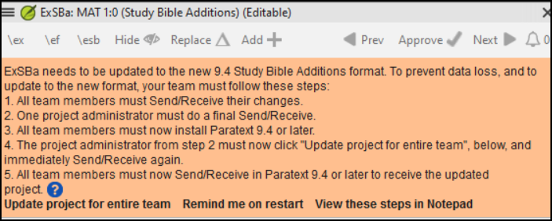

# Créer une Bible d'étude avec Paratext 9.4 {#98137245ea6a44b79015596b67b3c634}

:::info

Les fonctionnalités d'**Annexes de la Bible d'étude (ABÉ)** mises en œuvre dans **9.4 BÉTA** exigent que le projet ABÉ soit migré, en raison d'un changement de format de données. Le nouveau format de données ABÉ 9.4 n'est PAS compatible avec la version PT 9.3. Afin d'utiliser les nouvelles fonctionnalités du ABÉ, tous les membres du projet doivent passer à la version bêta de la PT 9.4 et l'administrateur du projet doit migrer le projet ABÉ.

:::

**Introduction** Avec Paratext 9.2 (et plus), vous pouvez créer une Bible d'étude basée sur votre traduction en ajoutant des paragraphes d'introduction, des encadrés, des notes de bas de page détaillées et des renvois supplémentaires pour aider votre utilisateur à avoir une compréhension plus approfondie du texte biblique.

**Avant de commencer** Avant de pouvoir créer une Bible d'étude, vous devrez traduire et vérifier votre Nouveau Testament (ou ses parties). Ensuite, votre administrateur peut créer un nouveau projet (voir ci-dessous).

**Pourquoi est-ce important?** Les informations de la Bible d'étude sont créées dans un projet séparé avec des liens vers le texte traduit. Si le texte traduit change, le lien peut être rompu. Les liens peuvent être corrigés, mais le problème est moins susceptible de se poser si le texte est stable.

**Que ferez-vous?** Vous (ou votre administrateur) allez créer un projet **Annexes de la Bible d'étude**. Comme son nom l'indique, c'est là que vous pouvez ajouter les matériaux d'étude (sans affecter votre traduction).

Ce projet séparé contient votre texte supplémentaire et une copie en lecture seule de votre projet. Lorsque vous êtes prêt, vous pouvez fusionner le projet Study Bible Additions avec votre projet de traduction en un troisième projet.

- Migrer une version antérieure des Annexes de la Bible d'étude

ou

    - Créez un nouveau projet d'Annexes de la Bible d'étude basé sur votre traduction
    - Enregistrez le nouveau projet
- Ajoutez le matériel supplémentaire (introductions, barres latérales, notes de bas de page et renvois).
- Masquez tout texte non biblique dans la traduction de base (par exemple, les titres).
- Fusionnez les projets pour créer un projet de publication.

:::info Mise à jour

Paratext 9.4 permet de réorganiser les renvois, les notes de bas de page et les barres latérales. Pour plus de détails, regardez [cette vidéo sur Study Bible additions in 9,4 (Annexes de la Bible d'étude 9,4)](https://vimeo.com/858761672) C'est en anglais (avec sous-titres en français)

:::

## Migrer une version antérieure des Annexes de la Bible d'étude {#0a743ded6dc24fc399975383664db289}

- Ouvrez un projet Annexes de la Bible d'étude.
    - .

        

## Créer un projet de type Annexes de la Bible d'étude {#7ed7e93951db49deaf2c5cf7d4d15d70}

1. Utilisez le menu **Paratext** pour créer un **nouveau projet**.
2. Définissez le type **** du projet sur **Annexes de la Bible d'étude**.
3. Choisissez votre projet de traduction pour le projet **"basé sur"**.
4. Vous devrez **inscrire** le nouveau projet.
    - _*Une copie grise en lecture seule de votre projet est affichée, avec une barre d'outils en haut._

        

## Ajouter le matériel supplémentaire {#e7a1b3e1b97b4eed9be5b9f1c2ed0dcd}

### Matériel d'introduction {#05a4f1d78d3549d9ac44235760b89873}

1. Déplacez votre curseur à l'endroit où vous souhaitez ajouter le matériel supplémentaire.
2. Cliquez sur **Ajouter +** dans la barre d'outils.
3. Une boîte bleue avec un marqueur \\ip est ajoutée.
4. Tapez le texte.

### Texte de l'encadré {#ab2be09dfc0e4fdeb177091e89785b58}

1. Placez votre curseur à l'endroit où vous souhaitez ajouter du matériel.
2. cliquez sur **\esb** dans la barre d'outils
    - _Un panneau latéral s'ouvre avec un marqueur \\ms ajouté_
3. Tapez le titre après le marqueur \\ms
4. Appuyer sur Entrée
5. Choisissez un marqueur pour le texte suivant.
6. Tapez le texte.
7. Continuez si nécessaire.

### Renvois étendus {#cbcab8e8c6a64e38bf737472fe26d8e9}

1. Positionnez votre curseur à l'endroit où vous souhaitez que l'appel de la renvoi
2. cliquez sur **\\ex** dans la barre d'outils
    1. Un panneau de notes de bas de page s'ouvre avec un marqueur de renvoi ajouté
3. Tapez le renvoi.

### Note de bas de page étendue {#864c186270064955922ed758dc7d9fcf}

1. Positionnez votre curseur à l'endroit où vous souhaitez ajouter la note de bas de page supplémentaire
2. Cliquez sur **\\ex** dans la barre d'outils
3. Un panneau de notes de bas de page s'affiche avec les marqueurs \\ef appropriés
4. Ajoutez des notes de bas de page selon vos besoins.

### Masquer le matériel non scripturaire {#8fff7769e5ae4060b0f1ffef9a979a79}

Vous pouvez masquer les éléments non scripturaires, tels que les titres, dans la traduction.

1. Positionnez votre curseur à l'endroit où vous souhaitez ajouter la note de bas de page supplémentaire
2. Cliquez sur **Masquer** dans la barre d'outils
    - _Le texte s'affiche dans une zone grisée._

## 25.3 Fusionnez les projets pour créer un projet de publication {#23a03d9d683240a6a21290721a8dbb93}

Pour publier la Bible d'étude, vous devez créer un projet de publication.

1. Cliquez sur le menu Projet du projet Ajouts à la Bible d'étude
2. Choisissez "Créer un projet de publication fusionné"

    

3. Cliquez sur la liste déroulante "**Projet de publication fusionné**".
4. Créez un nouveau projet ou choisissez un projet précédent
5. Cliquez sur **Créer**
    - _Paratext fusionne le projet de traduction et le projet d'annexes de Bible d'étude et affiche le projet de publication fusionné._
6. Si nécessaire, changez l'affichage en **Aperçu**.

### Effectuer des modifications {#9bd2afcdbf5946038a9b70561fcebc5d}

Vous avez maintenant trois projets.

1. Votre projet de traduction original,
2. Le Projet d'annexes de Bible d'étude et
3. Le projet de publication fusionnée.
- Toute **correction de la traduction** doit être apportée au **projet de traduction** original.
    - Ces corrections seront mises à jour dans le projet Annexes de la Bible d'étude bibliques lors de la prochaine recréation du projet de publication fusionné.
    - Toute _correction apportée au matériel d'étude biblique_ doit être effectuée dans le _projet Annexes de la Bible d'étude_ .
- _Le projet de publication fusionné_ est en lecture seule et ne peut pas être modifié.
    - Pour mettre à jour les modifications, recréez le projet de publication fusionné.

## Projet d'Annexes de la Bible d'étude - Comparer les versions {#7b7d078eecd44a71ae7fa6217ba07218}

Dans Paratext 9.3 (et plus), vous pouvez désormais comparer les versions

1. Ouvrez un projet Annexes de la Bible d'étude
2. Dans le menu **Projet**,
3. Sous **Projet**, choisissez **Comparer les versions**  
   *Les changements dans les annexes sont affichés*.
    - _Les modifications apportées aux ajouts sont affichées_.

## 25.5 Imprimer la Bible d'étude avec PTXPrint {#cfc9e16b905c4aa48c7aad34c7c5ef9a}

PTXPrint version 2.1.x (et supérieure) peut imprimer le projet de publication fusionné. Pour des instructions détaillées, voir [https://software.sil.org/ptxprint/how-to-study-bible-layout/](https://software.sil.org/ptxprint/how-to-study-bible-layout/)

