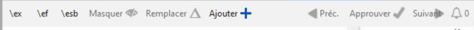

# 25. Création d'une Bible d'étude
(avec Paratext 9.2 et ultérieur)

**Introduction** Avec Paratext 9.2 (et plus), vous pouvez créer une Bible d'étude basée sur votre traduction en ajoutant des paragraphes d'introduction, des encadrés, des notes de bas de page détaillées et des renvois supplémentaires pour aider votre utilisateur à avoir une compréhension plus approfondie du texte biblique.

**Avant de commencer** Avant de pouvoir créer une Bible d'étude, vous devrez traduire et vérifier votre Nouveau Testament (ou ses parties). Ensuite, votre administrateur peut créer un nouveau projet (voir ci-dessous).

**Pourquoi est-ce important?** Les informations de la Bible d'étude sont créées dans un projet séparé avec des liens vers le texte traduit. Si le texte traduit change, le lien peut être rompu. Les liens peuvent être corrigés, mais le problème est moins susceptible de se poser si le texte est stable.

**Que ferez-vous?** Vous (ou votre administrateur) allez créer un projet **Annexes de la Bible d'étude**. Comme son nom l'indique, c'est là que vous pouvez ajouter les matériaux d'étude (sans affecter votre traduction).

This separate project contains your additional text and a read-only copy of your project. Lorsque vous êtes prêt, vous pouvez fusionner le projet Study Bible Additions avec votre projet de traduction en un troisième projet.

- Créez un nouveau projet d'ajouts à la Bible d'étude basé sur votre traduction.
- Enregistrez le nouveau projet
- Ajoutez le matériel supplémentaire (introductions, barres latérales, notes de bas de page et renvois).
- Masquez tout texte non biblique dans la traduction de base (par exemple, les titres).
- Fusionnez les projets pour créer un projet de publication.

## 25.1 Créer un projet de type Annexes de la Bible d'étude {#0a743ded6dc24fc399975383664db289}

1. Utilisez le menu Paratext de créer un nouveau projet.
2. Définissez le type de projet comme Annexe de la Bible d'étude.
3. Choisissez votre projet de traduction pour le projet "basé sur".
4. Vous devrez enregistrer le nouveau projet.
    - _*Une copie grise en lecture seule de votre projet est affichée, avec une barre d'outils en haut._

        

## Ajouter le matériel supplémentaire {#e7a1b3e1b97b4eed9be5b9f1c2ed0dcd}

### Matériel d'introduction {#05a4f1d78d3549d9ac44235760b89873}

1. Déplacez votre curseur à l'endroit où vous souhaitez ajouter le matériel supplémentaire.
2. Cliquez sur **Ajouter +** dans la barre d'outils.
3. Une boîte bleue avec un marqueur \\ip est ajoutée.
4. Tapez le texte.

### Texte de l'encadré {#ab2be09dfc0e4fdeb177091e89785b58}

1. Placez votre curseur à l'endroit où vous souhaitez ajouter du matériel.
2. click **\esb** on the toolbar
    - _A sidebar panel is opened with a \ms marker added_
3. Type the title after the \ms marker
4. Press Enter
5. Choose a marker for the following text.
6. Tapez le texte.
7. Continuez si nécessaire.

### Renvois étendus {#cbcab8e8c6a64e38bf737472fe26d8e9}

1. Positionnez votre curseur à l'endroit où vous souhaitez que l'appel de la renvoi
2. click **\ex** on the toolbar
    1. A footnote panel is opened with a \ex markers added
3. Type in the cross-reference.

### Note de bas de page étendue {#864c186270064955922ed758dc7d9fcf}

1. Positionnez votre curseur à l'endroit où vous souhaitez ajouter la note de bas de page supplémentaire
2. Cliquez sur **\\ex** dans la barre d'outils
3. Un panneau de notes de bas de page s'affiche avec les marqueurs \\ef appropriés
4. Ajoutez des notes de bas de page selon vos besoins.

### Masquer le matériel non scripturaire {#8fff7769e5ae4060b0f1ffef9a979a79}

Vous pouvez masquer les éléments non scripturaires, tels que les titres, dans la traduction.

1. Positionnez votre curseur à l'endroit où vous souhaitez ajouter la note de bas de page supplémentaire
2. Click **Hide** on the toolbar
    - _The text is displayed in a greyed-out box._

## 25.3 Fusionnez les projets pour créer un projet de publication {#23a03d9d683240a6a21290721a8dbb93}

Pour publier la Bible d'étude, vous devez créer un projet de publication.

1. Cliquez sur le menu Projet du projet Ajouts à la Bible d'étude
2. Choisissez "Créer un projet de publication fusionné"

    

3. Cliquez sur la liste déroulante "**Projet de publication fusionné**".
4. Créez un nouveau projet ou choisissez un projet précédent
5. Cliquez sur **Créer**
    - _Paratext merges the translation project and the Study Bible Additions project and displays the Merged publication project._
6. Si nécessaire, changez l'affichage en **Aperçu**.

### Effectuer des modifications {#9bd2afcdbf5946038a9b70561fcebc5d}

Vous avez maintenant trois projets.

1. Votre projet de traduction original,
2. The Study Bible Additions project and
3. Le projet de publication fusionnée.
- Toute **correction de la traduction** doit être apportée au **projet de traduction** original.
    - These corrections will be updated in the Study Bible Additions project when you next recreate the merge publication project.
    - _Any corrections to the Study Bible material_ should be made in the _Study Bible Additions project_.
- _Le projet de publication fusionné_ est en lecture seule et ne peut pas être modifié.
    - Pour mettre à jour les modifications, recréez le projet de publication fusionné.

## Study Bible Additions project - Compare versions {#7b7d078eecd44a71ae7fa6217ba07218}

Dans Paratext 9.3, vous pouvez désormais comparer les versions

1. Ouvrez un projet Annexes de la Bible d'étude
2. Dans le menu **Projet**,
3. Sous **Projet**, choisissez **Comparer les versions**  
   *Les changements dans les annexes sont affichés*.
    - _Les modifications apportées aux ajouts sont affichées_.

## 25.5 Imprimer la Bible d'étude avec PTXPrint {#cfc9e16b905c4aa48c7aad34c7c5ef9a}

PTXPrint version 2.1.x (et supérieure) peut imprimer le projet de publication fusionné. Pour des instructions détaillées, voir [https://software.sil.org/ptxprint/how-to-study-bible-layout/](https://software.sil.org/ptxprint/how-to-study-bible-layout/)

