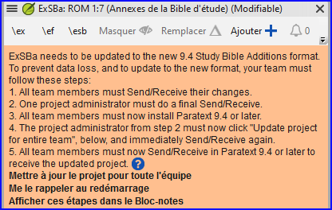

# Creating a Study Bible with Paratext 9.4  {#98137245ea6a44b79015596b67b3c634}

:::info

The **Study Bible Additions (SBA)** features implemented in **9.4 beta** requires that the SBA project be migrated, due to a data format change. Le nouveau format de données ABÉ 9.4 n'est PAS compatible avec la version PT 9.3. Afin d'utiliser les nouvelles fonctionnalités du ABÉ, tous les membres du projet doivent passer à la version bêta de la PT 9.4 et l'administrateur du projet doit migrer le projet ABÉ.

:::

**Introduction**  With Paratext 9.2 (and above) you can create a study Bible based on your translation by adding introductory paragraphs, sidebars and detailed footnotes and additional cross-references to help your user have a deeper understanding of the Bible text.

**Where are you in the process?**  Before you can create a Study Bible, you will want to translate and consultant check your New Testament (or portions). Ensuite, votre administrateur peut créer un nouveau projet (voir ci-dessous).

**Why is this important?**  Study Bible information is created in a separate project with links to the translated text. Si le texte traduit change, le lien peut être rompu. Les liens peuvent être corrigés, mais le problème est moins susceptible de se poser si le texte est stable.

**What will you do?**  You (or your administrator) will create a **Study Bible Additions project**. Comme son nom l'indique, c'est là que vous pouvez ajouter les matériaux d'étude (sans affecter votre traduction).

Ce projet séparé contient votre texte supplémentaire et une copie en lecture seule de votre projet. Lorsque vous êtes prêt, vous pouvez fusionner le projet Study Bible Additions avec votre projet de traduction en un troisième projet.

- Migrer une version antérieure des Annexes de la Bible d'étude

ou

- Créez un nouveau projet d'Annexes de la Bible d'étude basé sur votre traduction
- Inscrire le nouveau projet
- Ajoutez le matériel supplémentaire (introductions, barres latérales, notes de bas de page et renvois)
- Masquez tout texte non biblique dans la traduction de base (par exemple, les titres)
- Fusionnez les projets pour créer un projet de publication.

:::info Upgrade

Paratext 9.4 permet de réorganiser les renvois, les notes de bas de page et les barres latérales. For more details, watch [this video on Study Bible additions in 9,4](https://vimeo.com/858761672)

:::

## Migrate an earlier version of the Study Bible Additions {#0a743ded6dc24fc399975383664db289}

- Ouvrez un projet Annexes de la Bible d'étude.
  - Un avis s'affiche expliquant comment migrer votre projet.

    

## To Create a new Study Bible Additions project {#7ed7e93951db49deaf2c5cf7d4d15d70}

1. Use the **Paratext menu** to create a **new project**.
2. Set the **type** of project to **Study Bible Additions**.
3. Choose your translation project for the **“based on” project**.
4. You will need to **register** the new project.
   - _A grey-out read-only copy of your project is displayed, with a toolbar at the top._

## Add the additional material {#e7a1b3e1b97b4eed9be5b9f1c2ed0dcd}

### Introductory material {#05a4f1d78d3549d9ac44235760b89873}

1. Déplacez votre curseur à l'endroit où vous souhaitez ajouter le matériel supplémentaire.
2. Click **Add +** on the toolbar
3. Une boîte bleue avec un marqueur \\ip est ajoutée.
4. Tapez le texte.

### Sidebar text {#ab2be09dfc0e4fdeb177091e89785b58}

1. Placez votre curseur à l'endroit où vous souhaitez ajouter du matériel.
2. click **\esb** on the toolbar
   - _A sidebar panel is opened with a \ms marker added_
3. Tapez le titre après le marqueur \\ms
4. Appuyer sur Entrée
5. Choisissez un marqueur pour le texte suivant.
6. Tapez le texte.
7. Continuez si nécessaire.

### Extended cross-reference {#cbcab8e8c6a64e38bf737472fe26d8e9}

1. Positionnez votre curseur à l'endroit où vous souhaitez que l'appel de la renvoi
2. click **\ex** on the toolbar
   1. Un panneau de notes de bas de page s'ouvre avec un marqueur de renvoi ajouté
3. Tapez le renvoi.

### Extended footnote {#864c186270064955922ed758dc7d9fcf}

1. Positionnez votre curseur à l'endroit où vous souhaitez ajouter la note de bas de page supplémentaire
2. click **\ef** on the toolbar
3. Un panneau de notes de bas de page s'affiche avec les marqueurs \\ef appropriés
4. Ajoutez des notes de bas de page selon vos besoins.

### Hide non-scriptural material {#8fff7769e5ae4060b0f1ffef9a979a79}

Vous pouvez masquer les éléments non scripturaires, tels que les titres, dans la traduction

1. Positionnez votre curseur à l'endroit où vous souhaitez ajouter la note de bas de page supplémentaire
2. Click **Hide** on the toolbar
   - _The text is displayed in a greyed-out box._

## Merge the projects to create a publication project {#23a03d9d683240a6a21290721a8dbb93}

Pour publier la Bible d'étude, vous devez créer un projet de publication.

1. Cliquez sur le menu Projet du projet Ajouts à la Bible d'étude

2. Choisissez "Créer un projet de publication fusionné"

   

3. Click the dropdown list “**Merged publication project**”.

4. Créez un nouveau projet ou choisissez un projet précédent

5. Click **Create**
   - _Paratext merges the translation project and the Study Bible Additions project and displays the Merged publication project._

6. If necessary change the view to **Preview**.

### Making changes {#9bd2afcdbf5946038a9b70561fcebc5d}

Vous avez maintenant trois projets.

1. Votre projet de traduction original,
2. Le Projet d'annexes de Bible d'étude et
3. Le projet de publication fusionnée.

- _Any corrections to the translation_ should be made to the _original translation project_.
  - Ces corrections seront mises à jour dans le projet Annexes de la Bible d'étude bibliques lors de la prochaine recréation du projet de publication fusionné.
  - _Any corrections to the Study Bible material_ should be made in the _Study Bible Additions project_.
- The _merged publication project_ is read-only and cannot be changed.
  - Pour mettre à jour les modifications, recréez le projet de publication fusionné.

## Study Bible Additions project - Compare versions {#7b7d078eecd44a71ae7fa6217ba07218}

Dans Paratext 9.3 (et plus), vous pouvez désormais comparer les versions

1. Ouvrez un projet Annexes de la Bible d'étude
2. From the **Project** menu,
3. Under **Project**, choose **Compare Versions**
   - _The changes in the additions are displayed_.

## Printing the Study Bible with PTXPrint {#cfc9e16b905c4aa48c7aad34c7c5ef9a}

PTXPrint version 2.1.x (et supérieure) peut imprimer le projet de publication fusionné. For detailed instructions, see [https://software.sil.org/ptxprint/how-to-study-bible-layout/](https://software.sil.org/ptxprint/how-to-study-bible-layout/)
