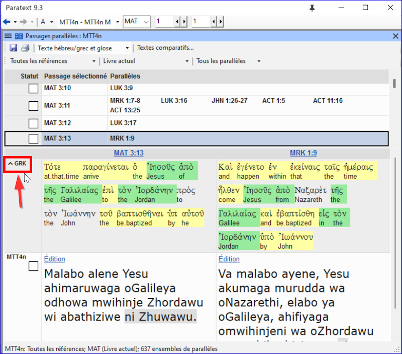
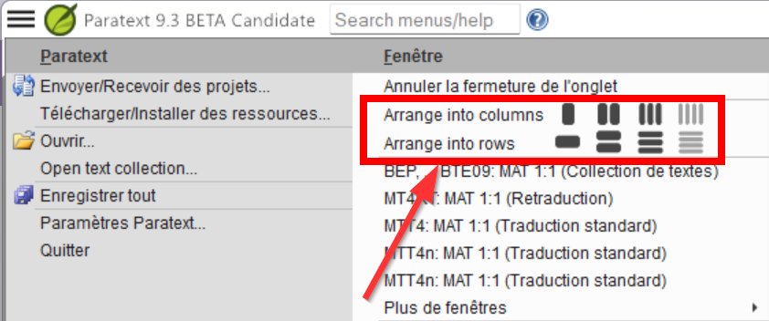
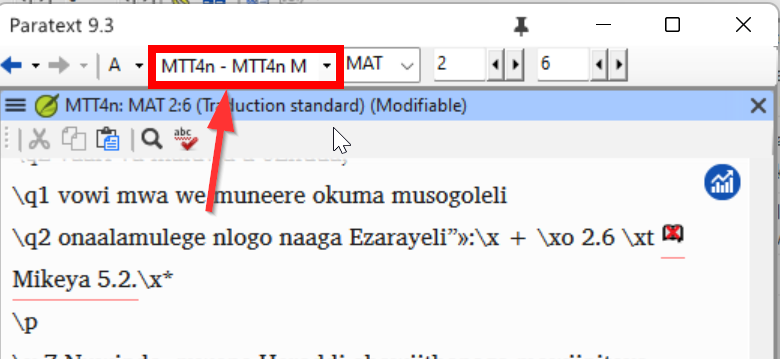

---
lang: fr
title: Quoi de neuf - Paratext 9.3
sidebar_position: 3
---

### Paratext Live
Paratext Live utilise plus qu'un serveur.

- Paratext 8, 9.0 et 9.1 utilisent un serveur "Internet secondaire" et Paratext 9.2 utilise serveur "Internet".
  -  *C'est pourquoi vous ne pouvez pas utiliser Paratext Live avec 9.2 et 9.1 en même temps*.

- Dans Paratext 9.3, lorsque vous démarrez Paratext Live, vous choisissez le serveur que vous souhaitez utiliser.
  - **Internet**, qui est 9.2 et 9.3.
  - **Internet secondaire**, qui est 9.0, 9.1 ou Paratext 8.  

:::note
Tous les participants à une session en direct doivent toujours utiliser le même serveur, mais à partir de la version 9.3, vous pouvez travailler avec quelqu'un en 9.1 ou en 9.2 (mais pas en même temps).
:::

### Annexes de la Bible d'étude
La nouvelle fonctionnalité la plus évidente est la possibilité de **comparer les versions**.

- Ouvrez un projet Annexes de la Bible d'étude
- Dans le menu **Projet**, 
- Sous **Projet**, choisissez **Comparer les versions**  
  *Les changements dans les annexes sont affichés*.

### Référence de l'Écriture dans la barre de navigation
Dans Paratext 9.3, vous pouvez copier et coller une référence biblque dans la barre de navigation.
- Copier le texte d'une référence (depuis un autre fichier)
- Cliquez sur le **nom du livre** dans la barre de navigation.
- Collez en utilisant **Ctrl+V**.  
   

La référence doit être dans un format qui correspond à la langue de l'interface.

Par exemple 
- en anglais : MAT 12.3, Mrk 5:4, Galates 1:12
- en espagnol : Romanos 8:28

:::note
Les noms doivent correspondre aux noms tels qu'ils apparaissent dans les titres.

Actuellement, il n'est pas possible de copier à partir du Paratext, mais cette fonctionnalité sera ajoutée dans une mise à jour ultérieure.
:::

### Outil de recherche de passages parallèles
- Les couleurs ont changé de **vert** à **gris**.
- Vous pouvez réduire ou étendre le grec / hébreu en cliquant sur la petite flèche.
   

### Ouvrir une collection de textes
Il y a un nouvel élément de menu dans le **menu principal**. 
- A partir du menu **Paratext**
- Choisissez **Ouvrir une collection de texte**  
   -  *Cette fenêtre ressemble à celle utilisée dans les versions précédentes de Paratext*.
- Ouvrez une collection de texte précédemment **enregistrée** en bas à gauche.
- Vous pouvez également ouvrir une collection de texte à partir de la fenêtre **Ouvrir**.

📄

### Arrangement des fenêtres
- Organisez les fenêtres par **lignes** ainsi que par **colonnes**.

   
:::tip
N'oubliez pas d'Enregistrer votre disposition des fenêtres !
:::

### Fenêtres flottantes
- Liste déroulante pour changer le projet actif
   

### Autres nouveautés/changements
- **RegEx Pal** - à partir du menu principal \> Avancé ou du menu Projet \> Avancé.
- La **synchronisation** avec Logos et d'autres programmes compatibles est maintenant activée **par défaut**.
- Des modifications ont été apportées pour faciliter la localisation des fichiers d'aide et de l'interface utilisateur
- Les **modules bibliques** peuvent maintenant gérer les **marqueurs de chapitre** dans les livres supplémentaires.
