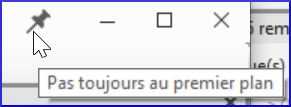
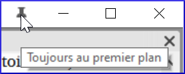

### Conseil 1 : Comment changer de fenêtre

-  L'échange de deux fenêtres peut impliquer deux ou plusieurs étapes. [Par exemple, faites glisser l'une d'entre elles vers le bord gauche et obtenez une colonne supplémentaire, puis faites glisser l'autre vers le coin inférieur droit.]
-  Une autre façon d'échanger ces deux textes est d'utiliser la liste des projets.

### Conseil 2 : Comment annuler le déplacement d’une fenêtre

Si vous faites une erreur avec un déplacement,

-  Cliquez sur le menu principal de **≡ Paratext**.
-  Cliquez sur Annuler le déplacement d’onglet.

### Conseil 3 : Comment désancrer les fenêtres flottantes

-  Lorsque la punaise est inclinée, cette fenêtre ne reste plus tout le temps au dessus.
      
-  Si vous voulez qu'il reste toujours au premier plan, cliquez sur l'icône pour l'épingler.
   

### Conseil n°4 : Comment élargir la colonne Masquer automatiquement

-  Cliquez sur la flèche en haut de la colonne pour rendre la colonne un peu plus large.  
    

### Conseil 5 : Comment annuler la fermeture d’une fenêtre

-  Cliquez sur le menu principal de **≡ Paratext**
-  Choisir Annuler la fermeture de l’onglet
