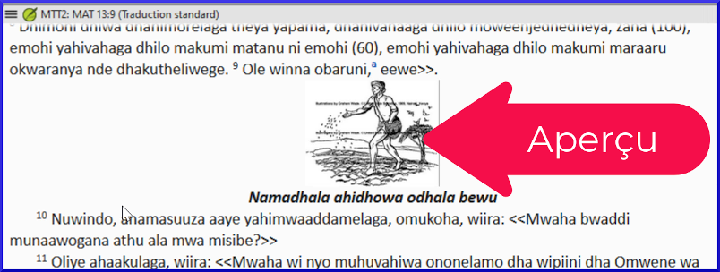

---
lang: fr
title: Qu’est que l'affichage aperçu ? (1.2.2e)
---

Dans cette vidéo, nous apprenons sur l'affichage appelé Aperçu.

**Pour passer à Aperçu**

1.  Ouvrez le **menu** du projet **≡**.
1.  Développez le menu si nécessaire.
1.  Sous **Affichage**, cliquez sur **Aperçu**.  
     -  *Cet affichage ressemble beaucoup à l'affichage formaté, avec des balises USFM cachées, et seulement leur effet sur le style du texte affiché*.

Aperçu va encore plus loin pour faire le texte ressembler à il sera vu par les lecteurs éventuels de la traduction.
:::note
-  Il n'y a pas de surlignage gris des numéros de vers.
-  La taille d'une image est plus appropriée.
-  Dans l'aperçu, vous ne pouvez pas du tout éditer.
-  Vous ne pouvez en aucun cas modifier le texte.
-  Cliquer sur la figure ne fait pas apparaître la boîte de dialogue Propriétés de la figure.
-  Vous pouvez toujours cliquer sur une note de bas de page ou sur une renvoi pour ouvrir et visualiser le panneau des notes de bas de page.
:::

L'aperçu ressemble à l'affichage formaté, mais ne permet aucune modification du texte ou des styles.

Il est utile pour visualiser le texte sans risque d'édition.

### Résumé : Ajout de marqueurs dans différents affichages

Il y a cinq affichages dans Paratext :

| Affichage Standard    | a des marqueurs visibles, mais distincts, du texte formaté et est entièrement modifiable.           |
|-----------------------|-----------------------------------------------------------------------------------------------------|
| Affichage Formaté     | est la même, sauf que les marqueurs sont cachés.                                                    |
| Affichage Non formaté | a des marqueurs visibles, aucun formatage du texte ou des marqueurs, et est entièrement modifiable. |
| Affichage basique     | est identique à la "Vue standard", sauf que seul le texte est modifiable, pas les marqueurs.        |
| Affichage Aperçu      | est identique à la "Vue formatée", sauf qu'elle n'est pas du tout modifiable.                       |

