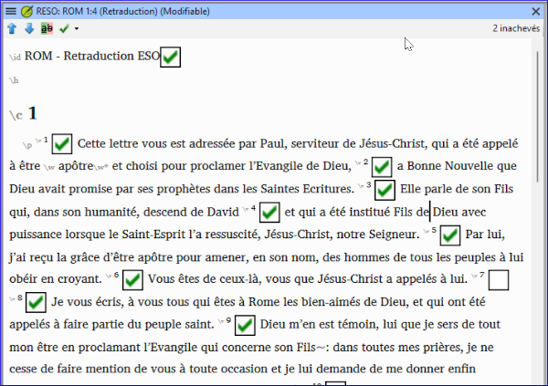

### Qu'est-ce que c'est et qu'est-ce qui en fait une bonne ?
  

Une retraduction est un moyen de vérifier une traduction. Dans la traduction de la Bible, le texte vernaculaire est traduit dans une langue principale afin qu'un consultant en traduction qui ne maîtrise pas la langue vernaculaire puisse examiner la traduction et aider l'équipe à l'améliorer. Dans le cas du Paratext, la retraduction est effectuée dans le cadre d'un projet distinct, mais lié.

#####  

### Quelles sont les qualités d'une bonne retraduction ?

-   Elle est effectuée par une personne qui n'a pas participé à la rédaction de la traduction en langue vernaculaire.
-   Elle est naturelle et reflète la façon dont le retraducteur comprend le sens du texte vernaculaire.
-   Sans utiliser d'aides ou d'autres Bibles.
-   Refléter ce que dit le texte vernaculaire et non ce qu'il devrait dire.
