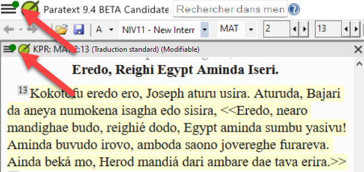
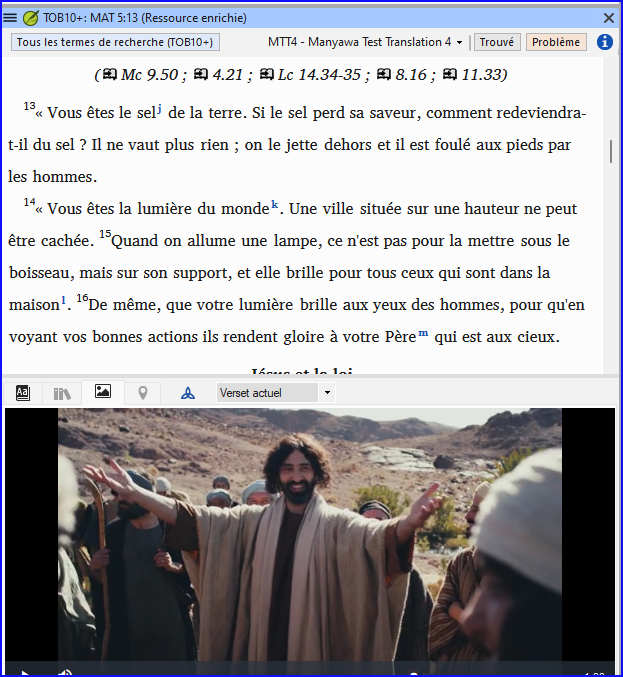

## **Nouveautés de Paratext 9.4 Beta** {#ef25a726728f449c90b3fdabf820eab6}

(extrait de [https://paratext.org/features/whats-new/whats-new-in-paratext-9-4-beta/](https://paratext.org/features/whats-new/whats-new-in-paratext-9-4-beta/))

**Quelques faits marquants**

- **Notification des mises à jour des projets sur l'ordinateur de l'utilisateur :** Paratext peut désormais vérifier si les projets présents sur l'ordinateur de l'utilisateur ont été mis à jour sur le serveur d'envoi et de réception. Si le projet a été modifié, les utilisateurs en seront informés par un point vert dans le menu principal et dans le menu du projet (voir l'image ci-dessous). Les paramètres de vérification des mises à jour sont disponibles dans la fenêtre **Envoyer/recevoir des projets** . [Menu principal vidéo démo (en anglais)](https://paratext.org/features/whats-new/whats-new-in-paratext-9-4-beta/?vimeography_gallery=157&vimeography_video=857678678)

    

- **Notification des mises à jour des ressources installées.** Un point vert dans le menu principal peut également indiquer des mises à jour des textes des ressources sur l'ordinateur local. L'accès aux paramètres de cette fonction se fait dans la dialogue**Télécharger/Installer ressources** .
- **Amélioration de l'interface droite-gauche.** Paratext affiche désormais correctement les interfaces utilisateur de droite à gauche (comme l'arabe). [RTL vidéo démo (en anglais)](https://paratext.org/features/whats-new/whats-new-in-paratext-9-4-beta/?vimeography_gallery=157&vimeography_video=858761461)

    

- **Possibilité de masquer les notes de projet.** De nombreux drapeaux rouges dans le texte peuvent facilement devenir un obstacle à la lecture. Les utilisateurs peuvent désormais choisir de masquer ou d'afficher les drapeaux des notes de projet dans le texte. Accès à partir du menu **Affichage&gt; Show Project Notes** (afficher les remarques de projet). [Menu de projet vidéo démo (en anglais)](https://paratext.org/features/whats-new/whats-new-in-paratext-9-4-beta/?vimeography_gallery=157&vimeography_video=857939433)

    

- **Amélioration du contrôle des citations.** Le nouveau vérification de base "Types de citations" sait où les citations doivent se trouver dans le texte sur la basé sur des données [Glyssen (scripts audio)](https://software.sil.org/glyssen/) et peut s'assurer qu'elles sont toutes marquées de manière appropriée. [Types de citations vidéo démo](https://paratext.org/features/whats-new/whats-new-in-paratext-9-4-beta/?vimeography_gallery=157&vimeography_video=859138745)
- **Ajout de vidéos aux ressources enrichies.** L'onglet Média des ressources enrichies contient désormais des clips vidéo provenant de [LUMO](https://lumoproject.com/) et de la série "Bible Lands as Classroom" de l'UBS. [Vidéos sur les ressources enrichies - démo vidéo](https://paratext.org/features/whats-new/whats-new-in-paratext-9-4-beta/?vimeography_gallery=157&vimeography_video=858761461)

    

- **Importer/exporter des listes de termes bibliques.** Cette fonctionnalité devrait améliorer le flux de travail des équipes de projet avec l'outil Termes bibliques, en leur permettant de créer et d'échanger les listes de termes bibliques au fur et à mesure de l'avancement du projet. Veuillez installer le dernier correctif logiciel de la mise à jour Beta (à venir) pour une fonctionnalité complète. [Termes bibliques vidéo démo](https://paratext.org/features/whats-new/whats-new-in-paratext-9-4-beta/?vimeography_gallery=157&vimeography_video=858020833)

**Et bien d'autres améliorations !**

- Ajout de la possibilité d'utiliser le dictionnaire FieldWorks avec Paratext Interlinearizer. [▶ Vidéo de démonstration de l'intégration de FieldWorks](https://paratext.org/features/whats-new/whats-new-in-paratext-9-4-beta/?vimeography_gallery=157&vimeography_video=859073261)
- Ajout de la possibilité de modifier l'ordre des renvois, des notes de bas de page et des barres latérales dans les projets de projet d'annexes de la Bible d'étude. [▶ Démonstration vidéo de Study Bible Additions](https://paratext.org/features/whats-new/whats-new-in-paratext-9-4-beta/?vimeography_gallery=157&vimeography_video=858761672)
- Ajout de la possibilité de "Gérer les dispositions des fenêtres". [▶ Menu principal vidéo démo](https://paratext.org/features/whats-new/whats-new-in-paratext-9-4-beta/?vimeography_gallery=157&vimeography_video=857678678)
- Les correspondances entre les passages parallèles sont plus faciles à voir.
- Éléments nouveaux/améliorés dans le menu du projet ([▶ Démonstration vidéo du menu du projet](https://paratext.org/features/whats-new/whats-new-in-paratext-9-4-beta/?vimeography_gallery=157&vimeography_video=857939433)) :
    - L'exportation vers PTXprint est désormais disponible dans le menu du projet.
    - Améliorations apportées à la fonction "Insérer un tableau".
    - Les projets dérivés peuvent ouvrir le projet de base.
- Fonctionnalités supplémentaires ([▶ Démonstration vidéo des fonctionnalités supplémentaires](https://paratext.org/features/whats-new/whats-new-in-paratext-9-4-beta/?vimeography_gallery=157&vimeography_video=859466352)) :
    - Amélioration de la comparaison des versions afin d'offrir un contraste clair entre les différences.
    - Capacité à gérer les guillemets alternatifs
    - La vérification de référence donne des messages d'erreur plus spécifiques
- Tâches et avancement accepte les codes de livre familiers (par exemple : "GEN")
- Amélioration des ressources Les termes du dictionnaire ne sont plus répétés
- Lorsque vous utilisez l'option "Envoyer des commentaires", Paratext marque un point de repère dans l'historique du projet
- [Scripture Burrito](https://docs.burrito.bible/en/latest/) 1.0 import/export
- Diverses corrections de bogues
