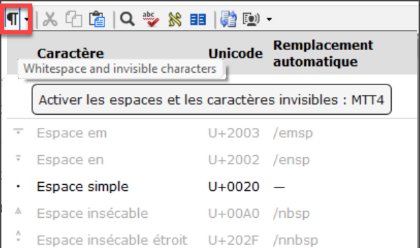
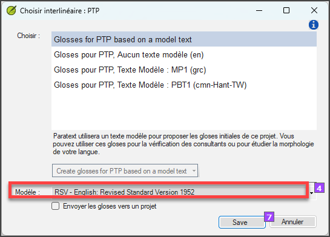
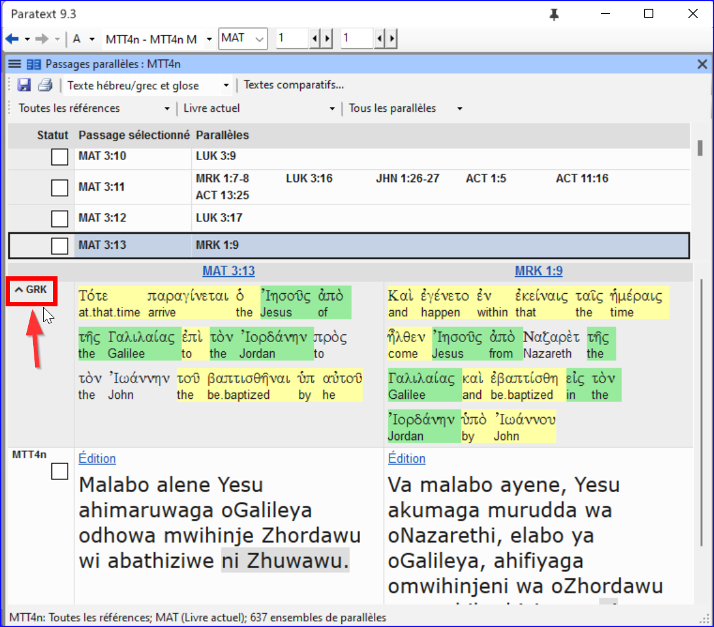
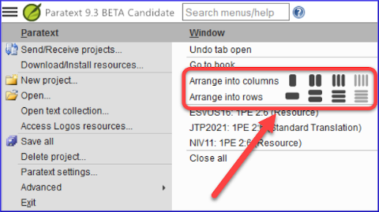

## Paratext 9.5 {#16154c54093a4476b7397c214e78e49f}

See Paratext website - [What’s New in Paratext 9.5 Beta](https://paratext.org/features/whats-new/whats-new-in-paratext-9-5-beta/)

Highlights

- **Support for whitespaces and invisible characters**\*
  - Note: The whole team needs to update to 9.5
  - Administrator enables it on by clicking the dropdown on the paragraph icon

    

- Available in
  - text editor, wordlist, results list, scripture reference settings and number settings
  -
  - Character Inventory, Spell checking dialogs, Quotation rules.

- Study Bible Additions (SBA) Improvements
  - Tâches et avancement
  - figures in footnotes and sidebars
  - Scripture Reference Settings within SBA projects can now override the settings of the base project
  - Improved checking features, ensuring more accurate and efficient review processes.

- Inventories
  - undo and redo

  - dock Inventory panels

  - inventory panels now consistent appearance and behaviour to Wordlist.

    

  - Approval is managed based on location - verse text, non-verse text, or study content within SBA.

  - Filtering to help find and organize inventory items.

- Additional improvements
  - Display **multiple gloss languages** in Biblical terms (Major Biblical Terms)

    

  - Filter buttons to the Download/Install resources window

    

  - Simplified creating and editing Interlinearizer settings.
    - Choose from existing or click **Create New**

      

    - Choose the model text, click **save**

      

  - Project notes list - “unread and unresolved” filter

    

### Additional Improvements {#1ba598a5fd40807f8592f94edb9bef69}

We’ve also made these additional improvements:

- Added the ability to display **multiple gloss languages** in **Biblical Terms** windows.
- Added **filter buttons** to the **Download/Install resources** window.
- **Simplified** the process of creating and editing **Interlinearizer settings**.
- Added an **“Unread and unresolved”** filter to the **Project notes list**.
- Provided support for the new format of Flora, Fauna, and Realia in the Enhanced Resource Encyclopedia tab.
- Provided support for multi-language Flora, Fauna, and Realia.
- Added a Help link for apparatus abbreviation in GRK Source Language Text.
- Improved UI localization implementation.
- Improved merging changes for project data.
- Allowed changing inventories and settings for Transliteration projects.
- Added ability to automatically format references when Scripture Reference settings are updated.
- Provided a built-in Paratext annual survey invitation.
- Many bug fixes.

Please see the _What’s new in Paratext 9.5?_ Help topic for more info about these improvements.

## Paratext 9.4  {#192598a5fd408046bbd6d5ee536dc483}

See Paratext website - [**What’s New in Paratext 9.4 Beta**](https://paratext.org/features/whats-new/whats-new-in-paratext-9-4-beta/)

Highlights

- **Notification of updates for projects on the user’s computer:**  A green dot on the project menu. Les paramètres de vérification des mises à jour sont disponibles dans la fenêtre **Envoyer/recevoir des projets** . [Menu principal vidéo démo (en anglais)](https://paratext.org/features/whats-new/whats-new-in-paratext-9-4-beta/?vimeography_gallery=157&vimeography_video=857678678)

  

- **Notification des mises à jour des ressources installées.** Un point vert dans le menu principal peut également indiquer des mises à jour des textes des ressources sur l'ordinateur local. Access to the settings for this feature is in the **Download/Install resources**

- **Amélioration de l'interface droite-gauche.** Paratext affiche désormais correctement les interfaces utilisateur de droite à gauche (comme l'arabe). [RTL vidéo démo (en anglais)](https://paratext.org/features/whats-new/whats-new-in-paratext-9-4-beta/?vimeography_gallery=157&vimeography_video=858761461)

  

- **Option to hide project notes.** Access from the **View menu &gt; Show Project Notes**. [Menu de projet vidéo démo (en anglais)](https://paratext.org/features/whats-new/whats-new-in-paratext-9-4-beta/?vimeography_gallery=157&vimeography_video=857939433)

  

- **Amélioration des vérifications des citations.** La nouvelle vérification de base "Types de citations" sait où les citations doivent se trouver dans le texte sur la base des données [Glyssen](https://software.sil.org/glyssen/) et peut s'assurer qu'elles sont toutes marquées de manière appropriée. [Types de citations vidéo démo](https://paratext.org/features/whats-new/whats-new-in-paratext-9-4-beta/?vimeography_gallery=157&vimeography_video=859138745)

- **Ajout de vidéos aux ressources enrichies.** L'onglet Média des ressources enrichies contient désormais des clips vidéo provenant de [LUMO](https://lumoproject.com/) et de la série "Bible Lands as Classroom" de l'UBS. [Vidéos sur les ressources enrichies - démo vidéo](https://paratext.org/features/whats-new/whats-new-in-paratext-9-4-beta/?vimeography_gallery=157&vimeography_video=858761461)

- **Import/Export Biblical terms lists.** Allows users to create and exchange the Biblical Terms lists as the project progresses. [Termes bibliques vidéo démo](https://paratext.org/features/whats-new/whats-new-in-paratext-9-4-beta/?vimeography_gallery=157&vimeography_video=858020833)

**Et bien d'autres améliorations !**

## Paratext 9.3  {#4c850f9665ff4ab8870f1ae0fed0e870}

[What’s new in Paratext 9.3](https://paratext.org/features/whats-new/whats-new-in-paratext-9-3/)

### Paratext Live uses a couple of servers {#14973ac6c79843a3a94db72e3348418d}

- Paratext 8, 9.0 et 9.1 utilisent un serveur appelé Internet (secondaire) WCF et Paratext 9.2 utilise Internet (primaire) AMQP.
  - _C'est pourquoi il n'est pas possible d'utiliser Paratext Live avec 9.2 et 9.1 en même temps_
- Dans Paratext 9.3, lorsque vous démarrez Paratext Live, vous choisissez le serveur que vous souhaitez utiliser.
  - **Internet (primary)**, which is 9.2 and 9.3.
  - **Internet (secondary)** which is 9.0, 9.1 or Paratext 8.

:::note

Toutes les personnes participant à une session en direct particulière doivent toujours utiliser le même serveur, mais à partir de la version 9.3, vous pouvez travailler avec une personne utilisant la version 9.1 ou une autre utilisant la version 9.2 (mais pas en même temps)

:::

## Study Bible Additions {#8c8628c57aa04e48b5d33488872d0b29}

The most obvious new feature the ability to **compare versions**.

1. Ouvrez un projet Annexes de la Bible d'étude
2. Dans le menu **Projet**,
3. Sous **Projet**, choisissez **Comparer les versions**
  - _Les modifications apportées aux ajouts sont affichées_.

## Scripture reference in navigation bar {#3c00a0202ad949bc8909f66660badb73}

Dans Paratext 9.3, vous pouvez copier et coller une référence biblque dans la barre de navigation.

1. Copier le texte d'une référence (depuis un autre fichier)
2. Click in the **book name** in the navigation bar
3. Paste using **Ctrl+V**

  

La référence doit être présentée dans un format correspondant à la langue de l'interface.

Par exemple :

- en français : MAT 12.3, Mrk 5:4, Galates 1:12
- en espagnol : Romanos 8:28

:::note

Les noms doivent correspondre aux noms tels qu'ils apparaissent dans les titres.
Actuellement, il n'est pas possible de copier à partir de Paratext, mais cette fonctionnalité sera ajoutée lors d'une prochaine mise à jour.

:::

## Parallel Passages Tool {#f660aff19a7541efaa453398f11dbacd}

- The colours have changed from **green** to **grey (and back to green in 9.4)**

- Vous pouvez réduire ou étendre le grec / hébreu en cliquant sur la petite flèche.
   

## Open a text collection {#fd1736d1bd07444fb6902b8dccf951dc}

There is a new menu item on the **main menu**

1. From the **Paratext menu**

2. Choose **Open text collection**
  - _Cette fenêtre ressemble à celle utilisée dans les versions précédentes de Paratext_.

    

3. Open a previously **saved text collection** from the bottom left

4. You can still open a text collection from the **Open** window as well.

## Arranging windows {#b526a01da9e04357804f4849c39f2fdc}

- Arrange windows by **rows** as well as by **columns**.

:::tip

N'oubliez pas d'enregistrer votre disposition des fenêtres !

:::

## Floating Windows {#493f51aae2f5480893f25897c408c26c}

- Liste déroulante pour changer le projet actif
   

  

### Other new/changed {#4796465de7ac4f3190c47faa4b9750b8}

- **RegEx Pal** - from Main menu &gt; Advanced or Project menu &gt; Advanced.
- **Synchronizing** with Logos and other compatible programs is now turned **on by default**
- Des modifications ont été apportées pour faciliter la localisation des fichiers d'aide et de l'interface utilisateur
- **Bible modules** can now handle **chapter markers** in the extra books
